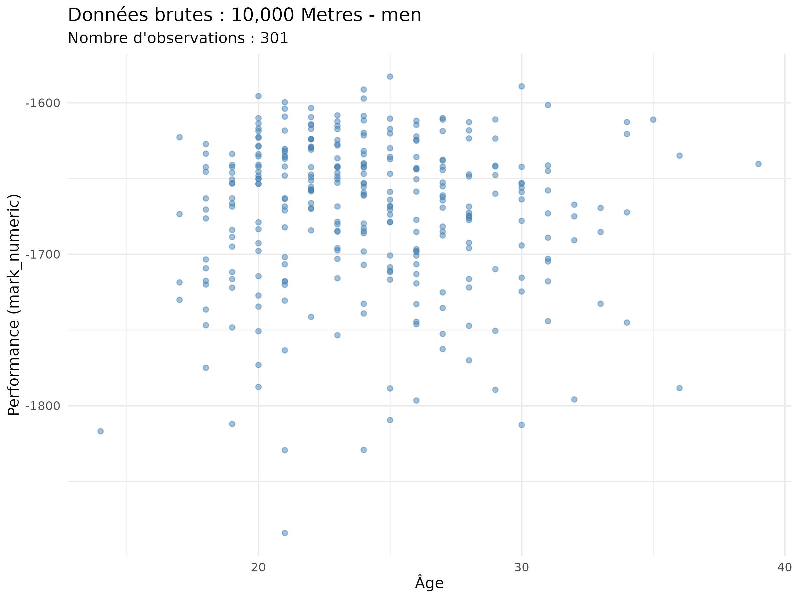
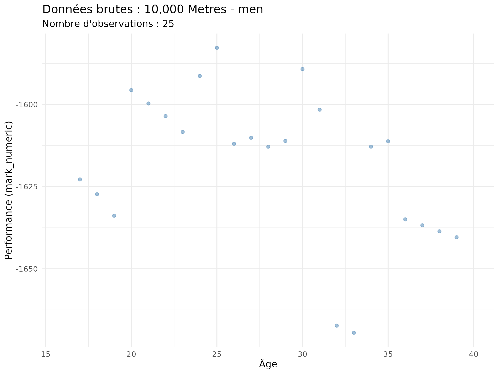

<!--Cette première partie ci-dessus entre deux « --- » s’appelle un « YAML header » (nom en anglais aussi utilisé en français) ou un « en-tête YAML ».-->

<!--« lang: fr » à remplacer par « lang: en » si rapport rédigé en anglais. Définir la langue du document est utile pour la typographie (par exemple les espaces autour de la ponctuation ne sont pas les mêmes dans les deux langues), la langue de la table des matières, des dates, le cadre linguistique du PDF généré, etc.-->

<!--« mainfont » définit la police utilisée et « fontsize » la taille de cette police.-->

```{=html}
<!--« header-includes: |
      \usepackage[bottom]{footmisc} » permet aux notes de bas de page d’être réellement en bas de page et non juste après la dernière ligne de texte (ce qui peut amener à des notes en milieu de page si le texte s’arrête à ce niveau).-->
```
```{=html}
<!--« text: |
      \usepackage[dvipsnames]{xcolor} » permet de mettre des portions de texte en couleur.-->
```
```{=html}
<!--« text: |
      \usepackage{booktabs} » permet d’utiliser le langage LaTeX pour améliorer la présentation des tableaux. -->
```
<!--« geometry » définit les marges de chaque taille du rapport. « top », en haut ; « bottom », en bas ; « left », à gauche ; « right », à droite.-->

```{=html}
<!--« bibliography: references.bib
citation: true
link-citations: true 
nocite: "@*" » est utile pour faire une liste bibliographique, pour plus d’explications, voir la section dédiée.-->
```
<!--La présentation de la page de titre est codée ci-dessous en LaTeX qui est un langage supporté par les documents Quarto sur RStudio ; sauf à vouloir innover la présentation, vous n’avez pas à apprendre le langage LaTeX à cette fin. Toutefois, selon la nature du projet, vous aurez peut-être à étudier davantage LaTeX pour rédiger des formules mathématiques ou pour améliorer la présentation de vos tableaux. Page officielle de ce langage de programmation : https://www.latex-project.org/ (en anglais). De nombreux autres sites également en français enseignent l’utilisation de LaTeX, dans son ensemble ou pour un usage particulier de ce langage.-->

```{=tex}
\begin{titlepage}
\centering

\includegraphics{ressources/ensai_logo_1.png}\\
\vspace{1.0cm}

{\LARGE\textsc{Rapport de projet statistique}}\\
\vspace{0.5cm}
{\large Élèves 2A}

\vspace{2.5cm}

\rule{\textwidth}{0.5mm}\\
\vspace{0.8cm}
{\huge\bfseries Trajectoires de performance en athlétisme d'élite : modélisation de la relation âge-performance et identification de l'âge au pic}\\
\vspace{0.8cm}
\rule{\textwidth}{0.5mm}\\

\vspace{2.5cm}

\begin{flushleft}
\emph{Étudiants :}\\
Arthur \textsc{Deletang}\\
Maëlys \textsc{D'Halluin}\\
Clémence \textsc{Pinsard}
\end{flushleft}

\begin{flushright}
\emph{Tuteur :}\\
Imad {Hamri}\\
\end{flushright}

\vfill 
\begin{center}
École nationale de la statistique et de l’analyse de l’information\\
2025--2026
\end{center}
\end{titlepage}
```
<!--« vspace » définit la taille verticale d’un espace à laisser vide.-->

<!--« flushleft », « flushright » et « center » : alignements à gauche, à droite et centré.-->

<!--« \emph » met du texte en italique dans un texte en romain et vice versa.-->

<!--« vfill » renvoie le texte codé par la suite (ici jusqu’à « \end{titlepage} » en bas de la page.-->

<!--Dans « 2025--2026 », les deux traits d’union permettent de faire un tiret long. « 2025--2026 » pourra être remplacé par une date.-->

# Résumé {.unnumbered}

La détection précoce des talents sportifs et la compréhension de la trajectoire des athlètes d'élite constituent des enjeux majeurs pour les fédérations sportives internationales. Cette étude s'intéresse à la relation entre l'âge et la performance en athlétisme, en cherchant à identifier l'âge au pic de performance selon les disciplines et le sexe. Mieux comprendre cette dynamique permet non seulement d'optimiser la planification des carrières sportives, mais aussi d'améliorer les stratégies de détection et d'accompagnement des jeunes athlètes. L'analyse s'appuie sur les données de World Athletics couvrant la période 1985--2024, recensant les 100 meilleures performances annuelles mondiales par discipline et par sexe. Deux modèles non linéaires sont mobilisés : le modèle de Moore (1975) et le modèle IMAP (Berthelot et al., 2019), appliqués à différentes familles de disciplines. Cette étude permet de comparer les dynamiques de progression et de déclin entre disciplines et entre sexes, et ainsi contribuer à une meilleure connaissance du vieillissement athlétique.

# Abstract {.unnumbered}

Early talent detection and understanding the career trajectories of elite athletes are key challenges for international sports federations. This study examines the relationship between age and performance in athletics, aiming to identify peak performance age across disciplines and sexes. A deeper understanding of this dynamic can help optimize career planning and improve strategies for identifying and supporting young athletes. The analysis draws on World Athletics data spanning 1985--2024, covering the top 100 annual performances worldwide per discipline and sex. Two nonlinear models are applied: the Moore model (1975) and the IMAP model (Berthelot et al., 2019), across various discipline families. This study allows us to compare the dynamics of progression and decline between disciplines and between sexes, and thus contribute to a better understanding of athletic aging.

\newpage

\tableofcontents

\newpage

# Introduction {.unnumbered}

## Contexte et enjeux {.unnumbered}

La détection précoce des talents sportifs constitue un enjeu majeur pour les fédérations internationales d'athlétisme. Si la question de l'identification des jeunes athlètes prometteurs semble intuitive, elle se révèle en réalité bien plus complexe : les performances exceptionnelles observées à l'adolescence ne garantissent pas nécessairement la réussite au plus haut niveau à l'âge adulte. Ce constat soulève une problématique centrale : comment identifier, parmi les jeunes athlètes performants, ceux qui parviendront à maintenir, voire améliorer leur niveau dans les années suivantes ?

Cette question s'inscrit dans un contexte scientifique où la relation entre l'âge et la performance sportive a fait l'objet de nombreuses recherches. Depuis les travaux pionniers de Moore en 1975, qui proposa le premier modèle mathématique de cette relation, la communauté scientifique n'a cessé d'approfondir la compréhension de cette dynamique. Plus récemment, Berthelot et ses collaborateurs ont développé en 2019 le modèle IMAP (Integrative Model of Age-Performance), fondé sur des mécanismes biologiques cellulaires, offrant ainsi une nouvelle perspective pour modéliser l'évolution des capacités physiques tout au long de la vie.\

Notre étude s'appuie sur une base de données internationale fournie par World Athletics, couvrant la période 2000-2024 et recensant les 100 meilleures performances annuelles, pour chaque sexe, dans chaque discipline athlétique. Ce corpus, portant sur plusieurs dizaines de milliers de performances au plus haut niveau mondial, permet d'analyser finement la trajectoire des athlètes d'élite à travers différentes disciplines.

## Objectif de l'étude {.unnumbered}

L'objectif principal de ce projet est d'analyser la relation entre l'âge et la performance en athlétisme. Plus spécifiquement, nous cherchons à comprendre comment évoluent les performances athlétiques au fil du temps et à déterminer l'âge auquel les athlètes atteignent leur pic de performance.\

Contrairement aux approches basées uniquement sur l'âge moyen des athlètes, qui peuvent être biaisées par les différences d'âge de début et de fin de carrière selon les pays ou les disciplines, notre étude se concentre sur l'identification de l'âge au pic de performance. Cette approche permet de mieux comprendre la dynamique temporelle de la performance sportive, caractérisée par une phase de croissance progressive des capacités, suivie d'un plateau puis d'un déclin lié au vieillissement.

## Questions de recherches et trajectoires attendues {.unnumbered}

L'analyse de nos données vise à répondre à plusieurs interrogations fondamentales sur la dynamique de la performance athlétique. La littérature scientifique nous guide dans la formulation de nos attentes quant aux résultats escomptés.\

Tout d'abord, nous cherchons à caractériser la variabilité de l'âge au pic de performance selon les disciplines. Les travaux d'Allen et Hopkins [@Allen2015] ont établi une relation claire entre la durée de l'épreuve et l'âge optimal de performance : dans les épreuves de puissance explosive et de sprint, l'âge au pic décroît avec la durée de l'effort, allant d'environ 27 ans pour les lancers à 20 ans pour les sprints courts en natation. À l'inverse, pour les épreuves d'endurance, l'âge au pic augmente avec la durée, s'échelonnant d'environ 20 ans pour les épreuves courtes à près de 39 ans pour l'ultra-endurance cycliste. Cette tendance s'explique par les différences dans les systèmes énergétiques sollicités et le temps nécessaire au développement complet des capacités aérobies. Nous nous attendons donc à observer dans nos données un âge au pic plus précoce pour les épreuves de sprint et de saut, et plus tardif pour les disciplines d'endurance comme le demi-fond et le fond.\

La question des différences entre sexes mérite également une attention particulière. Bien que plusieurs études, notamment celle d'Allen et Hopkins [@Allen2015], rapportent peu de différences entre hommes et femmes dans l'âge au pic de performance pour les épreuves explosives et d'endurance, d'autres travaux suggèrent une distinction : l'analyse des Jeux Olympiques 2020 [@Infographic2020] révèle que l'âge moyen des athlètes masculins est d'un an supérieur à celui des femmes. De plus, des études sur le vieillissement athlétique indiquent que le déclin de performance avec l'âge pourrait être plus marqué chez les femmes que chez les hommes dans certaines disciplines, particulièrement en sprint, tandis que cette différence s'atténue dans les épreuves d'endurance longue. Nos analyses chercheront à confirmer ou infirmer ces tendances sur notre échantillon d'athlètes.\

Enfin, la dynamique temporelle de la performance nous intéresse particulièrement. La relation âge-performance suit typiquement une forme asymétrique en U inversé : une phase de croissance progressive durant l'enfance et l'adolescence, un plateau lors du pic de performance à l'âge adulte, puis un déclin dont la vitesse s'accélère après 70 ans. Carter [@Carter2019] décrit cette asymétrie comme une caractéristique fondamentale du vieillissement humain. La phase de croissance et la phase de déclin ne sont pas symétriques, et cette asymétrie pourrait varier selon les disciplines. Les épreuves de puissance, qui dépendent fortement des fibres musculaires rapides, connaissent un déclin plus précoce et prononcé que les épreuves d'endurance, où la perte de capacité aérobie est plus progressive. Nous explorerons donc la vitesse de progression en début de carrière et la vitesse de déclin après le pic, en comparant ces dynamiques entre disciplines et entre sexes. \

\newpage

# Présentation des données

Notre étude s'appuie sur une base de données issue de World Athletics, la fédération sportive internationale chargée de régir les fédérations nationales d'athlétisme et d'organiser les compétitions internationales mondiales \footnote{\url{https://fr.wikipedia.org/wiki/World_Athletics}}. Cette base recense, pour chaque discipline et chaque année entre 1985 et 2024, les 100 meilleures performances mondiales réalisées lors de compétitions officielles. \

Les données comportent plusieurs variables clés : l'identifiant de l'athlète, son âge au moment de la performance, son sexe, sa nationalité, la discipline pratiquée, la performance brute (temps, distance ou hauteur selon la discipline) et le ResultScore. Ce dernier, développé par World Athletics, constitue une métrique normalisée permettant de comparer les performances entre disciplines différentes en s'appuyant sur des paramètres définis par des experts du domaine. \

La base couvre l'ensemble des disciplines olympiques en athlétisme : courses (sprint, demi-fond, fond, haies), sauts (hauteur, longueur, triple saut, perche), lancers (poids, disque, javelot, marteau) et épreuves combinées (décathlon, heptathlon). Cette diversité permet d'analyser finement les spécificités de chaque famille de disciplines. \

Il convient toutefois de noter certaines limites structurelles : un déséquilibre dans la répartition des athlètes par âge, avec une sous-représentation des athlètes de plus de 35 ans, ainsi qu'une possible hétérogénéité dans la qualité de l'enregistrement des données selon les périodes et les pays. Ces biais potentiels seront pris en compte dans notre analyse et discutés dans l'interprétation des résultats.

## Préparation et nettoyage des données

Le passage des données brutes à un échantillon exploitable a nécessité un protocole de nettoyage, articulé autour de quatre étapes clés :

- **Calcul de l'âge et nettoyage initial :** Les entrées ne disposant pas de performance numérique exploitable ou d'une date de naissance valide ont été écartées. L'âge de chaque athlète a été calculé par la différence entre l'année de la performance (*season*) et son année de naissance.

Une limite méthodologique inhérente à la base de données doit être soulignée : la date exacte de la performance n'étant pas disponible, l'âge au pic a été estimé par la différence entre l'année de la compétition et l'année de naissance de l'athlète.

- **Identification des carrières terminées :** Afin d'éviter le biais de troncature (inclure un athlète n'ayant pas encore atteint son pic), nous avons restreint l'étude aux athlètes retraités. Un seuil de "retraite" a été fixé à l'année 2022 : tout athlète ayant réalisé une performance après cette date a été considéré comme actif et exclu de l'analyse.

- **Sélection de la meilleure performance annuelle :** Pour chaque athlète, à chaque âge et dans chaque discipline, nous n'avons conservé que la meilleure performance annuelle. Cette étape permet d'éliminer les variations de forme intra-saisonnières. Les disciplines ont ensuite été regroupées en neuf familles majeures :**5000-100000**, **800 - 1500 - Steeple**, **Épreuves combinées**, **Marche**, **Marathon**, **Sauts**, **Haies**, **Sprint** et **Lancers**.

- **Filtrage par expérience et équilibrage (Top 32) :** Pour garantir que l'âge au pic observé soit représentatif d'une trajectoire complète, seuls les athlètes ayant au moins **5 années de performances** enregistrées dans une même discipline ont été retenus. Enfin, pour corriger les disparités d'effectifs entre les sexes, nous avons procédé à un échantillonnage équilibré en sélectionnant le **Top 32** des meilleurs athlètes par discipline et par sexe, seuil défini par l'effectif le plus restreint du jeu de données (heptathlon).

## Variables d'intérêt

L'analyse repose sur un ensemble de variables structurées pour répondre à la problématique de l'évolution de la performance :

- **Age_Pic_Obs :** L'âge auquel l'athlète a réalisé son record personnel absolu au cours de sa carrière. Il s'agit de notre variable dépendante centrale.
\vspace{5pt}
- **Sex :** Pour comparer les performances entre les femmes et les hommes.
\vspace{5pt}
- **Famille :** Regroupement des disciplines par filières énergétiques.
\vspace{5pt}
- **Discipline :** Pour observer les ressemblances et différences entre les 24 disciplines en athlétisme.
\vspace{5pt}
- **meilleure\_perf\_km\_par\_h :** Conversion de la performance en kilomètre par heure afin d'avoir des valeurs positives à maximiser dans nos modèles.
\vspace{5pt}
- **mark_numeric :** Meilleure performance d'un athlète sur une saison au format numérique (seconde ou mètre selon la discipline).


\newpage


# Étude 1 : Statistiques descriptives et analyse inférentielle

Dans l’optique de mieux comprendre la structure de l'échantillon d'élite et d’en obtenir une vue d’ensemble, les caractéristiques de l'âge au pic observé sont examinées en premier lieu. Cette analyse préliminaire permet d'identifier des tendances majeures et de justifier le choix des modélisations non linéaires (Moore et IMAP) qui suivront.

## Méthodologie

La démarche analytique est structurée en trois phases complémentaires. Une **analyse descriptive** globale est d'abord menée pour identifier les indicateurs de position (médiane, quartiles) selon le sexe et la discipline. Ensuite, la distribution des données est soumise à un **test de normalité** (Shapiro-Wilk) afin de valider le cadre statistique. Enfin, une **analyse inférentielle** est déployée pour tester statistiquement l'influence du sexe et de la spécialité athlétique sur l'âge de performance.

## Résultats descriptifs et indicateurs de position 

Afin de cerner les principales caractéristiques de la population étudiée, une analyse descriptive a été menée sur l'ensemble des disciplines. L'examen de la distribution globale (@fig-hist) permet d'observer que la majorité des records personnels sont enregistrés dans une fenêtre comprise entre 22 et 28 ans pour les deux sexes. On note cependant une répartition distincte selon le genre : les hommes sont davantage représentés entre 21 et 24 ans, tandis que la tendance s'inverse par la suite. À partir de 26 ans, on observe une proportion plus importante de femmes atteignant leur âge au pic.

::: {#fig-hist fig-pos='H'}
\fbox{\includegraphics[width=0.85\textwidth]{outputs/histogramme_global.png}}

Distribution de l'âge au pic
:::

Les indicateurs de position associés à cette distribution sont détaillés dans le tableau ci-dessous :

| Sexe | Eff. | Min | Q1 | Moyenne $\pm$ SD | Médiane | Q3 | Max |
|:---|:---:|:---:|:---:|:---:|:---:|:---:|:---:|
| Hommes | 672 | 18 | 23 | 25.72 $\pm$ 3.74 | **25** | 28 | 46 |
| Femmes | 672 | 17 | 24 | 26.25 $\pm$ 3.60 | **26** | 29 | 40 |
: Résumé statistique de l'âge au pic observé selon le sexe {#tbl-stats}

Une différence d'un an est observée sur l'âge médian, s'établissant à 25 ans chez les hommes contre 26 ans chez les femmes. La répartition par familles de disciplines (@fig-box) montre également des variations de maturité sensibles selon les spécialités.

::: {#fig-box fig-pos='H'}
\fbox{\includegraphics[width=0.85\textwidth]{outputs/boxplot_familles.png}}

Âges au pic observés selon les familles de disciplines et le sexe
:::

Le groupe **Sprint** se distingue par la maturité la plus précoce, avec des médianes basses et une distribution resserrée. À l'inverse, le **Marathon** et les **Lancers** affichent les médianes les plus élevées.

\vspace{5pt}

\noindent On observe des structures de distribution spécifiques selon les familles :

- **Proximité entre sexes :** En **Haies**, en **Sauts** et dans les **Épreuves combinées**, les médianes et les quartiles sont quasiment alignés entre les hommes et les femmes.
\vspace{5pt}
- **Dispersion :** La famille **Lancers** et le **Marathon** montrent des distributions supérieures très étirées, signalant une plus grande variabilité de l'âge au pic.
\vspace{5pt}
- **Valeurs extrêmes :** Les **Lancers** et le **5000 - 10000** présentent de nombreux points isolés vers le haut, particulièrement chez les hommes, contrairement au épreuves combinées ou aux Haies.

\vspace{4pt}

\noindent Cette première approche par grandes familles met en évidence des tendances structurelles liées à la nature de l'effort. Toutefois, la variabilité observée (notamment les nombreux points extrêmes) suggère que l'analyse par famille peut masquer des disparités internes. Pour affiner cette compréhension, une analyse désagrégée à l'échelle de chaque discipline est nécessaire afin d'identifier les spécialités qui s'écartent des moyennes de leur propre groupe.

### Analyse descriptive par discipline {.unnumbered .unlisted}

Le tableau ci-dessous présente une synthèse détaillée de l'âge au pic observé pour chaque spécialité. Cette vue  permet d'identifier les spécificités propres à chaque discipline, au-delà des tendances globales par familles.

| Discipline | Hommes <br> (Moy ± SD) | Hommes <br> Med [Min-Max] | Femmes <br> (Moy ± SD) | Femmes <br> Med [Min-Max] |
|:-----------|:-------------------:|:-----------------:|:-------------------:|:-----------------:|
| **100 m** | 25.6 ± 4.1 | 24 [21-40] | 24.8 ± 3.0 | 25 [20-31] |
| **200 m** | 24.5 ± 3.0 | 24 [21-33] | 25.3 ± 3.4 | 26 [20-33] |
| **400 m** | 24.1 ± 3.3 | 23 [18-31] | 25.3 ± 2.9 | 25 [20-32] |
| **800 m** | 22.9 ± 3.5 | 23 [18-30] | 25.4 ± 2.7 | 26 [19-32] |
| **1500 m** | 25.9 ± 4.0 | 25 [19-35] | 25.9 ± 3.5 | 26 [19-34] |
| **5000 m** | 24.5 ± 4.6 | 22 [19-37] | 25.2 ± 3.4 | 26 [20-33] |
| **10 000 m** | 23.7 ± 3.6 | 23 [18-36] | 26.8 ± 4.9 | 27 [20-39] |
| **Marathon** | 27.7 ± 4.0 | 27 [22-36] | 30.0 ± 4.1 | 29 [18-40] |
| **Haies** | 26.0 ± 2.8 | 26 [21-31] | 26.9 ± 2.9 | 27 [20-32] |
| **400 m H** | 24.6 ± 2.7 | 24 [20-31] | 25.8 ± 2.4 | 26 [20-29] |
| **Steeple** | 24.9 ± 3.6 | 24 [19-33] | 25.3 ± 3.9 | 26 [18-32] |
| **Marche** | 26.3 ± 3.6 | 26 [21-37] | 25.8 ± 3.7 | 26 [20-34] |
| **Hauteur** | 25.4 ± 3.0 | 25 [21-32] | 25.4 ± 3.0 | 26 [20-33] |
| **Perche** | 26.5 ± 3.0 | 26 [22-35] | 27.0 ± 3.4 | 27 [20-35] |
| **Longueur** | 25.6 ± 3.2 | 26 [19-33] | 26.2 ± 3.5 | 26 [20-34] |
| **T. saut** | 25.6 ± 3.3 | 25 [21-35] | 26.7 ± 3.2 | 26 [21-32] |
| **Poids** | 26.8 ± 2.9 | 26 [23-36] | 26.7 ± 3.5 | 26 [21-34] |
| **Disque** | 28.8 ± 3.3 | 28 [22-36] | 26.5 ± 4.6 | 26 [18-37] |
| **Marteau** | 28.0 ± 5.0 | 26 [22-46] | 27.3 ± 2.9 | 28 [23-35] |
| **Javelot** | 26.8 ± 3.3 | 27 [21-34] | 26.4 ± 4.0 | 26 [17-37] |
| **Combinées** | 26.2 ± 3.1 | 26 [21-33] | 26.8 ± 3.0 | 27 [20-33] |

: Synthèse descriptive de l'âge au pic par discipline et sexe {#tbl-desc-complet}

\vspace{4pt}

\noindent L'observation de ce tableau permet de noter que, pour la majorité des disciplines, la **moyenne est supérieure à la médiane**. Ce constat est un indicateur mathématique d'une distribution étirée vers les âges élevés (asymétrie positive).

### Étude de la distribution et vérification de la normalité {.unnumbered .unlisted}

Avant de procéder aux tests d'inférence, il est indispensable d'étudier la forme de la distribution de notre variable d'intérêt : l'âge au pic observé. Cette étape permet de vérifier si les données suivent une loi normale, condition *sine qua non* pour l'utilisation de tests paramétriques classiques.

### Analyse visuelle par les histogrammes {.unnumbered .unlisted}

L'examen des histogrammes permet d'observer la répartition réelle des athlètes par classe d'âge. La @fig-hist-men présente cette distribution pour les athlètes masculins, segmentée par Famille de disciplines.

::: {#fig-hist-men fig-pos='H'}
\fbox{\includegraphics[width=1\textwidth]{outputs/hist_age_hommes.png}}

Distributions de l'âge au pic de performance (Athlètes masculins)
:::

\setlength{\parindent}{0pt}
*Note : Les histogrammes concernant les athlètes féminines, les planches détaillées par discipline ainsi que l'ensemble des graphiques Quantile-Quantile (QQ-plots) sont consultables en Annexe.*

\setlength{\parindent}{15pt}

\vspace{5pt}

\noindent L'observation de la @fig-hist-men révèle des profils variés :

- Certaines familles, comme le **Sprint**, montrent une concentration très marquée sur des âges précoces avec une chute rapide de l'effectif.
\vspace{5pt}
- D'autres, comme les **Lancers**, présentent une distribution plus étalée, suggérant une plus grande hétérogénéité des âges de performance.
\vspace{5pt}
- De manière générale, on observe une "queue" de distribution vers la droite (asymétrie positive), indiquant que si l'accès au haut niveau est limité avant 20 ans, le maintien de la performance peut se prolonger tardivement pour certains individus.

\vspace{5pt}

\noindent Cette asymétrie positive est confirmée lorsque l'on descend à l'échelle de la discipline individuelle (voir @fig-hist-disc-men en Annexe). Même sur des effectifs plus réduits, la forme des distributions reste hachée et décalée vers la gauche, ce qui visuellement invalide l'utilisation d'une courbe en cloche (normale) pour modéliser ces données. Cette observation visuelle est le premier indicateur de la nécessité d'utiliser des outils statistiques non paramétriques.

### Test statistique de normalité (Shapiro-Wilk) {.unnumbered .unlisted}

\noindent Pour valider les observations visuelles, le test de **Shapiro-Wilk** a été appliqué systématiquement. Afin de neutraliser le "paradoxe de la puissance" (la sur-sensibilité du test aux grands effectifs), nous avons comparé les taux de rejet de l'hypothèse nulle ($H_0$ : normalité) selon deux échelles d'analyse : l'échelle globale des familles et l'échelle spécifique des disciplines.

| Niveau d'analyse | Effectif moyen ($n$) | Nb total de tests | Tests rejetant $H_0$ ($p < 0,05$) | % de Rejet |
|:-----------------|:-------------------:|:-----------------:|:--------------------------------:|:----------:|
| **Famille** |**75**        | 18                | 11                               | **61,1 %** |
| **Discipline**| **32** | 42                | 10                               | **23,8 %** |

: Synthèse des tests de normalité selon l'échelle d'analyse {#tbl-shapiro-synthese}

\setlength{\parindent}{0pt}
*Note : L'intégralité des résultats des tests de Shapiro-Wilk (18 familles et 42 disciplines) est consultable en Annexe.*
\setlength{\parindent}{15pt}

\vspace{5pt}

\noindent L'analyse de la @tbl-shapiro-synthese révèle que :

1. À l'échelle des **familles** ($n \approx 75$), le test est extrêmement sensible et rejette la normalité dans la majorité des cas (61,1 %).

2. À l'échelle des **disciplines** (*n* = 32), niveau considéré comme le "juste milieu" statistique (suffisant pour la puissance mais évitant la sur-sensibilité), le taux de rejet tombe à 23,8 %.

\vspace{4pt}

\noindent Toutefois, le fait qu'un quart des disciplines rejette toujours la normalité malgré un effectif réduit ($n=32$) confirme que l'asymétrie observée sur les graphiques n'est pas un artefact lié au volume de données, mais une caractéristique biologique réelle de l'âge au pic de performance. Cette distribution se caractérise par un seuil d'accès au haut niveau et un maintien de la performance qui s'étire pour certains athlètes, créant une "queue" de distribution vers les âges avancés.

### Conclusion sur le choix des tests {.unnumbered .unlisted}

L'analyse combinée des taux de rejet et des diagnostics graphiques (QQ-plots en annexe) confirme que l'âge au pic ne suit pas une loi normale de manière universelle. Bien que la normalité soit statistiquement acceptée pour certaines disciplines lorsque l'effectif est strictement contrôlé à $n=32$, une **méthodologie non paramétrique unique** est privilégiée pour l'ensemble de l'étude. Ce choix garantit la cohérence des comparaisons entre tous les groupes et assure la robustesse des résultats face aux distributions asymétriques observées.\

\setlength{\parindent}{0pt}
**Implication méthodologique :**
\setlength{\parindent}{15pt}

1.  La **médiane** et les **quartiles** sont les indicateurs de référence pour décrire les positions (plus robustes que la moyenne face aux valeurs extrêmes).

2.  Des **tests non paramétriques** (Wilcoxon-Mann-Whitney et Kruskal-Wallis), fondés sur les rangs, sont exclusivement utilisés pour les comparaisons statistiques dans la suite de l'analyse.

## Analyse inférentielle : Influence du sexe et de la spécialité

### Méthodologie {.unnumbered .unlisted}

Le raisonnement statistique reposant sur la comparaison des rangs plutôt que des moyennes permet de s'affranchir des contraintes liées aux valeurs extrêmes et à l'asymétrie des distributions. Les procédures suivantes ont été appliquées avec un seuil de significativité $\alpha = 0,05$ :

- **Test de Wilcoxon-Mann-Whitney :** Utilisé pour comparer l'âge au pic entre deux groupes indépendants (comparaison par sexe).
\vspace{5pt}
- **Test de Kruskal-Wallis :** Utilisé pour comparer plus de deux groupes indépendants (comparaison par familles de disciplines). Il constitue l'alternative non paramétrique à l'ANOVA à un facteur.
\vspace{5pt}
- **Test post-hoc de Dunn :** En cas de résultat significatif au test de Kruskal-Wallis, cette procédure identifie les paires se distinguant spécifiquement. Une **correction de Bonferroni** est systématiquement appliquée aux $p$-values pour limiter le risque d'erreur de type I lié à la multiplicité des tests.

### Résultats {.unnumbered .unlisted}

**Effet global du sexe** 

\noindent Le test de Wilcoxon-Mann-Whitney appliqué à l'ensemble de l'échantillon révèle une différence statistiquement significative entre les sexes ($p = 0,0016$). La médiane globale de l'âge au pic s'établit à 26 ans pour les athlètes féminines contre 25 ans pour les athlètes masculins.\

\setlength{\parindent}{0pt}
**Effet global de la famille de disciplines**
\setlength{\parindent}{15pt}

\noindent Le test de Kruskal-Wallis indique un effet principal significatif de la discipline sur l'âge au pic ($\chi^2 = 98,22$, $p < 0,001$). Les comparaisons post-hoc de Dunn permettent d'isoler les contrastes suivants :

- **L'exception du Marathon :** Cette épreuve se distingue significativement de la quasi-totalité des épreuves de course (du 100 m au 5000 m, $p_{adj} < 0,01$) et des sauts (Hauteur, Longueur).
\vspace{5pt}
- **Le contraste Lancers vs Vitesse/Demi-fond :** Le Lancer du Disque et le Lancer du Marteau présentent des distributions significativement décalées par rapport aux épreuves de vitesse (100 m, 200 m, 400 m) et au 800 m ($p_{adj} < 0,05$).
\vspace{5pt}
- **L'homogénéité du bloc explosif :** L'absence de différence statistiquement significative entre les familles des **Sauts**, des **Haies** et du **Sprint court** ($p_{adj} = 1,00$), indiquant une uniformité des âges au pic pour ces épreuves.

\setlength{\parindent}{0pt}
**Interaction Sexe et Famille**
\setlength{\parindent}{15pt}

\noindent L'analyse croisée indique que l'écart global de maturité observé entre les sexes n'est pas distribué de manière homogène entre les familles. L'écart des médianes (faveur des femmes) est présent dans la famille de l'**Endurance**. À l'inverse, au sein des familles du **Sprint** et des **Sauts**, l'écart des médianes entre hommes et femmes se réduit jusqu'à devenir statistiquement non significatif au seuil $\alpha = 0,05$.\

\setlength{\parindent}{0pt}
**Analyse détaillée par Sexe et Discipline**
\setlength{\parindent}{15pt}

\noindent L'examen désagrégé par épreuve individuelle (Sexe $\times$ Discipline) permet de tester l'effet du sexe sur 21 spécialités mixtes (@tbl-wilcox-disc). 

| Discipline | Médiane Hommes | Médiane Femmes | $p$-value | Conclusion |
|:-----------|:--------------:|:--------------:|:---------:|:-----------|
| 800 Mètres | 23.0 | 25.5 | 0.002 | **Significatif** |
| 10 000 Mètres | 23.0 | 27.0 | 0.007 | **Significatif** |
| Marathon | 27.0 | 29.0 | 0.009 | **Significatif** |
| Lancer du Disque| 28.0 | 25.5 | 0.012 | **Significatif** |

: Principaux résultats du test de Wilcoxon par discipline {#tbl-wilcox-disc}

Les résultats indiquent un écart significatif pour seulement 4 des 21 disciplines. Dans les épreuves du 800 m, du 10 000 m et du Marathon, la médiane féminine est supérieure à la médiane masculine. Le Lancer du Disque présente le schéma inverse (médiane masculine supérieure). Pour les 17 autres épreuves, l'hypothèse nulle d'égalité des médianes entre les sexes ne peut être rejetée.

### Discussion {.unnumbered .unlisted}

Les analyses statistiques réalisées suggèrent que l’âge au pic de performance pourrait résulter d’une interaction entre le sexe et la nature des filières énergétiques sollicitées.\

Dans les disciplines d’endurance pure (10 000 m, marathon), un écart significatif est identifié, ce qui permet de supposer que les trajectoires de carrière féminines pourraient être caractérisées par une maturité plus tardive ou une longévité accrue dans l’élite. Il est possible que des facteurs liés à la gestion des carrières ou à des capacités d’adaptation aérobie prolongées chez les femmes expliquent ce décalage d’un à quatre ans, comme cela a pu être évoqué dans certains travaux sur le métabolisme lipidique [Source].\

À l’inverse, l’absence de différence significative observée dans les épreuves de sprint court ou de sauts laisse supposer que pour les disciplines dépendant prioritairement de la puissance explosive, des contraintes biologiques pourraient imposer un cadre temporel plus rigide et similaire pour les deux sexes.\

Ces interprétations doivent toutefois être considérées avec prudence. Bien que des liens statistiques soient mis en évidence, une causalité biologique directe ne peut être affirmée sur la base de ces seules données. Il est envisageable que des facteurs environnementaux, tels que la structure des circuits professionnels ou des contextes socio-économiques, participent aux disparités constatées [Source]. L'exception du lancer du disque (où les hommes sont plus âgés au pic) rappelle d'ailleurs la multifactorialité de la performance.\

Ces observations, limitées à l’échantillon étudié, justifient néanmoins l’intérêt d’une modélisation distincte par famille de disciplines pour la suite des travaux. L'âge au pic n'étant qu'une composante ponctuelle, il est désormais nécessaire de modéliser la durée de maintien au plus haut niveau (analyse de survie), en conservant impérativement cette segmentation.


\newpage

# Etude 2 : Modèles

## Méthodologie

De nombreux modèles ont déjà été élaborés afin de modéliser la relation entre l'âge et la performance en athlétisme. Nous allons nous concentrer sur le modèle de Moore (1975) ainsi que sur le modèle IMAP (2019). Ces deux modèles sont des modèles incluant une partie qui va croitre avec l'âge jusqu'à atteindre un pic ainsi qu'une seconde partie de décroissance.

### Modèle de Moore (1975)

Dans son modèle, Dan H. Moore explique la relation entre l'âge et la performance sur un large éventail d'âges, de 5 ans jusqu'à 75 ans. Il utilise l'équation suivante pour modéliser la performance en fonction de l'âge.

$$P(t) = a \cdot(1 - e^{-bt}) + c \cdot(1 - e^{dt})$$ {#eq-moore}

L'équation [(@eq-moore)] est un modèle à double exponentielle, constitué de deux composantes :\
- $P_1(t) = a(1 - e^{-bt})$ : correspond à la phase d'amélioration des performances avec l'âge.\
- $P_2(t) = c(1 - e^{dt})$ : correspond à la phase de déclin des performances, liée au vieillissement.

Dans ce modèle, les paramètres a, b, c et d sont tous positifs et P(t) correspond à la performance à l'âge t.

En s'appuyant sur l'expression analytique du pic $P(t_{pic}) = (a+c) − a·R^{−α} − c·R^{1−α}$ où $R = \frac {ab} {cd}$ et $\alpha = \frac {b} {b+d}$ ainsi que de sa position $t_{pic} = \frac {ln(\frac {ab} {cd})} {b+d}$, on peut caractériser précisément le rôle de chaque paramètre.
Les paramètres a et c gouvernent l'amplitude de la courbe mais agissent en sens opposés : a détermine le plateau vers lequel tend le terme montant et tire le pic vers le haut, tandis que c contrôle l'amplitude du terme descendant et l'abaisse. Leur rapport conditionne ainsi directement la valeur maximale atteinte par P(t). Sous l'hypothèse c << a, a est le paramètre dominant : il fixe à lui seul l'ordre de grandeur du pic, et c n'en est qu'une correction.

{width=80%}

Les paramètres b et d gouvernent quant à eux la dynamique temporelle de la courbe. b est la vitesse de montée, il est directement proportionnel à la pente initiale via P'(0) ≈ ab tandis que d est la vitesse de descente, estimable depuis la pente de la phase tardive. Leur somme b+d détermine l'étalement global de la courbe : une grande valeur de b+d produit un pic étroit et précoce, une petite valeur un pic large et tardif. La position du pic $t_{pic} = \frac {ln(\frac {ab} {cd})} {b+d}$ montre que b et d interagissent également avec a et c via le rapport $R = \frac {ab} {cd}$: le pic est d'autant plus tardif que la force du terme montant (ab) est grande devant celle du terme descendant (cd).

{width=80%}

La position de $t_{pic}$ a été obtenu en en annulant la dérivée de P(t). C'est-à-dire en annulant $P'(t) = ab · e^{−bt} − cd · e^{dt}$, l'équation $P'(t) = 0$ traduit l'équilibre instantané entre la vitesse de montée et la vitesse de descente. Ainsi, cette formule montre que ce n'est pas a seul ni b seul qui positionnent le pic, mais bien les produits ab et cd qui s'affrontent dans le rapport R. Sous l'hypothèse c << a, on a cd << ab, donc R >> 1, ln(R) > 0 et t* est bien positif — le pic existe. Plus c est faible devant a, plus R est grand et plus le pic est tardif : la descente, peu vigoureuse, tarde à contrebalancer la montée. À l'inverse, un cas limite instructif est $a \cdot b = c \cdot d$, soit $R = 1$ : $ln(R) = 0$ et $t_{pic} = 0$, il n'y a plus de pic et la courbe est décroissante dès l'origine. C'est pourquoi la contrainte ab > cd constitue non seulement une condition de positivité des paramètres, mais bien la condition d'existence du pic.

{width=80%}

### Modèle IMAP (2019)

Le modèle IMAP (\textit{Integrative Model of Age-Performance}), développé par Berthelot et al. en 2019, propose une approche biologiquement fondée de la relation âge-performance, en modélisant la dynamique des populations cellulaires au cours de la vie. Contrairement au modèle de Moore, dont les paramètres sont purement empiriques, l'IMAP s'appuie sur deux mécanismes cellulaires distincts : la sénescence réplicative $\alpha(t)$, qui décrit la croissance puis la saturation de la population cellulaire, et la perte de fonctionnalité cellulaire $\beta(t)$, qui traduit le déclin progressif lié au vieillissement. La performance $P(t)$ à l'âge $t$ est alors donnée par :

\begin{equation}
\label{eq:imap}
P(t) = \beta_0 N_\infty \cdot e^{\frac{\alpha_0}{\alpha_r}(1 - e^{-\alpha_r t})} \cdot \left(1 - e^{\beta_r(t - t_d)}\right)
\end{equation}

où $N_\infty$ est la taille asymptotique de la population cellulaire, $\alpha_0 > 0$ et $\alpha_r > 0$ contrôlent respectivement le taux initial et la vitesse de saturation de la croissance cellulaire, $\beta_0 > 0$ et $\beta_r > 0$ contrôlent le taux et la vitesse du déclin fonctionnel, et $t_d > 0$ est un paramètre explicite correspondant à l'âge de décès. Ce dernier paramètre constitue une différence importante avec le modèle de Moore : il assure une convergence contrôlée de la courbe et réduit la variabilité des estimations aux âges avancés.


### Méthode générale

#### Précautions pour gérer le déséquilibre des âges {.unnumbered}

On note dans nos données un fort déséquilibre dans la distribution des âges (très peu d'âges dits « élevés » et très peu d'âges dit « faibles »). La figure suivante illustre cela, entre 20 et 30 ans, il y a beaucoup plus de points qu'avant 20 ans ou après 30 ans. Il va falloir gérer ce problème car comme chaque point à le même poids, les âges où nous avons beaucoup de points risquent d'influencer fortement notre modèle. 

{width=80%}

Pour cela, nous allons garder pour chaque âge la meilleure performance réalisée et estimer nos modèles à partir de ces données.

{width=80%}


#### Descente de gradients {.unnumbered}

##### Pourquoi cette méthode ?

La méthode de la descente de gradient est nécessaire car dans le cadre du modèle de Moore comme pour le modèle IMAP, les formules présentent une non-linéarité par rapport à certains paramètres. La non-linéarité est selon les paramètres b et d, situés en exposants pour le modèle de Moore et selon les paramètres $\alpha_r$, $\beta_r$ et $\alpha_0$. Contrairement à une régression linéaire classique (MCO), il n'existe pas de formule explicite permettant de calculer directement les coefficients optimaux par une simple inversion matricielle. La structure même de l'équation, composée de deux membres bi-exponentiels, crée une interdépendance forte : il devient difficile d'isoler l'influence de chaque partie sur l'allure globale de la courbe, car les deux termes "se mélangent" pour produire le résultat final. Là où une régression linéaire tenterait de trouver une solution globale et instantanée, la descente de gradient adopte une approche plus fine et progressive. Elle ajuste les paramètres et de concert, avançant pas à pas dans toutes les directions pour minimiser l'erreur, permettant ainsi de calibrer précisément le modèle là où les méthodes directes échouent.

##### Fonctionnement

La descente de gradient est un algorithme d'optimisation itératif du premier ordre. Son objectif est de déterminer le jeu de paramètres $\theta={\theta_1, ...,\theta_n}$ qui minimise une fonction de coût (ou fonction de perte), notée $J(\theta)$. Dans ce cadre, nous utilisons l'Erreur Quadratique Moyenne (MSE), qui mesure l'écart entre les prédictions du modèle et les observations réelles.
Le gradient, noté $\nabla J(\theta)$, est le vecteur regroupant les dérivées partielles de la fonction de coût par rapport à chaque paramètre : $$\nabla J(\theta) = \begin{pmatrix} \frac{\partial J}{\partial \theta_1} \\ \vdots \\ \frac{\partial J}{\partial \theta_n} \end{pmatrix}$$
Mathématiquement, ce vecteur pointe toujours vers la direction de la plus forte augmentation de la fonction. Par conséquent, pour minimiser l'erreur, l'algorithme doit se déplacer dans la direction opposée au gradient.
L'algorithme démarre d'une initialisation arbitraire et met à jour les paramètres de manière itérative selon la règle suivante : $\theta_{next} = \theta_{current} – \eta \cdot \nabla J(\theta)$.
Dans cette formule, $\eta$ représente le taux d'apprentissage (learning rate). C'est un hyperparamètre crucial qui détermine la taille du pas effectué à chaque étape :
-	S'il est trop grand, l'algorithme risque d'osciller et de ne jamais converger.
-	S'il est trop petit, la progression sera extrêmement lente.
L'opération est répétée jusqu'à la convergence, c'est-à-dire lorsque le gradient devient proche de zéro (indiquant que nous avons atteint un minimum) ou lorsque le nombre maximal d'itérations est atteint.


##### Optimum local

La descente de gradient est une méthode permettant d'obtenir un optimum local qu'il faut distinguer de l'optimum global. En effet, l'optimum local dépend du point d'où nous décidons de partir et n'est pas forcément le meilleur optimum. Dans cette méthode, le point de départ choisi joue donc un rôle essentiel et a une influence considérable sur les paramètres estimés. Pour contrer ce problème, nous allons estimer plusieurs modèles (1000) pour chaque couple (Sex, discipline) en générant de façon aléatoire les points de départ pour chacune des estimations.

{width=80%}

#### Introduction de l'aléatoire {.unnumbered}

Le point de départ choisi jouant un rôle essentiel dans la détermination des paramètres estimés, il est essentiel d'ajouter une part d'aléatoire dans le choix de ces paramètres. Ainsi nous estimerons plusieurs fois chaque modèle avec des points de départ généré aléatoirement à chaque fois. Nous allons ainsi estimés 1 000 modèles pour chaque couple afin de maximiser nos chances d'en avoir qui convergent et pouvoir ensuite choisir le plus performant.

##### L'aléatoire dans le modèle de Moore

###### Initialisation des paramètres du modèle

Afin d'estimer les paramètres du modèle de Moore, nous devons fournir à l'algorithme de descente de gradient des valeurs initiales pour $a, b, c$ et $d$. Celles-ci sont générées aléatoirement à partir des propriétés observables de la série de données, selon le schéma suivant :

* **$a$** est tiré uniformément entre 0,9 et 1,2 fois la valeur de performance maximale observée, reflétant le fait que le plateau asymptotique du terme montant est légèrement supérieur au pic ;
* **$b$** est tiré uniformément autour du rapport $\frac{\text{pente initiale}}{a}$, conformément à l'approximation $f'(0) \approx ab$ valable lorsque $c \ll a$ ;
* **$c$** est tiré uniformément dans un voisinage étroit de $a/100$, traduisant l'hypothèse que le terme descendant est une petite perturbation devant le terme montant ;
* **$d$** est tiré uniformément autour de l'estimateur $\frac{\ln[(f(t_3) - a) / (f(t_4) - a)]}{t_3 - t_4}$, obtenu par régression sur deux points situés dans la phase descendante de la courbe.

Par ailleurs, les quatre paramètres étant par définition strictement positifs, des contraintes de positivité sont imposées lors de la génération, sans restriction sur les valeurs maximales.

##### Adaptation du modèle IMAP à nos données {.unnumbered}

Le modèle IMAP tel que proposé par Berthelot et al. (2019) a été conçu pour
des données couvrant l'ensemble du cycle de vie, de 5 à 75 ans environ.
Dans ce cadre, les six paramètres --- $\alpha_0$, $\alpha_r$, $\beta_0$,
$N_\infty$, $\beta_r$ et $t_d$ --- sont tous identifiables car la courbe
présente à la fois une phase de croissance complète, un pic prononcé et
une phase de déclin étendue.

Notre jeu de données couvre en revanche une fenêtre beaucoup plus restreinte,
de 16 à 40 ans, correspondant aux carrières des athlètes d'élite. Cette
troncature crée un problème d'**identifiabilité** : les paramètres $\beta_0$
et $N_\infty$ n'apparaissant que sous forme de produit dans la formule,
ils ne peuvent pas être estimés séparément. Ils ont donc été fusionnés en
un unique paramètre d'amplitude $A = \beta_0 N_\infty$, ramenant le nombre
de paramètres libres à quatre : $A$, $\alpha_0$, $\alpha_r$ et $\beta_r$.
La formule estimée est ainsi :

$$P(t) = A \cdot e^{\frac{\alpha_0}{\alpha_r}(1 - e^{-\alpha_r t})}
\cdot \left(1 - e^{\beta_r(t - t_d)}\right)$$


##### Choix du paramètre $t_d$ {.unnumbered}

Le paramètre $t_d$, qui représente dans le modèle original l'espérance de
vie de l'athlète, ne peut pas être estimé de façon fiable sur des données
tronquées à 40 ans : la phase de déclin terminal est trop peu visible dans
la fenêtre d'observation pour contraindre ce paramètre. Des tests ont
confirmé que laisser $t_d$ libre conduit systématiquement à une matrice
de gradient singulière et à l'absence de convergence.

Nous avons donc fixé $t_d$ à une valeur supérieure à l'âge maximal observé
dans chaque groupe (discipline $\times$ sexe), en testant huit valeurs :
$t_d = \max(\text{Age}) + \delta$ avec $\delta \in \{10, 15, 20, 25, 30,
35, 40, 45\}$. Pour chaque valeur de $\delta$, 500 estimations sont lancées
avec des points de départ aléatoires, et la valeur retenue est celle qui
minimise le RMSE sur l'ensemble des huit candidats.

Cette approche garantit que le terme de déclin est suffisamment visible
dans la fenêtre d'observation pour que le gradient soit non singulier,
tout en restant cohérente avec l'interprétation de $t_d$ comme horizon
temporel au-delà duquel la performance décline rapidement. Il convient
de noter que $t_d$ ne représente plus ici l'âge de décès biologique au
sens strict, mais un paramètre de calibration lié à la fenêtre des données.


##### L'aléatoire dans le modèle IMAP

Comme pour le modèle de Moore, le problème des optima locaux est géré par
une procédure de départs multiples aléatoires. Les points de départ des
quatre paramètres libres sont générés aléatoirement à chaque itération,
selon une logique proportionnelle à $t_d$ inspirée des travaux de Berthelot
et al. (2019) :

\begin{itemize}
  \item $A$ est tiré négativement dans l'intervalle
        $[-0{,}003 \cdot t_d \;;\; -0{,}002 \cdot t_d]$,
        reflétant le fait que le terme de déclin impose $A < 0$ pour que
        la courbe reste positive sur la fenêtre d'observation ;
  \item $\alpha_0$ est tiré dans
        $[0{,}00075 \cdot t_d \;;\; 0{,}00325 \cdot t_d]$ ;
  \item $\alpha_r$ est tiré dans
        $[0{,}00225 \cdot t_d \;;\; 0{,}00325 \cdot t_d]$ ;
  \item $\beta_r$ est tiré négativement dans
        $[-0{,}0015 \cdot t_d \;;\; -0{,}0005 \cdot t_d]$.
\end{itemize}

Pour chaque valeur de $t_d$ testée, 500 modèles sont estimés et le meilleur
--- au sens du RMSE --- est retenu. Au total, 4 000 estimations sont donc
réalisées par couple (sexe $\times$ discipline).


#### Choix du modèle le plus performant : Critère d'optimisation {.unnumbered}

Une fois les modèles estimés, il va nous falloir déterminer les paramètres optimaux pour chaque modèle afin de résumer au mieux les données et obtenir une courbe la plus représentative possible. Il nous faut donc un critère d'optimisation. Le critère d'optimisation que nous allons utiliser est assez classique : il s'agit de l'erreur quadratique (ou méthode des moindres carrés). Ce critère consiste à minimiser la somme des erreurs quadratiques, notée : $$S(\theta) = \sum_{i=1}^{N} (f_i - \hat{f}(age_i, \theta))^2$$ On cherche donc : $$\arg\min_{\theta} \sum_{i=1}^{N} (f_i - \hat{f}(age_i, \theta))^2$$.

Pour chaque couple (sexe, discipline), nous allons choisir parmi les différents modèles estimés (et ayant donc convergés) celui qui MSE. On trouve ainsi les paramètres correspondant au modèle le plus performant.

#### Comparaison des modèles : AIC et BIC {.unnumbered}

Afin de comparer les différents modèles de régression linéaire considérés dans cette étude, les critères d'information AIC (Akaike Information Criterion) et BIC (Bayesian Information Criterion) sont utilisés. Ces deux critères reposent sur une logique commune : pénaliser la complexité du modèle afin d'éviter le surapprentissage, tout en cherchant à minimiser l'erreur de prévision sur de nouvelles observations.

##### AIC : Akaike Information Criterion

L'AIC est défini par $$AIC=n \cdot \ln(\frac {SRC} n)+2(p+1)$$ où n désigne le nombre d'observations, p le nombre de variables explicatives retenues dans le modèle, et SCR la somme des carrés des résidus. Cette formule, valable sous hypothèse de normalité des erreurs, quantifie l'erreur de prévision.

##### BIC : Bayesian Information Criterion

Le BIC est quant à lui défini par $$BIC=n \cdot \ln(\frac {SRC} n)+(p+1) \cdot \ln (n),$$ et se distingue de l'AIC uniquement par le remplacement du facteur 2 par $\ln (n)$ dans le terme de pénalité. Bien que proches dans leur formulation, ces deux critères conduisent fréquemment au choix de modèles différents. 

Pour chacun de ces critères, le modèle retenu est celui présentant la valeur la plus faible.


## Résultats
### Résultats du modèle IMAP {.unnumbered}


Le modèle IMAP a convergé pour l'ensemble des 42 couples (sexe $\times$ discipline). Le Tableau 4 présente les âges au pic estimés par groupe de disciplines. 

| Groupe | Sexe | $t_{\text{pic}}$ moyen | Min | Max |
|---|---|---|---|---|
| Sprint | Hommes | 27,1 | 25,3 | 29,2 |
| Sprint | Femmes | 27,3 | 26,8 | 28,2 |
| Haies | Hommes | 27,0 | 26,9 | 27,0 |
| Haies | Femmes | 27,2 | 26,4 | 28,0 |
| Demi-fond | Hommes | 26,6 | 25,2 | 27,7 |
| Demi-fond | Femmes | 26,1 | 24,9 | 27,1 |
| Fond | Hommes | 25,2 | 24,9 | 25,4 |
| Fond | Femmes | 27,0 | 25,8 | 28,3 |
| Marathon | Hommes | 29,5 | 29,5 | 29,5 |
| Marathon | Femmes | 29,8 | 29,8 | 29,8 |
| Marche | Hommes | 28,2 | 28,2 | 28,2 |
| Marche | Femmes | 27,3 | 27,3 | 27,3 |
| Lancers | Hommes | 28,6 | 26,8 | 30,0 |
| Lancers | Femmes | 27,6 | 27,2 | 28,3 |
| Sauts | Hommes | 27,2 | 26,3 | 28,4 |
| Sauts | Femmes | 27,9 | 27,0 | 28,7 |
| Combinées | Hommes | 26,6 | 26,6 | 26,6 |
| Combinées | Femmes | 25,3 | 25,3 | 25,3 |

: Âge au pic estimé par le modèle IMAP selon le groupe de disciplines
et le sexe {#tbl-imap-groupes}

 

Les estimations se situent entre 25 et 30 ans pour la majorité des groupes. Le marathon constitue l'exception la plus nette, avec un pic estimé à 29,5 ans chez les hommes et 29,8 ans chez les femmes. Les différences entre sexes sont faibles : les femmes présentent un pic légèrement plus tardif dans les sauts (+0,7 an en moyenne) et au marathon (+0,3 an), mais légèrement plus précoce dans les épreuves de fond et les épreuves combinées, avec des écarts restant dans une marge de 1 à 2 ans.Concernant la qualité d'ajustement, le RMSE varie selon l'unité de mesure de la performance : les disciplines exprimées en mètres (lancers, RMSE moyen de 1,57 m chez les hommes) présentent des erreurs absolues plus élevées que les disciplines exprimées en km/h (marche athlétique, RMSE < 0,01).


#### exemple du marathon 

La figure @fig-imap-marathon présente les ajustements obtenus pour les 
marathoniens et marathoniennes du Top 39. Chez les hommes, le modèle 
estime un pic de performance à **29,5 ans**, avec un $t_d$ retenu de 
65 ans. La courbe capture la phase de progression entre 18 et 28 ans, 
le plateau autour de 29--31 ans, puis le déclin progressif jusqu'à 
40 ans. Chez les femmes, le pic estimé est légèrement plus tardif à 
**29,8 ans**, avec un $t_d$ retenu de 85 ans. La dispersion des points 
est plus importante que chez les hommes --- notamment une performance 
à 35 ans (18,49 km/h) s'écartant nettement de la tendance centrale --- 
ce qui se traduit par un RMSE légèrement plus élevé (0,20 km/h) et des 
critères AIC et BIC moins favorables.

{#fig-imap-marathon width=90%}


### Comparaison des modèles Moore et IMAP {.unnumbered}

#### Âges au pic {.unnumbered}

Le Tableau @tbl-comparatif-pic présente les âges au pic estimés par les
deux modèles pour l'ensemble des disciplines. 

| Discipline | Moore H | IMAP H | Moore F | IMAP F |
|---|:---:|:---:|:---:|:---:|
| 100m | 27,6 | 29,2 | 28,1 | 28,2 |
| 200m | 24,7 | 25,3 | 27,4 | 26,9 |
| 400m | 25,1 | 26,6 | 25,1 | 26,8 |
| Haies hautes | 27,2 | 26,9 | 27,0 | 28,0 |
| 400m haies | 25,7 | 27,0 | 26,9 | 26,4 |
| 800m | 23,8 | 25,2 | 25,1 | 26,4 |
| 1500m | 26,0 | 27,7 | 25,6 | 27,1 |
| 3000m steeple | 26,8 | 26,8 | 25,8 | 24,9 |
| 5000m | 24,0 | 25,4 | 24,4 | 25,8 |
| 10 000m | 22,3 | 24,9 | 28,1 | 28,3 |
| Marathon | 29,7 | 29,5 | 29,3 | 29,8 |
| Marche | 27,2 | 28,2 | 26,1 | 27,3 |
| Longueur | 25,9 | 26,3 | 26,8 | 27,0 |
| Triple saut | 26,9 | 28,0 | 27,0 | 28,2 |
| Hauteur | 25,1 | 26,3 | 26,7 | 27,8 |
| Perche | 27,9 | 28,4 | 28,5 | 28,7 |
| Javelot | 28,5 | 26,8 | 27,5 | 27,6 |
| Disque | 30,9 | 30,0 | 28,7 | 28,3 |
| Poids | 29,9 | 28,7 | 28,7 | 27,2 |
| Marteau | 29,5 | 28,9 | 27,1 | 27,2 |
| Épreuves combinées | 27,2 | 26,6 | 27,0 | 25,3 |

: Âges au pic estimés (en années) par les modèles Moore et IMAP,
selon la discipline et le sexe {#tbl-comparatif-pic}

Les deux modèles produisent des estimations globalement cohérentes, avec des écarts souvent inférieurs à 2 ans (@tbl-comparatif-pic). Les convergences les plus nettes apparaissent pour les disciplines d'endurance longue : au marathon, l'écart entre Moore et IMAP est inférieur à 0,5 an pour les deux sexes. Les divergences les plus importantes concernent le sprint et le demi-fond : au 100m hommes, Moore estime le pic à 27,6 ans contre 29,2 ans pour IMAP ; au 10 000m hommes, l'écart est inverse avec 22,3 ans (Moore) contre 24,9 ans (IMAP). Pour les lancers, les deux modèles s'accordent sur des pics tardifs, au-delà de 28 ans.

#### Qualité d'ajustement : RMSE, AIC et BIC {.unnumbered}

Le Tableau @tbl-comparatif-rmse présente les RMSE obtenus par les deux
modèles. Les erreurs résiduelles sont proches entre les deux modèles. IMAP présente un RMSE inférieur sur plusieurs disciplines : au marteau hommes (1,319 contre 1,986, soit −34 %), au poids femmes (0,226 contre 0,446, soit −49 %), et au 10 000m hommes (0,277 contre 0,550). Moore présente en revanche un RMSE légèrement inférieur sur plusieurs disciplines de course courte et de demi-fond. 


| Discipline | RMSE Moore H | RMSE IMAP H | RMSE Moore F | RMSE IMAP F |
|---|:---:|:---:|:---:|:---:|
| 100m | 0,324 | 0,443 | 0,264 | 0,257 |
| 200m | 0,683 | 0,683 | 0,311 | 0,427 |
| 400m | 0,350 | 0,395 | 0,327 | 0,413 |
| Haies hautes | 0,370 | 0,363 | 0,388 | 0,428 |
| 400m haies | 0,084 | 0,094 | 0,053 | 0,063 |
| 800m | 0,282 | 0,342 | 0,407 | 0,447 |
| 1500m | 0,194 | 0,238 | 0,319 | 0,346 |
| 3000m steeple | 0,214 | 0,234 | 0,397 | 0,412 |
| 5000m | 0,148 | 0,176 | 0,205 | 0,234 |
| 10 000m | 0,550 | 0,277 | 0,480 | 0,507 |
| Marathon | 0,129 | 0,101 | 0,201 | 0,196 |
| Marche | 0,002 | 0,002 | 0,001 | 0,001 |
| Longueur | 0,171 | 0,178 | 0,149 | 0,150 |
| Triple saut | 0,171 | 0,190 | 0,195 | 0,198 |
| Hauteur | 0,037 | 0,040 | 0,019 | 0,020 |
| Perche | 0,096 | 0,099 | 0,008 | 0,082 |
| Javelot | 3,083 | 2,875 | 1,550 | 1,515 |
| Disque | 1,726 | 1,663 | 1,697 | 1,714 |
| Poids | 0,501 | 0,419 | 0,446 | 0,226 |
| Marteau | 1,986 | 1,319 | 1,156 | 1,174 |
| Épreuves combinées | 147,9 | 134,6 | 174,9 | 138,9 |

: RMSE par modèle, discipline et sexe {#tbl-comparatif-rmse}

La comparaison des critères AIC et BIC confirme cette absence de dominance systématique : IMAP obtient de meilleurs critères sur le marathon hommes, le 10 000m hommes et les épreuves combinées ; Moore obtient de meilleurs critères sur la majorité des disciplines de course courte et de demi-fond.

| Discipline | AIC Moore H | AIC IMAP H | AIC Moore F | AIC IMAP F |
|---|:---:|:---:|:---:|:---:|
| 100m | 20,2 | 35,8 | 6,4 | 8,6 |
| 200m | 55,5 | 55,4 | 17,7 | 32,9 |
| 400m | 23,3 | 29,2 | 19,5 | 31,3 |
| Haies hautes | 24,3 | 24,3 | 28,3 | 33,0 |
| 400m haies | -43,0 | -38,1 | - 58,4 | - 51,0 |
| 800m | 12,0 | 20,1 | 31,7 | 36,4 |
| 1500m | - 5,1 | 4,8 | 19,5 | 23,5 |
| 3000m steeple | 0,0 | 4,0 | 27,4 | 29,0 |
| 5000m | - 18,0 | - 9,7 | - 2,4 | 4,0 |
| 10 000m | 43,4 | 11,7 | 37,1 | 39,6 |
| Marathon | - 20,8 | - 33,0 | - 2,9 | - 4,0 |
| Marche | - 230,8 | - 229,8 | - 258,3 | - 252,1 |
| Longueur | - 10,3 | - 8,6 | - 17,7 | - 17,3 |
| Triple saut | - 11,7 | - 6,3 | - 5,1 | - 4,5 |
| Hauteur | - 87,7 | - 84,9 | - 121,8 | - 118,7 |
| Perche | - 40,6 | - 38,9 | - 48,8 | - 48,6 |
| Javelot | 132,9 | 129,4 | 98,5 | 97,4 |
| Disque | 103,9 | 102,0 | 103,0 | 103,5 |
| Poids | 40,6 | 32,0 | 36,2 | 2,3 |
| Marteau | 110,9 | 90,4 | 83,8 | 84,6 |
| Épreuves combinées | 275,0 | 271,1 | 308,4 | 297,9 |

: Critères AIC par modèle, discipline et sexe {#tbl-comparatif-aic}


| Discipline | BIC Moore H | BIC IMAP H | BIC Moore F | BIC IMAP F |
|---|:---:|:---:|:---:|:---:|
| 100m | 26,3 | 41,9 | 12,3 | 14,4 |
| 200m | 61,4 | 61,3 | 23,6 | 38,8 |
| 400m | 29,2 | 35,1 | 25,2 | 37,2 |
| Haies hautes | 29,7 | 30,0 | 34,2 | 38,9 |
| 400m haies | - 37,3 | - 32,4 | -53,2 | -45,7 |
| 800m | 17,2 | 25,3 | 37,8 | 42,5 |
| 1500m | 0,8 | 10,7 | 25,6 | 29,5 |
| 3000m steeple | 5,7 | 9,7 | 32,8 | 34,4 |
| 5000m | -12,1 | -3,8 | 3,5 | 9,9 |
| 10 000m | 49,1 | 17,4 | 42,8 | 45,3 |
| Marathon | -15,6 | -27,6 | 2,8 | 1,6 |
| Marche | -224,9 | -223,9 | -252,2 | -246,0 |
| Longueur | -4,6 | -2,9 | -11,8 | -11,4 |
| Triple saut | -5,6 | -0,3 | 1,0 | 1,6 |
| Hauteur | -81,6 | -78,8 | -115,7 | -112,6 |
| Perche | -34,5 | -32,8 | -42,7 | -42,5 |
| Javelot | 139,0 | 135,5 | 104,6 | 103,5 |
| Disque | 110,0 | 108,1 | 109,1 | 109,6 |
| Poids | 46,5 | 38,0 | 42,3 | 8,4 |
| Marteau | 117,0 | 96,5 | 89,9 | 90,7 |
| Épreuves combinées | 280,2 | 276,3 | 314,1 | 303,5 |

: Critères BIC par modèle, discipline et sexe {#tbl-comparatif-bic}


## Discussion

### Âge au pic selon la famille de disciplines

Les résultats confirment l'hypothèse d'une variabilité de l'âge au pic 
selon la filière énergétique sollicitée, conformément aux travaux 
d'Allen et Hopkins [@Allen2015]. Le pic plus tardif observé dans 
les lancers (28--30 ans) s'explique par la dépendance de ces disciplines 
à la force maximale, qui atteint son apogée plus tardivement que la 
vitesse explosive [@Komi1992]. À l'inverse, la précocité relative 
des épreuves de sprint et de demi-fond peut être associée à la 
prédominance des fibres musculaires rapides et à la capacité anaérobie, 
qualités qui culminent plus tôt dans la vie adulte [@Tanaka2003]. 
Le marathon constitue un cas particulier : le pic tardif estimé à près 
de 30 ans pour les deux sexes est cohérent avec la littérature sur 
l'endurance longue, qui souligne le rôle déterminant de l'expérience 
de course accumulée et de la maturité physiologique aérobie 
[@Allen2015].

### Différences entre sexes

Les écarts observés entre hommes et femmes restent faibles (1 à 2 ans 
au maximum) et non systématiques selon les disciplines, ce qui est 
cohérent avec les conclusions d'Allen et Hopkins [@Allen2015]. 
Ces différences pourraient partiellement s'expliquer par des 
trajectoires de développement hormonal distinctes : la testostérone, 
dont le pic survient plus tôt chez les hommes, favorise un gain de 
masse musculaire et de puissance explosive précoce, tandis que les 
adaptations physiologiques féminines, notamment cardiovasculaires, 
se développeraient sur une fenêtre temporelle légèrement plus étendue 
[@Deaner2012]. Toutefois, la faiblesse des écarts invite à nuancer 
l'influence du sexe comme facteur déterminant de l'âge au pic en 
athlétisme d'élite.

### Comparaison des modèles Moore et IMAP

L'absence de dominance systématique d'un modèle sur l'autre suggère 
que les deux formulations capturent des dynamiques similaires sur la 
fenêtre d'observation restreinte (16--40 ans). Les divergences les plus 
marquées dans les disciplines de sprint et de demi-fond pourraient 
s'expliquer par la sensibilité respective des deux modèles aux optima 
locaux sur des données peu étendues aux âges extrêmes. La richesse 
interprétative du modèle IMAP, dont les paramètres sont ancrés dans 
une théorie biologique cellulaire [@Berthelot2019], constitue un 
argument en sa faveur indépendamment des seuls critères statistiques, 
notamment pour des usages prospectifs ou comparatifs entre populations.
\newpage

# Discussion générale

\newpage

# Conclusion {.unnumbered}

\newpage

# Remerciements {.unnumbered}

\newpage

# Références {.unnumbered}

Voici la liste de toutes les références bibliographiques utiles à la rédaction de ce rapport :

::: {#refs}
:::

\newpage

# Annexes {.unnumbered}

## Distributions détaillées par discipline {.unnumbered .unlisted}

::: {layout-ncol=1}
{#fig-hist-disc-men width=100%}

{#fig-hist-disc-women width=100%}
:::

---

## Distributions par familles de disciplines {.unnumbered .unlisted}

::: {layout-ncol=1}
{#fig-hist-fam-men width=100%}

{#fig-hist-fam-women width=100%}
:::

---

## Diagnostics de normalité (QQ-Plots) par discipline {.unnumbered .unlisted}

::: {layout-ncol=1}
{#fig-qq-disc-men width=100%}

{#fig-qq-disc-women width=100%}
:::

---

## Diagnostics de normalité (QQ-Plots) par famille {.unnumbered .unlisted}

::: {layout-ncol=1}
{#fig-qq-fam-men width=100%}

{#fig-qq-fam-women width=100%}
:::

## Détail des tests de normalité de Shapiro-Wilk {.unnumbered .unlisted}

### Analyse par familles de disciplines {.unnumbered .unlisted}

| Famille | Sexe | Statistique W | $p$-value | Effectif ($n$) | Normalité |
|:---|:---:|:---:|:---:|:---:|:---:|
| **5000 - 10000** | Hommes | 0.883 | < 0.001 | 64 | **NON** |
| **5000 - 10000** | Femmes | 0.943 | 0.005 | 64 | **NON** |
| **800 - 1500 - steeple** | Hommes | 0.969 | 0.023 | 96 | **NON** |
| **800 - 1500 - steeple** | Femmes | 0.985 | 0.329 | 96 | **OUI** |
| **Épreuves combinées** | Hommes | 0.963 | 0.335 | 32 | **OUI** |
| **Épreuves combinées** | Femmes | 0.983 | 0.885 | 32 | **OUI** |
| **Haies** | Hommes | 0.956 | 0.022 | 64 | **NON** |
| **Haies** | Femmes | 0.975 | 0.230 | 64 | **OUI** |
| **Lancers** | Hommes | 0.915 | < 0.001 | 128 | **NON** |
| **Lancers** | Femmes | 0.975 | 0.019 | 128 | **NON** |
| **Marathon** | Hommes | 0.944 | 0.096 | 32 | **OUI** |
| **Marathon** | Femmes | 0.927 | 0.033 | 32 | **NON** |
| **Marche** | Hommes | 0.937 | 0.062 | 32 | **OUI** |
| **Marche** | Femmes | 0.942 | 0.083 | 32 | **OUI** |
| **Sauts** | Hommes | 0.965 | 0.002 | 128 | **NON** |
| **Sauts** | Femmes | 0.979 | 0.047 | 128 | **NON** |
| **Sprint** | Hommes | 0.892 | < 0.001 | 96 | **NON** |
| **Sprint** | Femmes | 0.971 | 0.032 | 96 | **NON** |

: Résultats des tests de Shapiro-Wilk par famille {#tbl-shapiro-famille}

\vspace{10pt}

### Analyse détaillée par discipline {.unnumbered .unlisted}

| Discipline | Sexe | Statistique W | $p$-value | Effectif ($n$) | Normalité |
|:---|:---:|:---:|:---:|:---:|:---:|
| 10 000 m | Hommes | 0.896 | 0.005 | 32 | **NON** |
| 10 000 m | Femmes | 0.944 | 0.097 | 32 | **OUI** |
| 100 m | Hommes | 0.823 | < 0.001 | 32 | **NON** |
| 100 m | Femmes | 0.962 | 0.313 | 32 | **OUI** |
| 100 m Haies | Femmes | 0.974 | 0.612 | 32 | **OUI** |
| 110 m Haies | Hommes | 0.957 | 0.222 | 32 | **OUI** |
| 1500 m | Hommes | 0.961 | 0.293 | 32 | **OUI** |
| 1500 m | Femmes | 0.976 | 0.692 | 32 | **OUI** |
| 20 km Marche | Hommes | 0.937 | 0.062 | 32 | **OUI** |
| 20 km Marche | Femmes | 0.942 | 0.083 | 32 | **OUI** |
| 200 m | Hommes | 0.881 | 0.002 | 32 | **NON** |
| 200 m | Femmes | 0.965 | 0.374 | 32 | **OUI** |
| 3000 m Steeple | Hommes | 0.965 | 0.373 | 32 | **OUI** |
| 3000 m Steeple | Femmes | 0.962 | 0.319 | 32 | **OUI** |
| 400 m | Hommes | 0.941 | 0.078 | 32 | **OUI** |
| 400 m | Femmes | 0.941 | 0.078 | 32 | **OUI** |

*Note : Les résultats pour les disciplines restantes suivent la même méthodologie (n=32).*

: Résultats des tests de Shapiro-Wilk par discipline (Extrait) {#tbl-shapiro-discipline}

## Comparaisons des sexes par discipline (Wilcoxon) {.unnumbered .unlisted}

Ce tableau présente les tests de comparaison de médianes entre les hommes et les femmes pour chaque discipline. Les disciplines non-mixtes (Décathlon, Heptathlon, Haies spécifiques) ne sont pas testées.

| Discipline | Médiane Hommes | Médiane Femmes | Différence (H-F) | $p$-value | Significatif |
|:-----------|:--------------:|:--------------:|:----------------:|:---------:|:------------:|
| **800 Metres** | 23.0 | 25.5 | -2.5 | 0.002 | **OUI** |
| **10,000 Metres** | 23.0 | 27.0 | -4.0 | 0.007 | **OUI** |
| **Marathon** | 27.0 | 29.0 | -2.0 | 0.010 | **OUI** |
| **Discus Throw** | 28.0 | 25.5 | +2.5 | 0.012 | **OUI** |
| **400 Metres Hurdles** | 24.5 | 26.0 | -1.5 | 0.050 | NON |
| **400 Metres** | 23.0 | 25.0 | -2.0 | 0.081 | NON |
| **Triple Jump** | 25.0 | 26.5 | -1.5 | 0.126 | NON |
| **5000 Metres** | 22.0 | 25.5 | -3.5 | 0.175 | NON |
| **200 Metres** | 24.0 | 26.0 | -2.0 | 0.286 | NON |
| **20 km Race Walk** | 26.0 | 26.0 | 0.0 | 0.418 | NON |
| **Pole Vault** | 26.0 | 27.0 | -1.0 | 0.521 | NON |
| **Long Jump** | 25.5 | 26.0 | -0.5 | 0.539 | NON |
| **3000 m Steeple** | 24.0 | 25.5 | -1.5 | 0.627 | NON |
| **100 Metres** | 24.0 | 25.0 | -1.0 | 0.661 | NON |
| **Shot Put** | 26.5 | 26.0 | +0.5 | 0.700 | NON |
| **Javelin Throw** | 27.0 | 26.0 | +1.0 | 0.803 | NON |
| **1500 Metres** | 25.0 | 26.0 | -1.0 | 0.856 | NON |
| **High Jump** | 25.0 | 26.0 | -1.0 | 0.957 | NON |
| **Hammer Throw** | 26.5 | 27.5 | -1.0 | 0.962 | NON |

: Tests de Wilcoxon-Mann-Whitney par discipline {#tbl-wilcox-annexe}

\vspace{20pt}

## Comparaisons inter-disciplines (Extrait du Test de Dunn) {.unnumbered .unlisted}

Le test de Kruskal-Wallis ayant révélé une différence globale significative entre les disciplines ($p < 0,001$), le test de Dunn permet d'identifier les paires d'épreuves dont les âges au pic diffèrent.

| Comparaison (Paire de disciplines) | Statistique Z | $p$-value (brute) | $p$-value (Bonferroni) |
|:-----------------------------------|:-------------:|:-----------------:|:----------------------:|
| 10,000 Metres - 100 Metres | 0.018 | 0.985 | 1.000 |
| 10,000 Metres - 100 m Hurdles | -2.757 | 0.006 | 1.000 |
| 100 Metres - 100 m Hurdles | -2.772 | 0.006 | 1.000 |
| 10,000 Metres - 110 m Hurdles | -1.364 | 0.172 | 1.000 |
| 100 Metres - 110 m Hurdles | -1.379 | 0.168 | 1.000 |
| 10,000 Metres - 1500 Metres | -1.420 | 0.155 | 1.000 |
| 100 Metres - 1500 Metres | -1.439 | 0.150 | 1.000 |
| 100 m Hurdles - 1500 Metres | 1.597 | 0.110 | 1.000 |

*Note : Les $p$-values ajustées par la méthode de Bonferroni sont conservatrices pour éviter les faux positifs liés aux comparaisons multiples (24 disciplines).*

: Test post-hoc de Dunn sur les disciplines (Extrait) {#tbl-dunn-annexe}

=======
## Annexe : Modèles de Moore


{width=80%}


{width=80%}


{width=80%}


{width=80%}


{width=80%}


{width=80%}


{width=80%}


{width=80%}


{width=80%}

