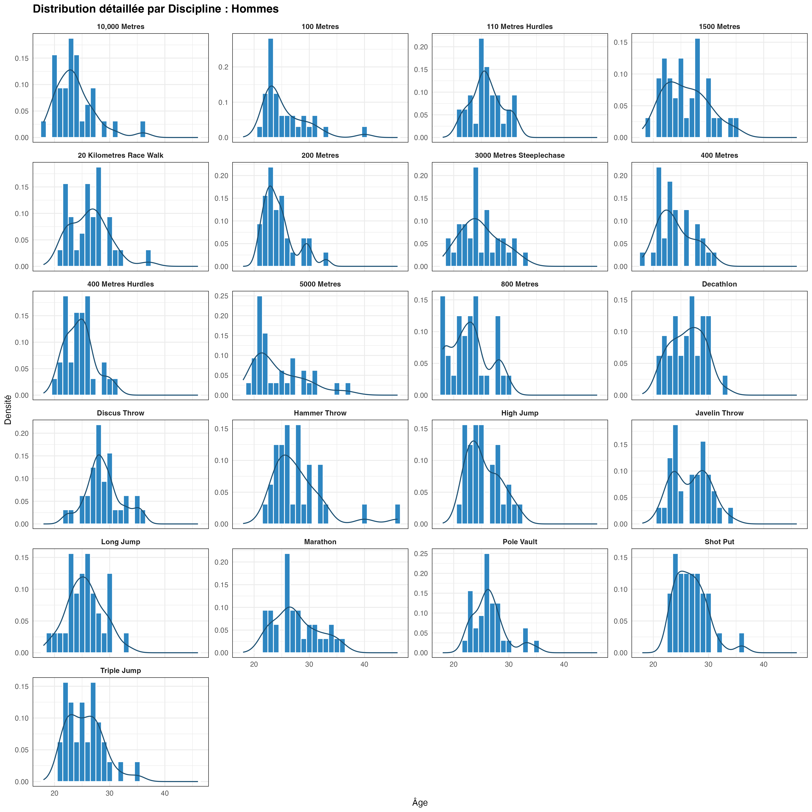
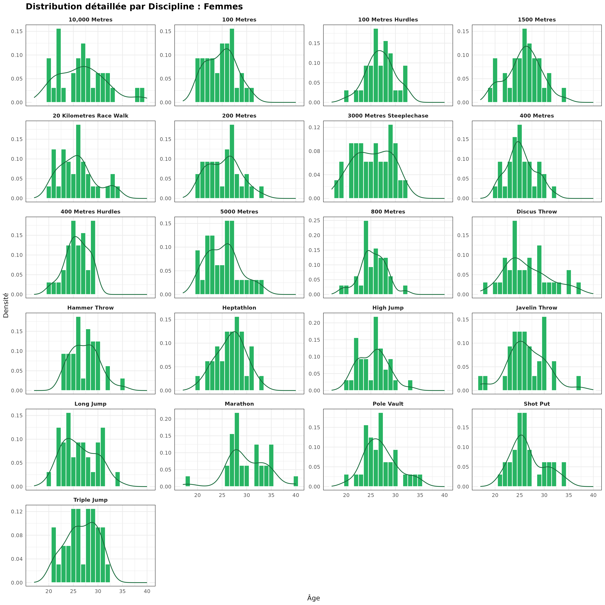
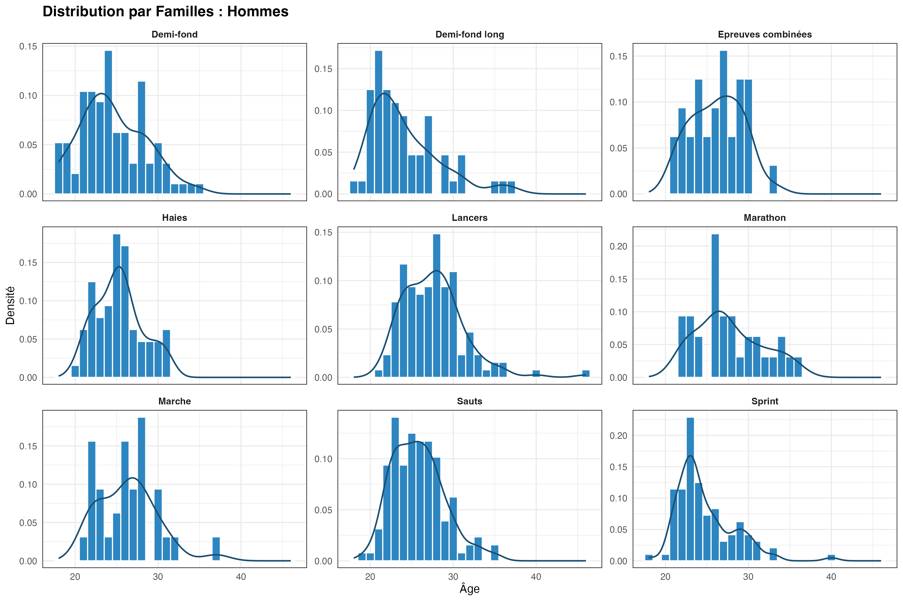
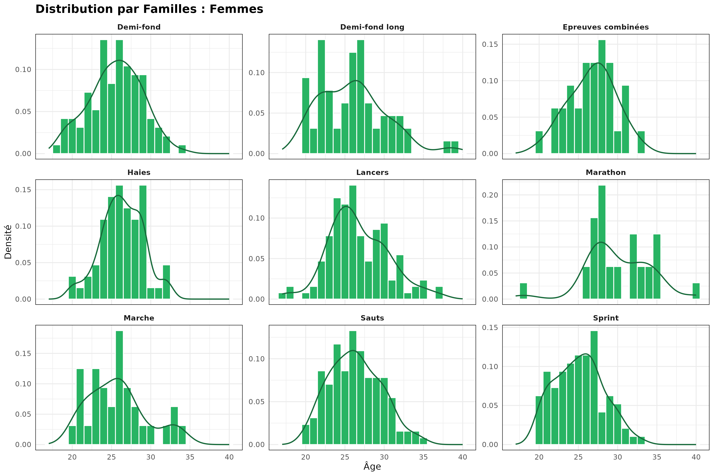
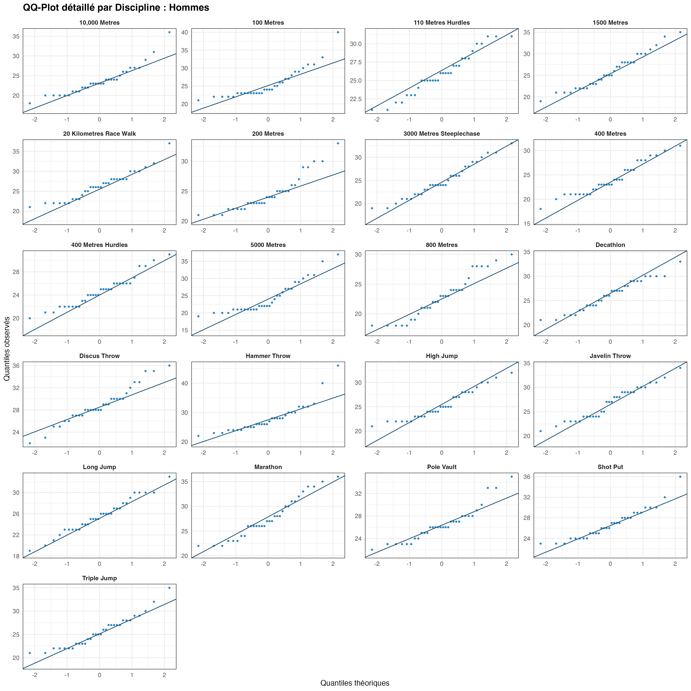
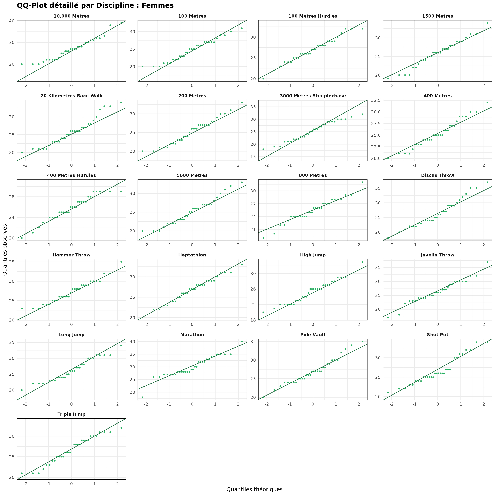
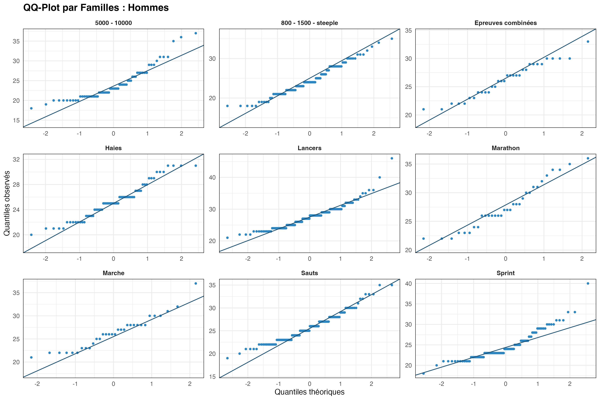
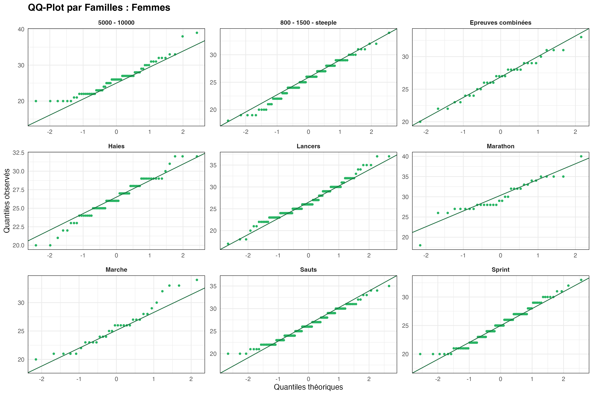

<!--Cette première partie ci-dessus entre deux « --- » s’appelle un « YAML header » (nom en anglais aussi utilisé en français) ou un « en-tête YAML ».-->

<!--« lang: fr » à remplacer par « lang: en » si rapport rédigé en anglais. Définir la langue du document est utile pour la typographie (par exemple les espaces autour de la ponctuation ne sont pas les mêmes dans les deux langues), la langue de la table des matières, des dates, le cadre linguistique du PDF généré, etc.-->

<!--« mainfont » définit la police utilisée et « fontsize » la taille de cette police.-->

```{=html}
<!--« header-includes: |
      \usepackage[bottom]{footmisc} » permet aux notes de bas de page d’être réellement en bas de page et non juste après la dernière ligne de texte (ce qui peut amener à des notes en milieu de page si le texte s’arrête à ce niveau).-->
```
```{=html}
<!--« text: |
      \usepackage[dvipsnames]{xcolor} » permet de mettre des portions de texte en couleur.-->
```
```{=html}
<!--« text: |
      \usepackage{booktabs} » permet d’utiliser le langage LaTeX pour améliorer la présentation des tableaux. -->
```
<!--« geometry » définit les marges de chaque taille du rapport. « top », en haut ; « bottom », en bas ; « left », à gauche ; « right », à droite.-->

```{=html}
<!--« bibliography: references.bib
citation: true
link-citations: true 
nocite: "@*" » est utile pour faire une liste bibliographique, pour plus d’explications, voir la section dédiée.-->
```
<!--La présentation de la page de titre est codée ci-dessous en LaTeX qui est un langage supporté par les documents Quarto sur RStudio ; sauf à vouloir innover la présentation, vous n’avez pas à apprendre le langage LaTeX à cette fin. Toutefois, selon la nature du projet, vous aurez peut-être à étudier davantage LaTeX pour rédiger des formules mathématiques ou pour améliorer la présentation de vos tableaux. Page officielle de ce langage de programmation : https://www.latex-project.org/ (en anglais). De nombreux autres sites également en français enseignent l’utilisation de LaTeX, dans son ensemble ou pour un usage particulier de ce langage.-->

```{=tex}
\begin{titlepage}
\centering

\includegraphics{ressources/ensai_logo_1.png}\\
\vspace{1.0cm}

{\LARGE\textsc{Rapport de projet statistique}}\\
\vspace{0.5cm}
{\large Élèves 2A}

\vspace{2.5cm}

\rule{\textwidth}{0.5mm}\\
\vspace{0.8cm}
{\huge\bfseries Modélisation de la relation âge-performance et identification de l'âge au pic en athlétisme de haut niveau}\\
\vspace{0.8cm}
\rule{\textwidth}{0.5mm}\\

\vspace{2.5cm}

\begin{flushleft}
\emph{Étudiants :}\\
Arthur \textsc{Deletang}\\
Maëlys \textsc{D'Halluin}\\
Clémence \textsc{Pinsard}
\end{flushleft}

\begin{flushright}
\emph{Tuteur :}\\
Imad {Hamri}\\
\end{flushright}

\vfill 
\begin{center}
École nationale de la statistique et de l’analyse de l’information\\
2025--2026
\end{center}
\end{titlepage}
```
<!--« vspace » définit la taille verticale d’un espace à laisser vide.-->

<!--« flushleft », « flushright » et « center » : alignements à gauche, à droite et centré.-->

<!--« \emph » met du texte en italique dans un texte en romain et vice versa.-->

<!--« vfill » renvoie le texte codé par la suite (ici jusqu’à « \end{titlepage} » en bas de la page.-->

<!--Dans « 2025--2026 », les deux traits d’union permettent de faire un tiret long. « 2025--2026 » pourra être remplacé par une date.-->

# Résumé {.unnumbered}

\noindent La détection précoce des talents sportifs et la compréhension de la trajectoire des athlètes d'élite constituent des enjeux majeurs pour les fédérations sportives internationales. Cette étude s'intéresse à la relation entre l'âge et la performance en athlétisme, en cherchant à identifier l'âge au pic de performance selon les disciplines et le sexe. Mieux comprendre cette dynamique permet non seulement d'optimiser la planification des carrières sportives, mais aussi d'améliorer les stratégies de détection et d'accompagnement des jeunes athlètes. L'analyse s'appuie sur les données de World Athletics couvrant la période 1985--2024, recensant les meilleures performances annuelles mondiales par discipline et par sexe. Deux modèles non linéaires sont mobilisés : le modèle de Moore et al. (1975) et le modèle IMAP (Berthelot et al., 2019), appliqués à différentes familles de disciplines. Cette étude permet de comparer les dynamiques de progression et de déclin entre disciplines et entre sexes, et ainsi contribuer à une meilleure connaissance de l'évolution des performances au cours d'une carrière.

# Abstract {.unnumbered}

\noindent Early talent detection and understanding the career trajectories of elite athletes are key challenges for international sports federations. This study examines the relationship between age and performance in athletics, aiming to identify peak performance age across disciplines and sexes. A deeper understanding of this dynamic can help optimize career planning and improve strategies for identifying and supporting young athletes. The analysis draws on World Athletics data spanning 1985--2024, covering the best annual performances worldwide per discipline and sex. Two nonlinear models are applied: the Moore model et al. (1975) and the IMAP model (Berthelot et al., 2019), across various discipline families. This study allows us to compare the dynamics of progression and decline between disciplines and between sexes, and thus contribute to a better understanding of how performance changes over the course of a career.

\newpage

\tableofcontents

\newpage

# Introduction {.unnumbered}

## Contexte et enjeux {.unnumbered}

\noindent La détection précoce des talents sportifs constitue un enjeu majeur pour les fédérations internationales d'athlétisme. Si la question de l'identification des jeunes athlètes prometteurs semble intuitive, elle se révèle en réalité bien plus complexe : les performances exceptionnelles observées à l'adolescence ne garantissent pas nécessairement la réussite au plus haut niveau à l'âge adulte. Ce constat soulève une problématique centrale : comment identifier, parmi les jeunes athlètes, ceux qui vont réussir à atteindre un haut niveau de performance à l'âge adulte (catégorie sénior) ?\

\noindent Cette question s'inscrit dans un contexte scientifique où la relation entre l'âge et la performance sportive a fait l'objet de nombreuses recherches. Depuis les travaux pionniers de Moore en 1975, qui proposa le premier modèle mathématique de cette relation, la communauté scientifique n'a cessé d'approfondir la compréhension de cette dynamique. Plus récemment, Berthelot et ses collaborateurs ont développé en 2019 le modèle IMAP (Integrative Model of Age-Performance), fondé sur des mécanismes biologiques cellulaires, offrant ainsi une nouvelle perspective pour modéliser l'évolution des capacités physiques tout au long de la vie.\

\noindent Notre étude s'appuie sur une base de données internationale disponible sur le site de World Athletics, couvrant la période 1985-2025 et contenant un bilan annuel (meilleure performance) par athlète, pour chaque sexe, dans chaque discipline athlétique. Ce corpus, portant sur plusieurs dizaines de milliers de performances au plus haut niveau mondial, permet d'analyser finement la trajectoire des athlètes d'élite à travers différentes disciplines.

## Objectif de l'étude {.unnumbered}

\noindent L'objectif principal de ce projet est d'analyser la relation entre l'âge et la performance en athlétisme. Plus spécifiquement, nous cherchons à comprendre comment évoluent les performances athlétiques au fil du temps et à déterminer l'âge auquel les athlètes atteignent leur pic de performance.\

\noindent Certaines études caractérisent la maturité athlétique d'une discipline par l'âge moyen de ses compétiteurs lors d'une saison donnée. Cette approche peut toutefois être trompeuse : selon les pays ou les disciplines, les athlètes ne débutent ni ne terminent leur carrière au même âge, ce qui fait varier cet âge moyen indépendamment du niveau de performance.  Notre étude se concentre donc sur l'identification de l'âge au pic de performance, c'est-à-dire l'âge auquel les capacités athlétiques sont à leur maximum. Cette approche permet de mieux comprendre la dynamique temporelle de la performance sportive, caractérisée par une phase de croissance progressive des capacités, suivie d'un plateau puis d'un déclin lié au vieillissement.\

\noindent Ce rapport s'articule en trois parties. Une première étude présente les statistiques descriptives et une analyse inférentielle de l'âge au pic observé selon les disciplines et le sexe. Une deuxième étude mobilise deux modèles non linéaires, le modèle de Moore (1975) et le modèle IMAP (Berthelot et al., 2019), afin de modéliser la trajectoire complète de la performance. Enfin, une troisième partie confronte les estimations empiriques et modélisées afin d'en évaluer la cohérence.

## Questions de recherches et hypothèses de l'étude {.unnumbered}

\noindent L'analyse de nos données vise à répondre à plusieurs interrogations fondamentales sur la dynamique de la performance athlétique. La littérature scientifique nous guide dans la formulation de nos attentes quant aux résultats escomptés.\

\noindent Tout d'abord, nous cherchons à caractériser la variabilité de l'âge au pic de performance selon les disciplines. Les travaux d'Allen et Hopkins [@Allen2015] ont établi une relation claire entre la durée de l'épreuve et l'âge optimal de performance : dans les épreuves de puissance explosive et de sprint, l'âge au pic décroît avec la durée de l'effort. À l'inverse, pour les épreuves d'endurance, l'âge au pic augmente avec la durée, s'échelonnant d'environ 20 ans pour les épreuves courtes à près de 39 ans pour l'ultra-endurance cycliste. Cette tendance s'explique par les différences dans les systèmes énergétiques sollicités et le temps nécessaire au développement complet des capacités aérobies. Nous nous attendons donc à observer dans nos données un âge au pic plus précoce pour les épreuves de sprint et de saut, et plus tardif pour les disciplines d'endurance comme le demi-fond et le fond.\

\noindent La question des différences entre sexes mérite également une attention particulière. Bien que plusieurs études, notamment celle d'Allen et Hopkins [@Allen2015], rapportent peu de différences entre hommes et femmes dans l'âge au pic de performance pour les épreuves explosives et d'endurance, d'autres travaux suggèrent une distinction : l'analyse des Jeux Olympiques 2020 [@Infographic2020] révèle que l'âge moyen des athlètes masculins est d'un an supérieur à celui des femmes. De plus, des études sur le vieillissement athlétique indiquent que le déclin de performance avec l'âge pourrait être plus marqué chez les femmes que chez les hommes dans certaines disciplines, particulièrement en sprint, tandis que cette différence s'atténue dans les épreuves d'endurance longue. Nos analyses chercheront à confirmer ou infirmer ces tendances sur notre échantillon d'athlètes.\

\noindent Enfin, la dynamique temporelle de la performance nous intéresse particulièrement. La relation âge-performance suit typiquement une forme asymétrique en U inversé : une phase de croissance progressive durant l'enfance et l'adolescence, un plateau lors du pic de performance à l'âge adulte, puis un déclin dont la vitesse s'accélère après 70 ans. Carter [@Carter2019] décrit cette asymétrie comme une caractéristique fondamentale du vieillissement humain. La phase de croissance et la phase de déclin ne sont pas symétriques, et cette asymétrie pourrait varier selon les disciplines. Les épreuves de puissance, qui dépendent fortement des fibres musculaires rapides, connaissent un déclin plus précoce et prononcé que les épreuves d'endurance, où la perte de capacité aérobie est plus progressive. Nous explorerons donc la vitesse de progression en début de carrière et la vitesse de déclin après le pic, en comparant ces dynamiques entre disciplines et entre sexes.\

\newpage

# Présentation des données

\noindent Notre étude s'appuie sur une base de données issue de World Athletics, la fédération sportive internationale chargée de régir les fédérations nationales d'athlétisme et d'organiser les compétitions internationales mondiales \footnote{\url{https://fr.wikipedia.org/wiki/World_Athletics}}. Cette base recense, pour chaque discipline et chaque année entre 1985 et 2025, quelques unes des meilleures performances mondiales réalisées lors de compétitions officielles. Notre étude se limitera aux performances réalisées dans des disciplines présentes dans les grands championnats (Championnats du monde, d'Europe).\

\noindent Les données comportent plusieurs variables clés : l'identifiant de l'athlète, son âge au moment de la performance, son sexe, sa nationalité, la discipline pratiquée, la performance brute (temps, distance ou hauteur selon la discipline) et le ResultScore. Ce dernier, développé par World Athletics, constitue une métrique normalisée permettant de comparer les performances entre disciplines différentes en s'appuyant sur des paramètres définis par des experts du domaine.\

\noindent La base couvre l'ensemble des disciplines olympiques en athlétisme : courses (sprint, demi-fond, fond, haies), sauts (hauteur, longueur, triple saut, perche), lancers (poids, disque, javelot, marteau) et épreuves combinées (décathlon, heptathlon). Cette diversité permet d'analyser finement les spécificités de chaque famille de disciplines.\

\noindent Il convient toutefois de noter certaines limites structurelles : un déséquilibre dans la répartition des âges, marqué par une raréfaction des athlètes de plus de 35 ans, ainsi qu'une possible hétérogénéité dans la qualité de l'enregistrement des données selon les périodes et les pays. Ce faible effectif chez les seniors s'explique par la nature même de notre échantillon, qui se concentre sur les performances de l'élite mondiale à chaque saison. Ces biais potentiels seront intégrés à notre analyse et discutés lors de l'interprétation des résultats.

## Préparation et nettoyage des données

\noindent Le passage des données brutes à un échantillon exploitable a nécessité un protocole de nettoyage, articulé autour de quatre étapes clés :

-   **Nettoyage initial :** Les entrées ne disposant pas de performance numérique exploitable ou d'une date de naissance valide ont été écartées.

-   **Calcul de l'âge :** Pour chaque performance gardée, l'âge de l'athlète a été calculé comme la différence entre l'année où la performance a été réalisée (*season*) et l'année de naissance de l'athlète. Il est donc important de noter qu'une limite méthodologique inhérente à la base de données apparait alors.

-   **Identification des carrières terminées :** Afin d'éviter le biais de troncature (inclure un athlète n'ayant pas encore atteint son pic), nous avons restreint l'étude aux athlètes retraités. Un seuil de "retraite" a été fixé à l'année 2022 : tout athlète ayant réalisé une performance après cette date a été considéré comme actif et exclu de l'analyse. Ainsi notre analyse porte sur la période 1985-2022, c'est-à-dire de la saison la plus ancienne présente dans la base de données jusqu'à 2022.

-   **Sélection de la meilleure performance annuelle, filtrage par expérience et équilibrage (Top 32) :** Pour chaque athlète, à chaque âge et dans chaque discipline, nous n'avons conservé que la meilleure performance annuelle. Les disciplines ont ensuite été regroupées en neuf familles majeures : **Demi-fond long** (5000 mètres et 10,000 mètres), **Demi-fond** (800 mètres, 1500 mètres, 3,000 mètres steeplechase), **Épreuves combinées**, **Marche**, **Marathon**, **Sauts** (Perche, Hauteur, Longueur, Triple saut), **Haies** (100 ou 110 mètres haies, 400 mètres haies), **Sprint** (100 mètres, 200 mètres et 400 mètres) et **Lancers** (Poids, Javelot, Marteau et Disque). Afin de garantir que l'âge au pic observé soit représentatif d'une trajectoire complète, seuls les athlètes ayant au moins **5 années de performances** enregistrées dans une même discipline ont été retenus. Enfin, pour corriger les disparités d'effectifs entre les sexes, nous avons procédé à un échantillonnage équilibré en sélectionnant le **Top 32** des meilleurs athlètes par discipline et par sexe, seuil défini par l'effectif le plus restreint du jeu de données (heptathlon).

-   **Récupération de toutes les performances des athlètes du TOP 32 dans chaque discipline :** Nous avons récupéré toutes les performances des athlètes du top 32 de chaque discipline.

## Variables d'intérêt

\noindent L'analyse repose sur un ensemble de variables structurées pour répondre à la problématique de l'évolution de la performance :

-   **Sex :** Variable qualitative à 2 modalités (men, women) qui va être utile pour comparer les performances entre les femmes et les hommes. \vspace{5pt}
-   **Famille :** Regroupement des disciplines par famille (sprints, lancers, sauts, haies, marche, épreuves combinées, marathon, demi-fond long, demi-fond) \vspace{5pt}
-   **Discipline :** Variable qualitative à 23 modalités correspondant aux noms des différentes disciplines de l'athlétisme. \vspace{5pt}
-   **Age :** Variable quantitative que nous avons codé représentant l'âge de l'athlète lorsqu'il a réalisé la performance correspondante, elle est calculée en faisant la différence entre l'année au cours de laquelle la performance a été réalisée et l'année de naissance de l'athlète. \vspace{5pt}
-   **Age_Pic_Obs :** Variable quantitative représentant l’âge auquel l’athlète a réalisé son record personnel absolu au cours de sa carrière. En tant que variable d’intérêt principale, elle correspond au moment où la performance maximale a été enregistrée pour chaque individu. \vspace{5pt}
-   **mark_numeric :** Variable quantitative qui correspond à la meilleure performance d'un athlète sur une saison au format numérique (en seconde ou mètre selon la discipline). \vspace{5pt}
-   **meilleure_perf_km_par_h :** Variable quantitative calculée à partir de **mark_numeric** pour les disciplines où **mark_numeric** correspond à un temps en seconde. Elle permet de convertir la performance en kilomètre par heure pour les disciplines de courses ou marche afin d'avoir des valeurs positives à maximiser dans nos modèles.

\newpage

# Étude 1 : Statistiques descriptives et analyse inférentielle

\noindent Dans l'optique de mieux comprendre la structure de cet échantillon d'élite et d'en obtenir une vue d'ensemble, les caractéristiques de l'âge au pic observé sont examinées en premier lieu. Cette analyse préliminaire permet d'identifier des tendances majeures et de justifier le choix des modélisations non linéaires (Moore et IMAP) qui suivront.

## Méthodologie

\noindent La démarche analytique est structurée en trois phases complémentaires. Une **analyse descriptive** globale est d'abord menée pour identifier les indicateurs de position (médiane, quartiles) et de dispersion selon le sexe et la discipline. Ensuite, la distribution des données est soumise à un **test de normalité** (Shapiro-Wilk) afin de valider le cadre statistique. Enfin, une **analyse inférentielle** est déployée pour tester statistiquement les liens entre le sexe, la spécialité athlétique et l'âge de performance.

## Analyse descriptive de l'âge au pic : Indicateurs de position et variabilité inter-disciplines

\noindent Afin de cerner les principales caractéristiques de la population étudiée, une analyse descriptive a été menée sur l'ensemble des disciplines. L'examen de la distribution globale (@fig-hist) montre que la performance de haut niveau est fortement concentrée : 68,2 % des records masculins et 65,9 % des records féminins sont enregistrés dans une fenêtre comprise entre 22 et 28 ans.

\noindent On note cependant une divergence  selon le genre. Les hommes semblent présenter une précocité plus marquée, avec 38,4 % d'entre eux atteignant leur pic entre 21 et 24 ans, contre seulement 27,7 % pour les femmes dans cette même tranche. À l'inverse, la distribution féminine est plus décalée vers la maturité : 58,2 % des femmes atteignent leur âge au pic à partir de 26 ans, alors que cette proportion est de 48,7 % chez les hommes.\

\noindent Enfin, la valeur extrême de 46 ans observée dans l'échantillon correspond au lanceur de marteau Oleksandr Dryhol qui, bien qu'ayant établi un record du monde vétéran en 2012, a été disqualifié des Jeux Olympiques cette même année pour dopage ; un rappel que certains pics de performance atypiques doivent être interprétés avec une certaine réserve.

::: {#fig-hist fig-pos="H"}
\fbox{\includegraphics[width=0.90\textwidth]{outputs/histogramme_global.png}}

Distribution de l'âge au pic
:::

\noindent Les indicateurs de position et de dispersion associés à cette distribution sont détaillés dans le tableau ci-dessous (@tbl-stats) :

| Sexe   | Eff. | Min | Q1  | Moyenne $\pm$ SD | Médiane | Q3  | Max |
|:-------|:----:|:---:|:---:|:----------------:|:-------:|:---:|:---:|
| Hommes | 672  | 18  | 23  | 25.72 $\pm$ 3.74 | **25**  | 28  | 46  |
| Femmes | 672  | 17  | 24  | 26.25 $\pm$ 3.60 | **26**  | 29  | 40  |

: Résumé statistique de l'âge au pic observé selon le sexe {#tbl-stats}

\noindent Une différence d'un an est observée sur l'âge médian, s'établissant à 25 ans chez les hommes contre 26 ans chez les femmes. La répartition par familles de disciplines (@fig-box) montre également des variations de maturité sensibles selon les spécialités.

::: {#fig-box fig-pos="H"}
\fbox{\includegraphics[width=0.85\textwidth]{outputs/boxplot_familles.png}}

Âges au pic observés selon les familles de disciplines et le sexe
:::

\noindent Le groupe **Sprint** se distingue par la maturité la plus précoce, avec des médianes basses et une distribution resserrée. À l'inverse, le **Marathon** et les **Lancers** affichent les médianes les plus élevées.

\vspace{5pt}

\noindent On observe des structures de distribution spécifiques selon les familles :

-   **Proximité entre sexes :** En **Marche**, en **Sauts** et dans les **Épreuves combinées**, les médianes et les quartiles sont quasiment alignés entre les hommes et les femmes. \vspace{5pt}
-   **Dispersion :** La famille **Lancers** et le **Marathon** montrent des distributions supérieures très étirées, signalant une plus grande variabilité de l'âge au pic. \vspace{5pt}
-   **Valeurs extrêmes :** Les **Lancers** et le **Demi-fond long** présentent de nombreux points isolés vers le haut, particulièrement chez les hommes, contrairement aux épreuves combinées ou aux Haies.

\vspace{4pt}

\noindent Cette première approche par grandes familles met en évidence des tendances liées à la nature de l'effort. Toutefois, la variabilité observée (notamment les nombreux points extrêmes) suggère que l'analyse par famille peut masquer des disparités internes. Pour affiner cette compréhension, une analyse à l'échelle de chaque discipline est nécessaire afin d'identifier les spécialités qui s'écartent des moyennes de leur propre groupe.

### Analyse descriptive par discipline {.unnumbered .unlisted}

\noindent Le tableau ci-dessous (@tbl-desc-complet) présente une synthèse détaillée de l'âge au pic observé pour chaque spécialité. Cette vue permet d'identifier les spécificités propres à chaque discipline, au-delà des tendances globales par familles.

| Discipline    | Hommes <br> (Moy ± SD) | Hommes <br> Med \[Min-Max\] | Femmes <br> (Moy ± SD) | Femmes <br> Med \[Min-Max\] |
|:--------------|:-------------:|:-------------:|:-------------:|:-------------:|
|   100 m      |       25.6 ± 4.1       |        24 \[21-40\]         |       24.8 ± 3.0       |        25 \[20-31\]         |
|   200 m      |       24.5 ± 3.0       |        24 \[21-33\]         |       25.3 ± 3.4       |        26 \[20-33\]         |
|   400 m      |       24.1 ± 3.3       |        23 \[18-31\]         |       25.3 ± 2.9       |        25 \[20-32\]         |
|   800 m      |       22.9 ± 3.5       |        23 \[18-30\]         |       25.4 ± 2.7       |        26 \[19-32\]         |
|   1500 m     |       25.9 ± 4.0       |        25 \[19-35\]         |       25.9 ± 3.5       |        26 \[19-34\]         |
|   5000 m     |       24.5 ± 4.6       |        22 \[19-37\]         |       25.2 ± 3.4       |        26 \[20-33\]         |
|   10 000 m   |       23.7 ± 3.6       |        23 \[18-36\]         |       26.8 ± 4.9       |        27 \[20-39\]         |
|   Marathon   |       27.7 ± 4.0       |        27 \[22-36\]         |       30.0 ± 4.1       |        29 \[18-40\]         |
|   Haies hautes     |       26.0 ± 2.8       |        26 \[21-31\]         |       26.9 ± 2.9       |        27 \[20-32\]         |
|   400 m haies    |       24.6 ± 2.7       |        24 \[20-31\]         |       25.8 ± 2.4       |        26 \[20-29\]         |
|   Steeple    |       24.9 ± 3.6       |        24 \[19-33\]         |       25.3 ± 3.9       |        26 \[18-32\]         |
|   Marche     |       26.3 ± 3.6       |        26 \[21-37\]         |       25.8 ± 3.7       |        26 \[20-34\]         |
|   Hauteur    |       25.4 ± 3.0       |        25 \[21-32\]         |       25.4 ± 3.0       |        26 \[20-33\]         |
|   Perche     |       26.5 ± 3.0       |        26 \[22-35\]         |       27.0 ± 3.4       |        27 \[20-35\]         |
|   Longueur   |       25.6 ± 3.2       |        26 \[19-33\]         |       26.2 ± 3.5       |        26 \[20-34\]         |
|   T. saut    |       25.6 ± 3.3       |        25 \[21-35\]         |       26.7 ± 3.2       |        26 \[21-32\]         |
|   Poids      |       26.8 ± 2.9       |        26 \[23-36\]         |       26.7 ± 3.5       |        26 \[21-34\]         |
|   Disque     |       28.8 ± 3.3       |        28 \[22-36\]         |       26.5 ± 4.6       |        26 \[18-37\]         |
|   Marteau    |       28.0 ± 5.0       |        26 \[22-46\]         |       27.3 ± 2.9       |        28 \[23-35\]         |
|   Javelot    |       26.8 ± 3.3       |        27 \[21-34\]         |       26.4 ± 4.0       |        26 \[17-37\]         |
|   Combinées  |       26.2 ± 3.1       |        26 \[21-33\]         |       26.8 ± 3.0       |        27 \[20-33\]         |

: Synthèse descriptive de l'âge au pic par discipline et sexe {#tbl-desc-complet}

\vspace{4pt}

\noindent Plusieurs constats se dégagent de cette analyse par discipline :

\vspace{5pt}

**Disciplines à pic précoce :** Les épreuves de sprint (100m, 200m, 400m) et le 800m chez les hommes présentent les âges moyens les plus bas (22.9 à 25.6 ans), avec des médianes encore plus précoces pour certaines (22-23 ans).

\vspace{5pt}

**Disciplines à pic tardif :** Le marathon se distingue nettement avec les âges au pic les plus élevés, tant chez les hommes (27.7 ± 4.0 ans) que chez les femmes (30.0 ± 4.1 ans). Les lancers lourds (disque, marteau) affichent également des âges élevés chez les hommes (≥28 ans).

\vspace{5pt}

**Variabilité intra-discipline :** L'écart-type et l'étendue (min-max) varient considérablement selon les épreuves. Le marteau hommes présente la plus grande variabilité (SD = 5.0, étendue de 24 ans), tandis que les haies et les sprints montrent une plus grande homogénéité (SD $\approx$ 2,5-3,5 ans).

\vspace{5pt}

**Différences entre sexes :** Les femmes tendent à atteindre leur pic légèrement plus tard que les hommes dans les épreuves d'endurance (800m, 10000m, marathon) et les sauts, alors que l'écart est minime voire inversé dans les sprints et lancers.

## Diagnostic de distribution et test de normalité

\noindent Avant de procéder aux tests d'inférence, il est indispensable d'étudier la forme de la distribution de notre variable d'intérêt : l'âge au pic observé. Cette étape permet de vérifier si les données peuvent être vraisemblablement approchées par une loi normale, condition nécessaire pour justifier l'utilisation de tests paramétriques classiques.


### Analyse visuelle par les histogrammes {.unnumbered .unlisted}

\noindent L'examen des histogrammes permet d'observer la répartition réelle des athlètes par classe d'âge. La @fig-hist-men présente cette distribution pour les athlètes masculins, segmentée par Famille de disciplines.

::: {#fig-hist-men fig-pos="H"}
\fbox{\includegraphics[width=1\textwidth]{outputs/hist_age_hommes.png}}

Distributions de l'âge au pic de performance (Athlètes masculins)
:::

\setlength{\parindent}{0pt}
*Note : Les histogrammes concernant les athlètes féminines (@fig-hist-fam-women), les planches détaillées par discipline (@fig-hist-disc-men) ainsi que l'ensemble des graphiques Quantile-Quantile (@fig-qq-disc-men) sont consultables en Annexe.*
\setlength{\parindent}{15pt}

\vspace{5pt}

\noindent L'observation de la @fig-hist-men révèle des profils variés :

-   Certaine famille, comme le **Demi-fond**, montre une concentration très marquée sur des âges précoces avec une chute rapide de l'effectif. \vspace{5pt}
-   D'autres, comme les **Lancers** et le **Marathon**, présentent une distribution décalée vers la droite et plus étalée, suggérant une plus grande hétérogénéité des âges de performance. \vspace{5pt}
-   De manière générale, on observe une "queue" de distribution vers la droite (asymétrie positive), indiquant que si l'accès au haut niveau est peu observé avant 20 ans, le maintien de la performance peut se prolonger tardivement pour certains individus.

\vspace{5pt}

\noindent Cette asymétrie positive est confirmée lorsque l'on descend à l'échelle de la discipline individuelle (voir les histogrammes par discipline @fig-hist-disc-men en Annexe). Même sur des effectifs plus réduits, la forme des distributions reste hachée et décalée vers la gauche, ce qui visuellement invalide l'utilisation d'une courbe en cloche (normale) pour modéliser ces données. Cette absence de normalité est confirmée par les graphiques Quantile-Quantile (QQ-plots) en Annexe (@fig-qq-disc-men), où l'écart des points par rapport à la droite de référence valide l'utilisation de tests non paramétriques. Ces observations visuelles sont les premiers indicateurs de la nécessité d'utiliser des outils statistiques non paramétriques.

\newpage

### Test statistique de normalité {.unnumbered .unlisted}

\noindent Pour valider les observations visuelles, le test de **Shapiro-Wilk** a été appliqué systématiquement. Ce test évalue formellement si les données de chaque groupe peuvent être modélisées par une loi normale :

- **$H_0$ :** La distribution de l'âge au pic selon la famille (ou la discipline) peut être raisonnablement approchée par une loi normale.
- **$H_1$ :** La distribution de l'âge au pic selon la famille (ou la discipline) ne peut pas être approchée par une loi normale.
- Décision : Si $p < 0,05$, on rejette **$H_0$** (normalité rejetée) et il est nécessaire d'utiliser des tests non paramétriques.

\noindent Afin de neutraliser le "paradoxe de la puissance" (la sur-sensibilité du test aux grands effectifs), nous avons comparé les taux de rejet de l'hypothèse nulle selon deux échelles d'analyse : l'échelle globale des familles et l'échelle spécifique des disciplines.

| Niveau d'analyse | Effectif moyen ($n$) | Nb total de tests | Tests rejetant $H_0$ ($p < 0,05$) | \% de Rejet |
|:-------------|:------------:|:------------:|:-----------------:|:------------:|
| **Famille**      |        **75**        |        18         |                11                 | **61,1 %**  |
| **Discipline**   |        **32**        |        42         |                10                 | **23,8 %**  |

: Synthèse des tests de normalité selon l'échelle d'analyse {#tbl-shapiro-synthese}

\setlength{\parindent}{0pt}
*Note : L'intégralité des résultats des tests de Shapiro-Wilk par famille (@tbl-shapiro-famille) et par discipline (@tbl-shapiro-discipline) est consultable en Annexe.*
\setlength{\parindent}{15pt}

\vspace{5pt}

\noindent L'analyse de la @tbl-shapiro-synthese révèle que :

1.  À l'échelle des **familles** ($n \approx 75$), le test est extrêmement sensible et rejette la normalité dans la majorité des cas (61,1 %).

2.  À l'échelle des **disciplines** (*n* = 32), niveau considéré comme le "juste milieu" statistique (suffisant pour la puissance mais évitant la sur-sensibilité), le taux de rejet tombe à 23 %.

### Conclusion sur le choix des tests {.unnumbered .unlisted}

\noindent L'analyse combinée des taux de rejet et des diagnostics graphiques confirme que l'âge au pic ne suit pas une loi normale de manière universelle. Bien que la normalité soit statistiquement acceptée pour certaines disciplines lorsque l'effectif est strictement contrôlé à $n=32$, une **méthodologie non paramétrique unique** est privilégiée pour l'ensemble de l'étude. Ce choix garantit la cohérence des comparaisons entre tous les groupes et assure la robustesse des résultats face aux distributions asymétriques observées.\

\setlength{\parindent}{0pt}
**Implication méthodologique :** 
\setlength{\parindent}{15pt}

1.  La **médiane** et les **quartiles** sont les indicateurs de référence pour décrire les positions (plus robustes que la moyenne face aux valeurs extrêmes).

2.  Des **tests non paramétriques** (Wilcoxon-Mann-Whitney et Kruskal-Wallis), fondés sur les rangs, sont exclusivement utilisés pour les comparaisons statistiques dans la suite de l'analyse.

\newpage

## Analyse inférentielle : Comparaison de l'âge au pic de performance selon le sexe et les disciplines

### Méthodologie {.unnumbered .unlisted}

\noindent Les procédures suivantes ont été appliquées avec un seuil de significativité $\alpha = 0,05$ :

- **Test de Wilcoxon-Mann-Whitney :** Utilisé pour comparer l'âge au pic entre deux groupes indépendants (comparaison par sexe).
  \begin{itemize}
    \item[---] $H_0$ : Les distributions de l'âge au pic sont identiques entre hommes et femmes.
    \item[---] $H_1$ : Les distributions de l'âge au pic diffèrent entre hommes et femmes.
  \end{itemize}

- **Test de Kruskal-Wallis :** Utilisé pour comparer plus de deux groupes indépendants. Il constitue l'alternative non paramétrique à l'ANOVA à un facteur.
  \begin{itemize}
    \item[---] $H_0$ : Les distributions de l'âge au pic sont identiques pour toutes les familles de disciplines.
    \item[---] $H_1$ : Au moins une famille de disciplines présente une distribution d'âge au pic différente des autres.
  \end{itemize}
    
- **Test post-hoc de Dunn :** En cas de résultat significatif au test de Kruskal-Wallis, cette procédure identifie les paires se distinguant spécifiquement. Une **correction de Bonferroni** est systématiquement appliquée aux $p$-values pour limiter le risque d'erreur de type I lié à la multiplicité des tests.

### Résultats {.unnumbered .unlisted}

\setlength{\parindent}{0pt}
**Effet global du sexe**
\setlength{\parindent}{15pt}

\noindent Le test de Wilcoxon-Mann-Whitney appliqué à l'ensemble de l'échantillon révèle une différence d'âge au pic statistiquement significative entre les sexes ($p = 0,0016$). La médiane globale de l'âge au pic s'établit à 26 ans pour les athlètes féminines contre 25 ans pour les athlètes masculins.\

\setlength{\parindent}{0pt}
**Effet global de la famille de disciplines**
\setlength{\parindent}{15pt}

\noindent Le test de Kruskal-Wallis indique un effet principal significatif de la discipline sur l'âge au pic ($\chi^2 = 98,22$, $p < 0,001$). Les comparaisons post-hoc de Dunn permettent d'isoler les contrastes suivants :

-   **L'exception du Marathon :** Cette épreuve se distingue significativement de la quasi-totalité des épreuves de course (du 100 m au 5000 m, $p_{adj} < 0,01$) et des sauts (Hauteur, Longueur). \vspace{5pt}
-   **Le contraste Lancers vs Vitesse/Demi-fond :** Le Lancer du Disque et le Lancer du Marteau présentent des distributions significativement décalées par rapport aux épreuves de vitesse (100 m, 200 m, 400 m) et au 800 m ($p_{adj} < 0,05$). \vspace{5pt}
-   **L'homogénéité du bloc explosif :** L'absence de différence statistiquement significative entre les familles des **Sauts**, des **Haies** et du **Sprint court** ($p_{adj} = 1,00$), indiquant une uniformité des âges au pic pour ces épreuves.

\setlength{\parindent}{0pt}
**Analyse de l'effet du sexe par familles de disciplines** 
\setlength{\parindent}{15pt}

\noindent Le tableau suivant présente les résultats des tests de comparaison de moyennes de rangs (Wilcoxon-Mann-Whitney) effectués au sein de chaque famille d'épreuves pour évaluer l'effet du sexe sur l'âge au pic observé ($n = 1344$).

\newpage

| Famille                          | Médiane H | Médiane F | Différence (F-H) | Conclusion |
|:------------------|:----------:|:----------:|:---------------:|:----------:|
|   Demi-fond long                  |   23.0    |   26.0    |    -3.0    |   **Significatif**   |
|   Marathon              |   27.0    |   29.0    |    -2.0    |   **Significatif**   |
|   Haies                 |   25.0    |   26.0    |    -1.0    |   **Significatif**   |
|   Demi-fond            |   24.0    |   26.0    |    -2.0    |   **Significatif**   |

: Principaux résultats du test de Wilcoxon par famille de discipline {#tbl-wilcox-familles-sig}

\setlength{\parindent}{0pt}
*Note : L'intégralité des résultats pour les neuf familles de disciplines est consultable en Annexe (@tbl-wilcox-familles-complet).*
\setlength{\parindent}{15pt}

\vspace{5pt}

\noindent Au seuil de significativité $\alpha = 0,05$, l'hypothèse nulle d'égalité des médianes est rejetée pour quatre familles : le Demi-fond long (5000-10000), le Marathon, le Demi-fond (800-1500-Steeple) et les Haies. Pour les cinq autres familles (Lancers, Sprint, Sauts, Marche et Épreuves combinées), aucune différence statistiquement significative n'est démontrée entre les sexes.\

\setlength{\parindent}{0pt}

**Analyse détaillée par Sexe et Discipline** \setlength{\parindent}{15pt}

\noindent L'examen désagrégé par épreuve individuelle (Sexe $\times$ Discipline) permet de tester l'effet du sexe sur 21 spécialités mixtes (@tbl-wilcox-disc).

| Discipline | Médiane H | Médiane F | Différence (F-H) | Conclusion |
|:------------------|:----------:|:----------:|:---------------:|:----------:|
| 800 mètres | 23.0 | 25.5 | +2.5 | **Significatif** |
| 10 000 mètres | 23.0 | 27.0 | +4.0 | **Significatif** |
| Marathon | 27.0 | 29.0 | +2.0 | **Significatif** |
| Lancer du disque | 28.0 | 25.5 | -2.5 | **Significatif** |

: Principaux résultats du test de Wilcoxon par discipline {#tbl-wilcox-disc}

\setlength{\parindent}{0pt}
*Note : L'intégralité des résultats pour les 21 disciplines mixtes est consultable en Annexe (@tbl-wilcox-annexe).*
\setlength{\parindent}{15pt}

\vspace{5pt}

\noindent Les résultats indiquent un écart significatif pour seulement 4 des 21 disciplines. Dans les épreuves du 800 m, du 10 000 m et du Marathon, la médiane féminine est supérieure à la médiane masculine. Le Lancer du Disque présente le schéma inverse (médiane masculine supérieure). Pour les 17 autres épreuves, l'hypothèse nulle d'égalité des médianes entre les sexes ne peut être rejetée.

## Discussion

\setlength{\parindent}{0pt}
**Distribution globale**
\setlength{\parindent}{15pt}

\noindent L'âge au pic observé se concentre majoritairement entre 22 et 28 ans pour les deux sexes. L'analyse fait apparaître une asymétrie positive, indiquant que si l'accès précoce au haut niveau est peu fréquent, certains athlètes maintiennent leur performance au-delà de 30 ans. Les médianes obtenues (25 ans chez les hommes, 26 ans chez les femmes) semblent cohérentes avec les valeurs de référence de la littérature. Par exemple, une étude de Hollings et al. [@Hollings2014] sur les finalistes mondiaux situe l'âge médian de performance maximale autour de 26 ans.\

\setlength{\parindent}{0pt}
**L'influence du sexe et de la discipline** 
\setlength{\parindent}{15pt}

\noindent Indépendamment du sexe, la famille de disciplines apparaît comme un facteur lié à la chronologie des carrières. Le groupe Sprint--Sauts--Haies affiche les pics les plus précoces et forme un ensemble homogène sans différence interne significative. À l'inverse, le Marathon et les Lancers présentent les médianes les plus tardives et les distributions les plus étalées. Cette opposition pourrait s'expliquer par les modèles de développement athlétique : les épreuves de puissance explosive culminent souvent tôt, tandis que les disciplines d'endurance ou de force technique pourraient nécessiter une accumulation d'expérience plus longue (Allen et al. [@Allen2015]). Concernant l'effet du sexe à l'échelle globale, la différence d'un an entre les médianes féminines et masculines est statistiquement significative ($p = 0,0016$), mais d'une ampleur mesurée. Elle constitue une tendance qui cache des profils très variés selon les spécialités.\

\setlength{\parindent}{0pt}

**Lien entre Sexe et Discipline** \setlength{\parindent}{15pt}

\noindent L'analyse par épreuve suggère que cet effet du sexe n'est pas uniforme. L'écart est significatif dans les familles d'endurance (Fond, Marathon, Demi-fond). Cette observation laisse supposer que les trajectoires féminines dans ces épreuves pourraient être caractérisées par une maturité plus tardive. Des travaux mentionnent que ce décalage pourrait être lié à des différences d'utilisation des lipides durant l'effort prolongé, favorisant potentiellement une forme de résistance métabolique à long terme (Tarnopolsky et al. [@Tarnopolsky2008]). À l'inverse, l'absence de différence significative pour le Sprint et les Sauts suggère que pour les disciplines explosives, les fenêtres temporelles de performance sont proches entre les sexes. Le lancer du disque constitue le seul cas où la médiane masculine dépasse celle des femmes ($p = 0,012$).\

\setlength{\parindent}{0pt}

**Perspectives et limites** \setlength{\parindent}{15pt}

\noindent Ces interprétations doivent être considérées avec prudence. Les liens statistiques établis ici ne permettent pas de conclure à une causalité biologique directe. Il est possible que des facteurs contextuels comme la structure des circuits professionnels ou des contextes socio-économiques participent aux écarts observés (Capranica et al. [@Capranica2013]). De plus, il convient de noter que l'histoire de l'athlétisme féminin suggère que l'accès plus tardif à certaines épreuves (le Marathon féminin n'est intégré aux Jeux Olympiques qu'en 1984 et le 10 000 m en 1988) a pu potentiellement influencer la structure des carrières et les âges de performance maximale observés, par rapport aux épreuves masculines plus anciennement institutionnalisées.\

\noindent Ces résultats appuient néanmoins l'idée d'une segmentation par famille et par discipline, tout en tenant compte de la variable du sexe, pour la suite de l'étude. L'âge au pic n'étant qu'un indicateur ponctuel, il semble utile de modéliser la durée de maintien au plus haut niveau en conservant cette distinction, afin de mieux appréhender les trajectoires de performance complètes.

\newpage

# Etude 2 : Modélisation non linéaire de la relation âge-performance en athlétisme de haut niveau : estimation et comparaison des modèles de Moore et IMAP

\noindent Les tendances descriptives dégagées dans l'étude précédente ont mis en évidence une variabilité significative de l'âge au pic selon les disciplines et le sexe, tout en soulignant les limites d'une approche fondée sur un indicateur ponctuel. Afin de modéliser la trajectoire complète de la performance — phase de progression, plateau et déclin — deux modèles non linéaires sont mobilisés : le modèle de Moore (1975) et le modèle IMAP (Berthelot et al., 2019). Cette approche permet d'estimer l'âge au pic à partir d'une courbe continue ajustée sur les données individuelles, et d'en comparer les dynamiques entre disciplines et entre sexes.


## Modèles

\noindent De nombreux modèles ont déjà été élaborés afin de modéliser la relation entre l'âge et la performance en athlétisme. Nous allons nous concentrer sur le modèle de Moore (1975) ainsi que sur le modèle IMAP (2019). Ces deux modèles sont des modèles incluant une partie qui va croitre avec l'âge jusqu'à atteindre un pic ainsi qu'une seconde partie de décroissance.

### Modèle de Moore (1975)

\noindent Dans son modèle, Dan H. Moore explique la relation entre l'âge et la performance sur un large éventail d'âges, de 5 ans jusqu'à 75 ans. Il utilise l'équation suivante pour modéliser la performance en fonction de l'âge.

$$P(t) = a \cdot(1 - e^{-bt}) + c \cdot(1 - e^{dt})$$ {#eq-moore}

\noindent L'@eq-moore est un modèle à double exponentielle, constitué de deux composantes :\
- $P_1(t) = a(1 - e^{-bt})$ : correspond à la phase d'amélioration des performances avec l'âge.\
- $P_2(t) = c(1 - e^{dt})$ : correspond à la phase de déclin des performances, liée au vieillissement.

\vspace{5pt}

\noindent Dans ce modèle, les paramètres a, b, c et d sont tous positifs et P(t) correspond à la performance à l'âge t. Dans cette équation, t désigne l'âge de l'athlète exprimé en années, et P(t) représente la performance à cet âge. Selon la discipline, la performance peut être exprimée comme une vitesse de course (en kilomètres par heure), une distance (en mètres) ou un nombre de points.\

\noindent Pour trouver la position du pic, on annule la dérivée $P′(t)=ab \cdot e^{−bt}+cd \cdot e^{dt}=0$, ce qui donne directement : $t_{pic} = \frac {ln(\frac {ab} {cd})} {b+d}$. Pour obtenir la valeur au pic, on calcule P(t) pour $t = t_{pic}$ et on obtient alors $P(t_{pic})=(a+c)−a \cdot (\frac {ab} {cd})^{\frac {-b} {b+d}}−c \cdot (\frac {ab} {cd})^{\frac d {b+d}}$.\

\noindent À partir de cette expression, on peut caractériser précisément le rôle de chaque paramètre. Les paramètres a et c gouvernent l'amplitude de la courbe mais agissent en sens opposés : a détermine le plateau vers lequel tend le terme montant et tire le pic vers le haut, tandis que c contrôle l'amplitude du terme descendant et l'abaisse. La @fig-params-ac illustre les effets de a et de c sur l'allure de P(t). De plus, le rapport $\frac{a}{c}$ conditionne la forme du pic : si $c \ll a$, le terme ascendant domine et a fixe seul l'ordre de grandeur du pic ; si au contraire $c \gg a$, le terme descendant est de grande amplitude et le pic résulte d'un équilibre plus prononcé entre les deux composantes. Dans tous les cas, la condition nécessaire et suffisante à l'existence d'un pic est ab\>cd.

::: {#fig-params-ac fig-pos="H"}
\fbox{\includegraphics[width=0.80\textwidth]{methodo/a_et_c.png}}

Effet des paramètres $a$ et $c$ sur la modélisation
:::

\setlength{\parindent}{0pt}
*Note : Ici, b et d sont fixés respectivement à 0,5 et 0,2. Afin de voir l'effet de a, dans le cas a grand, a est fixé à 8 et c à 0,4. Lorsque l'on passe au cas "a petit", c reste fixé à 0,4 et a passe à 4. Dans le cas c petit, c vaut 0,3 et a vaut 6. Et dans le cas c grand, a vaut toujours 6 et c vaut cette fois 2.*
\setlength{\parindent}{15pt}\

\noindent Les paramètres b et d gouvernent la dynamique temporelle de la courbe, c'est-à-dire à quelle vitesse elle monte et descend.

- b est la vitesse de montée : plus b est grand, plus la courbe croît rapidement en début de période. Cela se voit directement sur la pente initiale, qui vaut P′(0)=ab (si ab \> cd).
- d est la vitesse de descente : plus d est grand, plus la chute après le pic est rapide.

\vspace{5pt}

\noindent Leur somme $b+d$ contrôle l'étalement global du pic : une grande valeur de $b+d$ produit un pic étroit et précoce, une petite valeur un pic large et tardif, comme l'illustre la @fig-params-bd.
La position du pic, $t_{pic} = \frac {ln(\frac {ab} {cd})} {b+d}$ résume bien cette double influence. Au numérateur, le rapport $\frac{ab}{cd}$ compare la « force » du terme montant ($a \cdot b$) à celle du terme descendant ($c \cdot d$) : plus le terme montant domine, plus le pic est repoussé vers la droite. Au dénominateur, $b+d$ comprime ou étire l'ensemble de la courbe sur l'axe du temps. Ainsi, b et d n'agissent pas indépendamment : c'est leur interaction avec a et c qui fixe conjointement le moment où le pic survient.

::: {#fig-params-bd fig-pos="H"}
\fbox{\includegraphics[width=0.80\textwidth]{methodo/b_et_d.png}}

Effet des paramètres $b$ et $d$ sur la modélisation
:::

\setlength{\parindent}{0pt}
*Note : Ici, a et c sont fixés respectivement à 6 et 0,5. Dans le cas, b+d grand, b est fixé à 0,8 et d à 0,4. Dans le cas, b+d petit, B est fixé à 0,2 et d est fixe à 0,08. Tandis que dans le cas, b+d moyen, b et d sont fixés respectivement à 0,5 et 0,2.*
\setlength{\parindent}{15pt}\

\noindent La position du pic s'obtient en annulant la dérivée de P(t) :  $P'(t) = ab · e^{−bt} − cd · e^{dt} = 0$. Cette équation a une interprétation intuitive : le pic survient exactement au moment où la vitesse de montée ($ab \cdot e^{-bt}$) est égale à la vitesse de descente ($cd \cdot e^{dt}$). Ce n'est donc pas a seul ni b seul qui positionnent le pic, mais bien les produits ab et cd pris ensemble. En résolvant l'équation ci-dessus, on obtient l'expression de $t_{pic}$ déjà énoncée précédemment. Pour que ce pic existe (t \> 0), il faut que $ln(\frac {ab} {cd})$ \> 0, soit ab \> cd. Quelques cas concrets illustrent cette condition (@tbl-condition-pic) :

| $a$ | $b$ | $c$ | $d$ | $ab$ | $cd$ | Pic ? |
|:---:|:---:|:---:|:---:|:----:|:----:|:-----:|
| 2   | 3   | 1   | 4   | 6    | 4    | oui    |
| 1   | 2   | 3   | 1   | 2    | 3    | non     |
| 5   | 1   | 1   | 5   | 5    | 5    | non (cas limite) |

: Exemples illustrant la condition d'existence du pic $ab > cd$ {#tbl-condition-pic}

\noindent Notez que cette condition peut être satisfaite même si c \> a, à condition que d soit suffisamment petit devant b (première ligne du tableau). Le cas limite est $ab = cd$. En effet, lorsque $ab = cd$, le logarithme s'annule et $t_{pic} = 0$ : la courbe n'a plus de pic, elle est décroissante dès l'origine. Ce cas marque la frontière entre les deux régimes.

\vspace{5pt}

\noindent Plus $\frac{ab}{cd}$ est grand, plus le pic est tardif : la composante descendante, de faible vigueur relative, tarde à contrebalancer la montée.\

\noindent On suppose que la performance observée $P_i$ à l'âge $t_i$ se décompose en une composante déterministe et un terme d'erreur aléatoire : $P_i = f_1(t_i, \theta_1) + \varepsilon_i$, où les $\varepsilon_i$ sont supposés indépendants, centrés et de variance homogène $\sigma^2$ et $f_1(t_i, \theta_1)$ est la performance à l'âge $t_i$ estimée par le modèle de Moore de paramètres $\theta_1 = (a, b, c, d)$.


### Modèle IMAP (2019)

\noindent Le modèle IMAP (\textit{Integrative Model of Age-Performance}), développé par Berthelot et ses collaborateurs en 2019, propose une approche biologiquement fondée de la relation âge-performance, en modélisant la dynamique des populations cellulaires au cours de la vie. Contrairement au modèle de Moore, dont les paramètres sont purement empiriques, l'IMAP s'appuie sur deux mécanismes cellulaires distincts : la sénescence réplicative $\alpha(t)$, qui décrit la croissance puis la saturation de la population cellulaire, et la perte de fonctionnalité cellulaire $\beta(t)$, qui traduit le déclin progressif lié au vieillissement. La performance $P(t)$ à l'âge $t$ est alors modélisée par :

```{=tex}
\begin{equation}
\label{eq:imap}
P(t) = \beta_0 N_\infty \cdot e^{\frac{\alpha_0}{\alpha_r}(1 - e^{-\alpha_r t})} \cdot \left(1 - e^{\beta_r(t - t_d)}\right)
\end{equation}
```
\noindent où $N_\infty$ est la taille asymptotique de la population cellulaire, $\alpha_0 > 0$ et $\alpha_r > 0$ contrôlent respectivement le taux initial et la vitesse de saturation de la croissance cellulaire, $\beta_0 > 0$ et $\beta_r > 0$ contrôlent le taux et la vitesse du déclin fonctionnel, et $t_d > 0$ est un paramètre explicite correspondant à l'âge de décès. Ce dernier paramètre constitue une différence importante avec le modèle de Moore : il assure une convergence contrôlée de la courbe et réduit la variabilité des estimations aux âges avancés, il impose donc $P(t_d) = 0$.\

\noindent De même que pour le modèle de Moore, on suppose que la performance observée $P_i$ à l'âge $t_i$ se décompose en une composante déterministe et un terme d'erreur aléatoire : $P_i = f_2(t_i, \theta_2) + \varepsilon_i$, où les $\varepsilon_i$ sont supposés indépendants, centrés et de variance homogène $\sigma^2$ et $f_2(t_i, \theta_2)$ est la performance à l'âge $t_i$ estimée par le modèle IMAP de paramètres $\theta_2 = (N_\infty, \alpha_0, \alpha_r, \beta_0, \beta_r, t_d)$.

## Méthode

### Précautions pour gérer le déséquilibre des âges

\noindent On note dans nos données un fort déséquilibre dans la distribution des âges, nous disposons de peu d'athlètes dits jeunes ainsi que de peu d'athlètes que l'on peut considérer comme agés. La @fig-brut-1500m-men illustre cela, entre 20 et 30 ans, il y a beaucoup plus de points qu'avant 20 ans ou après 30 ans. Il va falloir gérer cette situation car nous cherchons à estimer les paramètres par moindres carrés et alors chaque point a le même poids dans l'estimation et la modélisation. Ainsi les âges très présents risquent d'influencer fortement notre estimation.

::: {#fig-brut-1500m-men fig-pos="H"}
\fbox{\includegraphics[width=0.80\textwidth]{donnees_reelles_top32/brut_1500_Metres_men.png}}

Top 32
:::

\noindent Pour cela, nous allons garder pour chaque âge la meilleure performance réalisée et estimer nos modèles à partir de ces données. On obtient alors la distribution représentée sur la figure @fig-best-age-1500m-men.

::: {#fig-best-age-1500m-men fig-pos="H"}
\fbox{\includegraphics[width=0.80\textwidth]{donnees_reelles_meilleure_par_age/brut_1500_Metres_men.png}}

Meilleures performances par âge (1500 m - Hommes)
:::

### Descente de gradients

#### Pourquoi cette méthode ? 

\noindent La méthode de la descente de gradient est l'une des méthodes possibles pour estimer les paramètres des différents modèles afin de modéliser la relation âge-performance en athlétisme de haut niveau. En effet, dans le cadre du modèle de Moore comme pour le modèle IMAP, les formules présentent une non-linéarité par rapport à certains paramètres. La non-linéarité est selon les paramètres b et d, situés en exposants pour le modèle de Moore et selon les paramètres $\alpha_r$, $\beta_r$ et $\alpha_0$ pour le modèle IMAP. Contrairement à une régression linéaire classique (MCO), il n'existe pas de formule explicite permettant de calculer directement les coefficients optimaux par une simple inversion matricielle. La structure même de l'équation, composée de deux membres bi-exponentiels, crée une interdépendance forte car les paramètres du modèle sont présents dans les deux exponentielles : il devient difficile d'isoler l'influence de chaque partie sur l'allure globale de la courbe, car les deux termes "se mélangent" pour produire le résultat final. Là où une régression linéaire tenterait de trouver une solution globale et instantanée, la descente de gradient adopte une approche plus fine et progressive. Elle ajuste les paramètres et de concert, avançant pas à pas dans toutes les directions pour minimiser l'erreur, permettant ainsi de calibrer précisément le modèle là où les méthodes directes échouent.

#### Fonctionnement 

\noindent La descente de gradient est un algorithme d'optimisation itératif du premier ordre. Son objectif est de déterminer le jeu de paramètres $\theta={(\theta_1, ...,\theta_n)}$ qui minimise une fonction de coût (ou fonction de perte), notée $J(\theta)$. Dans ce cadre, nous utilisons l'Erreur Quadratique Moyenne (MSE), qui mesure l'écart entre les prédictions du modèle et les observations réelles. Le gradient, noté $\nabla J(\theta)$, est le vecteur regroupant les dérivées partielles de la fonction de coût par rapport à chaque paramètre : $$\nabla J(\theta) = \begin{pmatrix} \frac{\partial J}{\partial \theta_1} \\ \vdots \\ \frac{\partial J}{\partial \theta_n} \end{pmatrix}$$
\noindent Mathématiquement, le gradient indique la direction de plus forte augmentation de la fonction ; pour minimiser l’erreur, l’algorithme se déplace donc dans la direction opposée. À partir d’une initialisation arbitraire, les paramètres sont mis à jour itérativement selon : $\theta_{k+1} = \theta_{k} - \eta \cdot \nabla J(\theta_{k})$, où $\eta$ est le taux d’apprentissage. Ce paramètre contrôle la taille du pas : trop grand, il peut empêcher la convergence ; trop faible, il ralentit fortement l’optimisation.\

\noindent L’algorithme s’arrête lorsqu’un critère de convergence est atteint, c’est-à-dire lorsque la variation de la fonction de coût entre deux itérations devient inférieure à un seuil fixé. Un nombre maximal d’itérations est également imposé : s’il est atteint avant satisfaction du critère de convergence, le modèle est considéré comme non convergé et exclu de la sélection.\

\noindent Dans cette étude, l’optimisation est réalisée avec l’algorithme de Levenberg-Marquardt (nls.lm, package minpack.lm), adapté aux moindres carrés non linéaires. Il combine descente de gradient et méthode de Gauss-Newton en ajustant automatiquement un paramètre d’amortissement $\lambda$, ce qui évite de fixer un learning rate ($\eta$). Le nombre maximal d’itérations est fixé à 1 000, avec jusqu’à 2 000 évaluations de la fonction de coût. La convergence est atteinte lorsque la variation relative de la somme des carrés des résidus entre deux itérations devient inférieure à $1{,}5 \cdot 10^{-8}$.\

\noindent Sous l'hypothèse de normalité des erreurs $\varepsilon_i \sim \mathcal{N}(0, \sigma^2)$, minimiser le RMSE est équivalent à maximiser la vraisemblance du modèle, ce qui fonde statistiquement le recours aux moindres carrés non linéaires.

#### Optimum local

\noindent La descente de gradient est une méthode permettant d'obtenir un optimum local qu'il faut distinguer de l'optimum global. En effet, l'optimum local dépend du point d'où nous décidons de partir et n'est pas forcément le meilleur optimum (@fig-descente-gradient). Dans cette méthode, le point de départ choisi joue donc un rôle essentiel et a une influence considérable sur les paramètres estimés. Pour contrer ce problème, nous allons estimer plusieurs modèles (1000) pour chaque couple (Sex, discipline) en générant de façon aléatoire les paramètres initiaux pour chacune des estimations.

::: {#fig-descente-gradient fig-pos="H"}
\fbox{\includegraphics[width=0.80\textwidth]{methodo/descente_gradient.png}}

Optimum local et descente de graident - Schéma conceptuel qui illustre le résultat obtenu par la descente de gradient selon les points de départ
:::

### Introduction de l'aléatoire pour initialiser les paramètres

\noindent Le point de départ de l'algorithme d'optimisation joue un rôle déterminant : un mauvais choix initial peut conduire à converger vers un minimum local, et donc vers des paramètres sous-optimaux. Pour limiter ce risque, nous adoptons une stratégie de multi-départs aléatoires : chaque modèle est estimé plusieurs fois, avec des valeurs initiales tirées aléatoirement à chaque tentative.\

\noindent Pour chaque couple de départs, l'algorithme minimise une fonction objective qui quantifie l'écart entre la courbe modélisée et les données observées (cette fonction est définie précisément dans la section suivante). Parmi toutes les estimations convergentes obtenues, on retient alors celle qui minimise cette fonction objective, garantissant ainsi la meilleure qualité d'ajustement possible.

#### L'aléatoire dans le modèle de Moore

\noindent Afin d'estimer les paramètres du modèle de Moore, nous devons fournir à l'algorithme de descente de gradient des valeurs initiales pour $a, b, c$ et $d$. Celles-ci sont générées aléatoirement à partir des propriétés observables de la série de données, selon le schéma suivant :

-   $a$ est tiré uniformément entre 0,9 et 1,2 fois la valeur de performance maximale observée, reflétant le fait que le plateau asymptotique du terme montant est légèrement supérieur au pic ;
-   $b$ est tiré uniformément dans un intervalle centré sur $\frac{\hat{p}}{a}$, où $\hat{p}$ désigne le taux de variation empirique de P calculé sur les premiers points observés. Ce choix est motivé par l'approximation $P'(0) \approx ab$, valable en début de courbe lorsque le terme montant domine localement;
-   $c$ est tiré uniformément dans un voisinage étroit de $\frac a {100}$, par choix conservateur afin de démarrer dans une région où la condition ab\>cd est nécessairement vérifiée et où le pic existe, sans que cette valeur initiale contraigne la solution finale estimée par l'algorithme;
-   $d$ est tiré uniformément autour de l'estimateur $\frac{\ln[(P(t_3) - a) / (P(t_4) - a)]}{t_3 - t_4}$, obtenu par régression sur deux points $t_3$ et $t_4$ situés dans la phase descendante de la courbe et $P_{t_3}$, $P_{t_4}$ les valeurs de performance empiriques correspondantes.

\vspace{5pt}

\noindent Par ailleurs, les quatre paramètres étant par définition strictement positifs, des contraintes de positivité sont imposées lors de la génération, sans restriction sur les valeurs maximales.

#### Adaptation du modèle IMAP à nos données 

\noindent Le modèle IMAP tel que proposé par Berthelot a été conçu pour des données couvrant l'ensemble du cycle de vie, de 5 à 75 ans environ. Dans ce cadre, les six paramètres --- $\alpha_0$, $\alpha_r$, $\beta_0$, $N_\infty$, $\beta_r$ et $t_d$ --- sont tous identifiables car la courbe présente à la fois une phase de croissance complète, un pic prononcé et une phase de déclin étendue.

\vspace{5pt}

\noindent Notre jeu de données couvre en revanche une fenêtre beaucoup plus restreinte, de 16 à 40 ans, correspondant aux carrières des athlètes d'élite. Cette troncature crée un problème d'**identifiabilité** : les paramètres $\beta_0$ et $N_\infty$ n'apparaissant que sous forme de produit dans la formule, ils ne peuvent pas être estimés séparément. Ils ont donc été fusionnés en un unique paramètre d'amplitude $A = \beta_0 N_\infty$, ramenant le nombre de paramètres libres à quatre : $A$, $\alpha_0$, $\alpha_r$ et $\beta_r$. La formule estimée est ainsi :

$$P(t) = A \cdot e^{\frac{\alpha_0}{\alpha_r}(1 - e^{-\alpha_r t})}
\cdot \left(1 - e^{\beta_r(t - t_d)}\right)$$

#### Choix du paramètre $t_d$

\noindent Le paramètre $t_d$, qui représente dans le modèle original l'espérance de vie de l'athlète, ne peut pas être estimé de façon fiable sur des données tronquées à 40 ans : la phase de déclin terminal est trop peu visible dans la fenêtre d'observation pour contraindre ce paramètre. Des tests ont confirmé que laisser $t_d$ libre conduit systématiquement à une matrice de gradient singulière et à l'absence de convergence.

\vspace{5pt}

\noindent Nous avons donc fixé $t_d$ à une valeur supérieure à l'âge maximal observé dans chaque groupe (discipline $\times$ sexe), en testant huit valeurs : $t_d = \max(\text{Age}) + \delta$ avec $\delta \in \{10, 15, 20, 25, 30, 35, 40, 45\}$. Pour chaque valeur de $\delta$, 500 estimations sont lancées avec des points de départ aléatoires, et la valeur retenue est celle qui minimise le RMSE sur l'ensemble des huit valeurs.

\vspace{5pt}

\noindent Cette approche garantit que le terme de déclin est suffisamment visible dans la fenêtre d'observation pour que le gradient soit non singulier, tout en restant cohérente avec l'interprétation de $t_d$ comme horizon temporel au-delà duquel la performance décline rapidement. Il convient de noter que $t_d$ ne représente plus ici l'âge de décès biologique au sens strict, mais un paramètre de calibration lié à la fenêtre des données.

#### L'aléatoire dans le modèle IMAP

\noindent Comme pour le modèle de Moore, le problème des optima locaux est géré par une procédure de départs multiples aléatoires. Les points de départ des quatre paramètres libres sont générés aléatoirement à chaque itération, selon une logique proportionnelle à $t_d$ inspirée des travaux de Berthelot :

```{=tex}
\begin{itemize}
  \item $A$ est tiré négativement dans l'intervalle
        $[-0{,}003 \cdot t_d \;;\;-0{,}002 \cdot t_d]$,
        reflétant le fait que le terme de déclin impose $A < 0$ pour que
        la courbe reste positive sur la fenêtre d'observation ;
  \item $\alpha_0$ est tiré dans
        $[0{,}00075 \cdot t_d \;;\; 0{,}00325 \cdot t_d]$ ;
  \item $\alpha_r$ est tiré dans
        $[0{,}00225 \cdot t_d \;;\; 0{,}00325 \cdot t_d]$ ;
  \item $\beta_r$ est tiré négativement dans
        $[-0{,}0015 \cdot t_d \;;\; -0{,}0005 \cdot t_d]$.
\end{itemize}
```
\noindent Pour chaque valeur de $t_d$ testée, 500 modèles sont estimés et le meilleur --- au sens du RMSE --- est retenu. Au total, 4 000 estimations sont donc réalisées par couple (sexe $\times$ discipline).

\vspace{5pt}

\noindent Le nombre d'estimations par valeur de $t_d$ est fixé à 500, contre 1000 pour le modèle de Moore. Ce choix résulte d'un compromis entre coût calculatoire et couverture de l'espace des paramètres : l'IMAP étant estimé pour 8 valeurs de $t_d$, le nombre total d'estimations par couple (sexe $\times$ discipline) s'élève à 4 000, soit quatre fois plus que pour Moore. ainsi augmenter davantage le nombre de départs par valeur de $t_d$ n'a pas apporté d'amélioration sensible du RMSE lors de nos tests préliminaires.

### Choix du modèle le plus performant

\noindent Une fois l'estimation terminée, les modèles n'ayant pas convergé sont écartés. Pour choisir ensuite les paramètres optimaux parmi les estimations convergentes, il nous faut un critère de sélection qui quantifie la qualité d'ajustement de chaque courbe aux données.

\vspace{5pt}

\noindent Le critère retenu est le RMSE (Root Mean Squared Error), défini par : $$RMSE(\theta) = \sqrt{\frac 1 N \sum_{i=1}^{N} (f_i - \hat{f}(age_i, \theta))^2}$$ On retient alors les paramètres qui minimisent ce critère : $$\hat{\theta} = \arg\min_{\theta} RMSE(\theta)$$
où $f_i$ est la performance observée à $age_i$, $\hat{f}(age_i, \theta)$ est la performance estimée par notre modèle à $age_i$ avec l'ensemble de paramètres $\theta$ et N est le nombre de points dont nous disposons pour chaque couple ($sexe \times discipline$) dont nous souhaitons estimer les paramètres.\

\noindent Le RMSE présente l'avantage d'être exprimé dans la même unité que les données, ce qui le rend directement interprétable : un RMSE de 5 signifie que la courbe s'écarte en moyenne de 5 unités des valeurs observées. Notons que minimiser le RMSE est mathématiquement équivalent à minimiser la somme des erreurs quadratiques, puisque la racine carrée et la division par N sont des transformations monotones qui ne changent pas l'argmin.\

\noindent Pour chaque couple ($sexe \times discipline$), nous allons choisir parmi les différents modèles estimés (et ayant donc convergés) celui qui minimise MSE. On trouve ainsi les paramètres correspondant au modèle le plus performant.

### Comparaison des modèles

\noindent Afin de comparer les différents modèles de régression linéaire considérés dans cette étude, les critères d'information AIC (Akaike Information Criterion) et BIC (Bayesian Information Criterion) sont utilisés. Ces deux critères reposent sur une logique commune : pénaliser la complexité du modèle afin d'éviter le surapprentissage, tout en cherchant à minimiser l'erreur de prévision sur de nouvelles observations.

\vspace{5pt}

\noindent Le calcul de l'AIC et du BIC repose sur la log-vraisemblance du modèle, qui suppose les résidus distribués selon une loi normale $\varepsilon_i \sim \mathcal{N}(0, \sigma^2)$. Sous cette hypothèse, la log-vraisemblance est proportionnelle à la somme des carrés des résidus, ce qui justifie l'expression des critères à partir de la SCR (somme des carrés des résidus).

#### AIC : Akaike Information Criterion

\noindent L'AIC est défini par $$AIC=n \cdot \ln(\frac {SRC} n)+2(p+1)$$ où n désigne le nombre d'observations, p le nombre de variables explicatives retenues dans le modèle, et SCR la somme des carrés des résidus. 

#### BIC : Bayesian Information Criterion

\noindent Le BIC est quant à lui défini par $$BIC=n \cdot \ln(\frac {SRC} n)+(p+1) \cdot \ln (n),$$ et se distingue de l'AIC uniquement par le remplacement du facteur 2 par $\ln (n)$ dans le terme de pénalité. Bien que proches dans leur formulation, ces deux critères conduisent fréquemment au choix de modèles différents.\

\noindent Pour chacun de ces critères, le modèle retenu est celui présentant la valeur la plus faible.\

\noindent En cas de désaccord entre les deux critères, nous privilégions le BIC. En effet, le BIC pénalise plus fortement la complexité que l'AIC (facteur $\ln(n)$ contre 2), ce qui le rend plus adapté à notre contexte où le nombre d'observations par couple (sexe $\times$ discipline) est limité et où le risque de surapprentissage est plus préoccupant que le risque de sous-ajustement.

\vspace{5pt}

\noindent Il convient de distinguer deux niveaux de sélection. Le RMSE est utilisé en première étape pour sélectionner, parmi les multiples estimations d'un même modèle avec des points de départ différents, celle qui s'ajuste le mieux aux données : c'est un critère de calibration numérique. L'AIC et le BIC interviennent en deuxième étape pour comparer entre eux les deux modèles (Moore et IMAP) une fois leurs paramètres optimaux identifiés : ces critères intègrent une pénalité sur le nombre de paramètres, ce qui permet une comparaison équitable entre le modèle de Moore (4 paramètres) et le modèle IMAP (4 paramètres libres + $t_d$ fixé). Le RMSE pourra aussi être utilisé pour comparer les disciplines entre elles mais pour cela il faudra le normalisé (par l'écart-type).

## Résultats

### Résultats du modèle de Moore 

\noindent Pour tous les couples (sexe $\times$ discipline), les modèles de Moore ont convergé. La @tbl-moore-groupes présente l'âge au pic de performance estimé par le modèle de Moore pour chaque groupe de disciplines et selon le sexe, avec les valeurs minimales et maximales observées au sein de chaque groupe. Les courbes correspondant à ces modèles sont présentées en annexe (@fig-moore-lancers à @fig-moore-combinees). De même le détail des $t_{pic}$ par discipline et leurs intervalles de confiance sont disponibles dans la @tbl-ages en annexe.

| Groupe    | Sexe   | $t_{\text{pic}}$ moyen | Min  | Max  |
|-----------|--------|------------------------|------|------|
| Sprint    | Hommes | 25,8                   | 24,7 | 27,6 |
| Sprint    | Femmes | 26,9                   | 25,1 | 28,1 |
| Haies     | Hommes | 26,45                  | 25,7 | 27,2 |
| Haies     | Femmes | 26,95                  | 26,9 | 27   |
| Demi-fond | Hommes | 25,5                   | 23,8 | 26,8 |
| Demi-fond | Femmes | 25,5                   | 25,1 | 25,8 |
| Demi-fond long | Hommes | 23,15                  | 22,3 | 24   |
| Demi-fond long | Femmes | 26,25                  | 24,4 | 28,1 |
| Marathon  | Hommes | 29,5                   | 29,5 | 29,5 |
| Marathon  | Femmes | 29,8                   | 29,8 | 29,8 |
| Marche    | Hommes | 27,2                   | 27,2 | 27,2 |
| Marche    | Femmes | 26,1                   | 26,1 | 26,1 |
| Lancers   | Hommes | 27,9                   | 28,5 | 30,9 |
| Lancers   | Femmes | 28                     | 27,1 | 28,7 |
| Sauts     | Hommes | 26,4                   | 25,1 | 27,9 |
| Sauts     | Femmes | 27,2                   | 26,8 | 28,5 |
| Combinées | Hommes | 27,2                   | 27,2 | 27,2 |
| Combinées | Femmes | 27                     | 27   | 27   |

: Âge au pic estimé par le modèle de Moore selon le groupe de disciplines et le sexe {#tbl-moore-groupes}

\noindent L'âge au pic moyen varie de 23,15 ans (demi-fond long, hommes) à 29,8 ans (marathon, femmes). Chez les hommes, les coureurs de demi-fond long présentent l'âge au pic le plus bas (23,15 ans), tandis que les athlètes du marathon affichent le plus élevé (29,5 ans). Chez les femmes, l'étendue est similaire, avec les demi-fondistes atteignant leur pic le plus tôt (25,5 ans) et les marathoniennes le plus tard (29,8 ans). Les disciplines de lancers, de marathon et de marche tendent à présenter des âges au pic plus élevés, autour de 27 à 30 ans pour les deux sexes. À l'inverse, le demi-fond long et le demi-fond se distinguent par des âges au pic plus précoces, notamment chez les hommes. Les disciplines de sprint, haies, sauts et épreuves combinées se situent dans des valeurs intermédiaires, comprises entre 25 et 27 ans environ.\

\noindent Les différences entre sexes restent limitées pour la majorité des groupes, dans une marge inférieure à 1 an. Une exception notable concerne le fond, où les femmes présentent un pic sensiblement plus tardif que les hommes (+3,1 ans), ce qui constitue l'écart intersexe le plus marqué de l'ensemble des groupes. À l'inverse, les femmes de l'épreuve de marche affichent un pic légèrement plus précoce que les hommes (−1,1 an).\

\noindent Concernant la qualité d'ajustement, le RMSE normalisé varie sensiblement selon les disciplines (@tbl-rmse-cr). La majorité des valeurs se situent entre 0,30 et 0,60, indiquant un ajustement modéré du modèle au regard de la variabilité inter-individuelle. Le 10 000 m constitue le cas le plus défavorable, avec une valeur de 0,903 chez les hommes et 0,601 chez les femmes. Le marathon femmes affiche également une valeur élevée (0,708). À l'opposé, les lancers présentent les meilleurs ajustements, avec des valeurs généralement inférieures à 0,45 pour les deux sexes --- le marteau femmes (0,260) et le poids (0,308--0,317) étant parmi les plus faibles de l'ensemble. Les épreuves de haies 400 m femmes se distinguent aussi par un ajustement particulièrement bon (0,203). Les différences entre sexes restent limitées dans la plupart des groupes, à l'exception notable du marathon et du 400 m haies, où des écarts de plus de 0,2 sont observés.

### Résultats du modèle IMAP 

\noindent Le modèle IMAP a convergé pour l'ensemble des 42 couples (sexe $\times$ discipline). La @tbl-imap-groupes présente les âges au pic estimés par groupe de disciplines. Les courbes correspondant à ces modèles sont présentées en annexe (@fig-imap-lancers à @fig-imap-combinees). De même le détail des $t_{pic}$ par discipline et leurs intervalles de confiance sont disponibles dans la @tbl-ages en annexe.

| Groupe    | Sexe   | $t_{\text{pic}}$ moyen | Min  | Max  |
|-----------|--------|------------------------|------|------|
| Sprint    | Hommes | 27,1                   | 25,3 | 29,2 |
| Sprint    | Femmes | 27,3                   | 26,8 | 28,2 |
| Haies     | Hommes | 27,0                   | 26,9 | 27,0 |
| Haies     | Femmes | 27,2                   | 26,4 | 28,0 |
| Demi-fond | Hommes | 26,6                   | 25,2 | 27,7 |
| Demi-fond | Femmes | 26,1                   | 24,9 | 27,1 |
| Demi-fond long | Hommes | 25,2                   | 24,9 | 25,4 |
| Demi-fond long | Femmes | 27,0                   | 25,8 | 28,3 |
| Marathon  | Hommes | 29,5                   | 29,5 | 29,5 |
| Marathon  | Femmes | 29,8                   | 29,8 | 29,8 |
| Marche    | Hommes | 28,2                   | 28,2 | 28,2 |
| Marche    | Femmes | 27,3                   | 27,3 | 27,3 |
| Lancers   | Hommes | 28,6                   | 26,8 | 30,0 |
| Lancers   | Femmes | 27,6                   | 27,2 | 28,3 |
| Sauts     | Hommes | 27,2                   | 26,3 | 28,4 |
| Sauts     | Femmes | 27,9                   | 27,0 | 28,7 |
| Combinées | Hommes | 26,6                   | 26,6 | 26,6 |
| Combinées | Femmes | 25,3                   | 25,3 | 25,3 |

: Âge au pic estimé par le modèle IMAP selon le groupe de disciplines et le sexe {#tbl-imap-groupes}

\noindent Les estimations se situent entre 25 et 30 ans pour la majorité des groupes. Le marathon constitue l'exception la plus nette, avec un pic estimé à 29,5 ans chez les hommes et 29,8 ans chez les femmes. Les différences entre sexes sont faibles : les femmes présentent un pic légèrement plus tardif dans les sauts (+0,7 an en moyenne) et au marathon (+0,3 an), mais légèrement plus précoce dans les épreuves de demi-fond long et les épreuves combinées, avec des écarts restant dans une marge de 1 à 2 ans. Concernant la qualité d'ajustement, le RMSE varie selon l'unité de mesure de la performance : les disciplines exprimées en mètres (lancers, RMSE moyen de 1,57 m chez les hommes) présentent des erreurs absolues plus élevées que les disciplines exprimées en km/h (marche athlétique, RMSE \< 0,01).

### Exemple du 1500m 

\noindent Le 1500m va permettre de détailler l'ajusement du modèle de Moore à nos données (@fig-moore-1500). Les paramètres estimés (a, b, c, d), $t_{pic}$ calculé à partir des paramètres estimés ainsi que les critères d'ajustement pour les deux sexes sont présentés dans la @tbl-moore-1500m.

#### Modèle de Moore

::: {.column-body-outset}
| T | Hommes | Femmes |
|:---|:---:|:---:|
| $a$ | $30{,}89$ | $29{,}215$ |
| $b$ | $0{,}126$ | $0{,}11279$ |
| $c$ | $141{,}92$ | $11{,}915$ |
| $d$ | $0{,}001$ | $0{,}001$ |
| $t_{\text{pic}}$ | $26$ ans $[24{,}5 ; 27{,}5]$ | $25{,}6$ ans $[23{,}6 ; 27{,}6]$ |
| RMSE | $0{,}1935$ km/h | $0{,}319$ km/h |
| AIC | $-5{,}11$ | $19{,}48$ |
| BIC | $0{,}77$ | $25{,}58$ |

: Paramètres estimés et critères d'ajustement du modèle de Moore --- 1500m {#tbl-moore-1500m}
:::

::: {#fig-moore-1500 fig-pos="H"}
\fbox{\includegraphics[width=0.90\textwidth]{annexes/moore_1500m.png}}

Ajustement du modèle de Moore sur le 1500m. Points : meilleure performance annuelle par âge (km/h). Ligne rouge : courbe ajustée.
:::

\setlength{\parindent}{0pt}
**Interprétation des paramètres.**
\setlength{\parindent}{5pt}

\noindent Chez les deux sexes, le paramètre b, qui gouverne la vitesse de montée des performances ($b = 0{,}126$ chez les hommes, $b = 0{,}113$ chez les femmes), est nettement supérieur au paramètre d de déclin ($d = 0{,}001$ dans les deux cas), avec un rapport $\frac b d$ d'environ 126. Cet écart de deux ordres de grandeur traduit une montée en performance rapide lors des premières décennies de vie, suivie d'une dégradation extrêmement progressive avec l'avancée en âge. La pente initiale théorique $P'(0) \approx ab$ vaut ainsi $3{,}89$ km/h par année chez les hommes et $3{,}30$ km/h par année chez les femmes, confirmant un développement athlétique similairement soutenu dans les deux groupes.\

\noindent Le paramètre a, qui fixe l'amplitude de la composante ascendante, est légèrement supérieur chez les hommes ($a = 30{,}89$ km/h) par rapport aux femmes ($a = 29{,}22$ km/h), ce qui est cohérent avec les différences physiologiques connues en endurance. En revanche, le paramètre c, qui gouverne l'amplitude du terme de déclin, présente un contraste saisissant entre les sexes : $c = 141{,}92$ chez les hommes contre $c = 11{,}92$ chez les femmes, soit un rapport de l'ordre de 12. Bien que d soit identique ($0{,}001$), cette différence implique que le produit $c \cdot d$, qui représente la « force » de la composante déclinante, est environ 12 fois plus élevé chez les hommes ($cd \approx 0{,}142$) que chez les femmes ($cd \approx 0{,}012$). Autrement dit, à taux de déclin égal, l'amplitude de la chute de performance à long terme est structurellement plus importante chez les hommes sur cette distance.\

\noindent Notons toutefois que la condition d'existence du pic (ab \> cd) est bien vérifiée dans les deux cas : $ab \approx 3{,}89 \gg cd \approx 0{,}142$ chez les hommes, et $ab \approx 3{,}29 \gg cd \approx 0{,}012$ chez les femmes, avec des rapports $R= \frac {ab} {cd}$ respectifs de $27{,}4$ et $276{,}5$.\

\setlength{\parindent}{0pt}
**Âge au pic et qualité d'ajustement.**
\setlength{\parindent}{5pt}

\noindent L'âge au pic estimé est très similaire entre sexes : 26,0 ans chez les hommes et 25,6 ans chez les femmes. L'ajustement est meilleur pour les hommes que pour les femmes, comme en témoigne un RMSE plus faible (0,1935 km/h vs 0,319 km/h). Les critères AIC et BIC, non comparables entre sexes car issus de jeux de données distincts, sont utilisés ici pour la comparaison entre modèles au sein de chaque groupe.

#### Modèle IMAP

\noindent Le 1500m offre une illustration détaillée de l'ajustement du modèle IMAP sur une discipline de demi-fond (@fig-imap-1500). Les paramètres estimés et les critères d'ajustement pour les deux sexes sont présentés dans la @tbl-imap-1500.

|                  |     Hommes     |     Femmes     |
|------------------|:--------------:|:--------------:|
| $A$              |  $-0{,}00119$  |  $-181{,}61$   |
| $\alpha_0$       |   $0{,}1365$   |   $0{,}0407$   |
| $\alpha_r$       |  $0{,}00593$   |  $0{,}03059$   |
| $\beta_r$        |  $-0{,}1156$   |  $-0{,}00100$  |
| $t_d$            |      $84$      |      $85$      |
| $t_{\text{pic}}$ | $27{,}7$ ans [25,8; 29,6] | $27{,}1$ ans [24,6; 29,6] |
| RMSE             | $0{,}238$ km/h | $0{,}346$ km/h |
| AIC              |    $4{,}83$    |   $23{,}45$    |
| BIC              |   $10{,}72$    |   $29{,}55$    |

: Paramètres estimés et critères d'ajustement du modèle IMAP --- 1500m {#tbl-imap-1500}

::: {#fig-imap-1500 fig-pos="H"}
\fbox{\includegraphics[width=0.90\textwidth]{annexes/imap_1500m.png}}

Ajustement du modèle IMAP sur le 1500m. Points : meilleure performance annuelle par âge (km/h). Ligne rouge : courbe ajustée.
:::

\setlength{\parindent}{0pt}
**Interprétation des paramètres.**
\setlength{\parindent}{5pt}

\noindent Le paramètre $A$, qui gouverne l'amplitude globale de la courbe, présente une valeur très différente entre les deux sexes ($-0{,}00119$ chez les hommes contre $-181{,}61$ chez les femmes), ce qui ne reflète pas une différence de performance mais une compensation par les autres paramètres : $A$ n'agit pas seul, il est modulé par les termes exponentiels, et des valeurs très différentes de $A$ peuvent produire des courbes d'allure similaire dès lors que $\alpha_0$ et $\alpha_r$ s'ajustent en conséquence. C'est précisément la difficulté d'identifiabilité inhérente au modèle IMAP sur des fenêtres d'observation restreintes, évoquée en section méthodologie.\

\noindent Le paramètre $\alpha_0$ contrôle le taux initial de croissance cellulaire : sa valeur plus élevée chez les hommes ($0{,}137$ contre $0{,}041$) est cohérente avec une phase de progression plus rapide visible sur le graphique entre 16 et 24 ans, où la courbe masculine monte plus abruptement. Le paramètre $\alpha_r$ gouverne la vitesse à laquelle cette croissance sature : sa valeur très faible chez les hommes ($0{,}006$) traduit une saturation lente, c'est-à-dire un plateau étendu autour du pic, bien visible sur le panneau droit de la figure entre 25 et 31 ans. Chez les femmes, $\alpha_r$ plus élevé ($0{,}031$) produit une saturation plus rapide et un pic plus prononcé, cohérent avec la forme plus arquée de la courbe féminine.\

\noindent Le paramètre $\beta_r$ décrit la vitesse du déclin fonctionnel : sa valeur fortement négative chez les hommes ($-0{,}116$) indique un déclin relativement rapide après le pic, tandis que la valeur quasi nulle chez les femmes ($-0{,}001$) suggère un déclin plus graduel sur la fenêtre d'observation. Cette différence se lit directement sur la figure : la courbe masculine descend plus nettement après 30 ans, tandis que la courbe féminine marque un déclin plus progressif jusqu'à 35 ans avant de s'accentuer.\

\setlength{\parindent}{0pt}
**Âge au pic et qualité d'ajustement.**
\setlength{\parindent}{5pt}

\noindent Les deux sexes présentent un pic estimé très proche : 27,7 ans chez les hommes et 27,1 ans chez les femmes, soit un écart de 0,6 an qui reste dans la marge d'incertitude liée au calcul de l'âge par différence d'années. Le RMSE est plus faible chez les hommes (0,238 km/h contre 0,346 km/h), reflet d'une dispersion plus grande des points féminins autour de la tendance centrale, notamment le point isolé à 40 ans (environ 20,7 km/h) qui s'écarte nettement de lacourbe.

### Comparaison des modèles Moore et IMAP

#### Âges au pic

\noindent La @tbl-comparatif-pic présente les âges au pic estimés par les deux modèles pour l'ensemble des disciplines. Les intervalles de confiance sont présentés en annexe dans la @tbl-ages.

| Discipline         | Moore H | IMAP H | Moore F | IMAP F |
|--------------------|:-------:|:------:|:-------:|:------:|
| 100m               |  27,6   |  29,2  |  28,1   |  28,2  |
| 200m               |  24,7   |  25,3  |  27,4   |  26,9  |
| 400m               |  25,1   |  26,6  |  25,1   |  26,8  |
| Haies hautes       |  27,2   |  26,9  |  27,0   |  28,0  |
| 400m haies         |  25,7   |  27,0  |  26,9   |  26,4  |
| 800m               |  23,8   |  25,2  |  25,1   |  26,4  |
| 1500m              |  26,0   |  27,7  |  25,6   |  27,1  |
| 3000m steeple      |  26,8   |  26,8  |  25,8   |  24,9  |
| 5000m              |  24,0   |  25,4  |  24,4   |  25,8  |
| 10 000m            |  22,3   |  24,9  |  28,1   |  28,3  |
| Marathon           |  29,7   |  29,5  |  29,3   |  29,8  |
| Marche             |  27,2   |  28,2  |  26,1   |  27,3  |
| Longueur           |  25,9   |  26,3  |  26,8   |  27,0  |
| Triple saut        |  26,9   |  28,0  |  27,0   |  28,2  |
| Hauteur            |  25,1   |  26,3  |  26,7   |  27,8  |
| Perche             |  27,9   |  28,4  |  28,5   |  28,7  |
| Javelot            |  28,5   |  26,8  |  27,5   |  27,6  |
| Disque             |  30,9   |  30,0  |  28,7   |  28,3  |
| Poids              |  29,9   |  28,7  |  28,7   |  27,2  |
| Marteau            |  29,5   |  28,9  |  27,1   |  27,2  |
| Épreuves combinées |  27,2   |  26,6  |  27,0   |  25,3  |

: Âges au pic estimés (en années) par les modèles Moore et IMAP, selon la discipline et le sexe {#tbl-comparatif-pic}

\noindent Les deux modèles produisent des estimations globalement cohérentes, avec des écarts souvent inférieurs à 2 ans (@tbl-comparatif-pic). Les convergences les plus nettes apparaissent pour les disciplines d'endurance longue : au marathon, l'écart entre Moore et IMAP est inférieur à 0,5 an pour les deux sexes. Les divergences les plus importantes concernent le sprint et le demi-fond : au 100m hommes, Moore estime le pic à 27,6 ans contre 29,2 ans pour IMAP ; au 10 000m hommes, l'écart est inverse avec 22,3 ans (Moore) contre 24,9 ans (IMAP). Pour les lancers, les deux modèles s'accordent sur des pics tardifs, au-delà de 28 ans.

#### Qualité d'ajustement : RMSE centré-réduit, AIC et BIC 

\noindent Afin de comparer les deux modèles sur une base commune indépendante des unités de mesure, le RMSE a été normalisé par l'écart-type des performances observées pour chaque couple (sexe $\times$ discipline), donnant un RMSE centré-réduit (RMSE$_{\text{CR}}$) interprétable comme la part de la variabilité naturelle des performances non expliquée par le modèle. Un RMSE$_{\text{CR}}$ inférieur à 0,5 indique que l'erreur résiduelle est inférieure à la moitié de l'écart-type des observations, ce qui témoigne d'un bon ajustement.\

\noindent De manière globale, Moore présente un RMSE$_{\text{CR}}$ moyen inférieur à celui d'IMAP, aussi bien chez les hommes (0,461 contre 0,534) que chez les femmes (0,435 contre 0,490), soit un écart de 0,064 point en faveur de Moore toutes disciplines confondues (0,448 contre 0,512). Les femmes affichent des RMSE$_{\text{CR}}$ moyens légèrement inférieurs à ceux des hommes pour les deux modèles, suggérant que les trajectoires féminines sont globalement mieux capturées par les deux formulations sur la fenêtre d'observation considérée.

| Discipline | Moore H | IMAP H | Moore F | IMAP F |
|------------|:-------:|:------:|:-------:|:------:|
| 1500m      |  0,390  | 0,526  |  0,529  | 0,625  |

: RMSE centré-réduit pour le 1500m --- illustration de la comparaison Moore vs IMAP (tableau complet en annexe, @tbl-rmse-cr) {#tbl-rmse}

\noindent Sur le 1500m, Moore présente des critères d'ajustement systématiquement plus favorables qu'IMAP pour les deux sexes. Le RMSE$_{\text{CR}}$ de Moore est inférieur de 0,13 point chez les hommes (0,390 contre 0,526) et de 0,10 point chez les femmes (0,529 contre 0,625), indiquant que les résidus de Moore représentent une part moins importante de la variabilité naturelle des performances. Cette hiérarchie se confirme sur les critères AIC et BIC : Moore obtient un AIC de $-5,1$ contre $4,8$ pour IMAP chez les hommes, et $19,5$ contre $23,5$ chez les femmes. L'écart est similaire sur le BIC ($0,8$ contre $10,7$ chez les hommes ; $25,6$ contre $29,5$ chez les femmes). Moore offre donc un meilleur compromis ajustement-parcimonie sur cette discipline, résultat cohérent avec la tendance générale observée sur l'ensemble du demi-fond (tableau complet en annexe, @tbl-rmse-cr).

| Discipline | AIC Moore H | AIC IMAP H | AIC Moore F | AIC IMAP F |
|------------|:-----------:|:----------:|:-----------:|:----------:|
| 1500m      |   \- 5,1    |    4,8     |    19,5     |    23,5    |
| Discipline | BIC Moore H | BIC IMAP H | BIC Moore F | BIC IMAP F |
| 1500m      |     0,8     |    10,7    |    25,6     |    29,5    |

: Critères AIC et BIC par modèle, discipline et sexe {#tbl-comparatif-aic-bic-1500m}

\noindent L'examen du tableau @tbl-rmse-cr (annexe) révèle que Moore présente un RMSE$_{\text{CR}}$ inférieur à celui d'IMAP dans la grande majorité des disciplines, avec un écart moyen de l'ordre de 0,05 à 0,10. Cet avantage est le plus net dans les disciplines de course (sprint, demi-fond, fond), où Moore obtient des erreurs résiduelles inférieures à la moitié de l'écart-type des observations pour plusieurs épreuves (3000m steeple hommes : 0,31 ; disque hommes : 0,32 ; poids hommes : 0,32). IMAP présente en revanche un RMSE$_{\text{CR}}$ légèrement inférieur sur quelques disciplines de terrain : poids hommes (0,291 contre 0,317), marteau hommes (0,347 contre 0,389) et épreuves combinées femmes (0,330 contre 0,377). Dans les deux cas, les RMSE$_{\text{CR}}$ restent inférieurs à 0,9 sur l'ensemble des disciplines, ce qui confirme que les deux modèles capturent une part substantielle de la structure des données. Pour le 1500m spécifiquement, Moore obtient un RMSE$_{\text{CR}}$ de 0,390 chez les hommes et 0,529 chez les femmes, contre 0,526 et 0,625 pour IMAP, illustrant l'avantage relatif de Moore sur cette famille de disciplines.\

\noindent La comparaison des critères AIC et BIC (@tbl-comparatif-aic et @tbl-comparatif-bic en annexe) confirme l'absence de dominance systématique d'un modèle sur l'autre. Moore obtient des critères inférieurs sur la majorité des disciplines de course courte et de demi-fond (100m, 800m, 1500m, 5000m pour les deux sexes), tandis qu'IMAP s'avère plus parcimonieux sur le marathon hommes (AIC : $-33,0$ contre $-20,8$), le 10 000m hommes (AIC : $11,7$ contre $43,4$) et les épreuves combinées (AIC : $271,1$ contre $275,0$ chez les hommes, $297,9$ contre $308,4$ chez les femmes). Ces résultats suggèrent qu'IMAP offre un meilleur compromis ajustement-parcimonie dans les disciplines d'endurance longue, où la fenêtre d'observation couvre une plus grande partie de la courbe de déclin.

## Discussion

### Âge au pic selon la famille de disciplines

\noindent Les résultats confirment l'hypothèse d'une variabilité de l'âge au pic selon la filière énergétique sollicitée, conformément aux travaux d'Allen et Hopkins [@Allen2015]. Le pic plus tardif observé dans les lancers (28--30 ans) s'explique par la dépendance de ces disciplines à la force maximale, qui atteint son apogée plus tardivement que la vitesse explosive (Komi et al. [@Komi1992]). À l'inverse, la précocité relative des épreuves de sprint et de demi-fond peut être associée à la prédominance des fibres musculaires rapides et à la capacité anaérobie, qualités qui culminent plus tôt dans la vie adulte (Tanaka et al. [@Tanaka2003]). Le marathon constitue un cas particulier : le pic tardif estimé à près de 30 ans pour les deux sexes est cohérent avec la littérature sur l'endurance longue, qui souligne le rôle déterminant de l'expérience de course accumulée et de la maturité physiologique aérobie [@Allen2015].

### Différences entre sexes

\noindent Les écarts observés entre hommes et femmes restent faibles (1 à 2 ans au maximum) et non systématiques selon les disciplines, ce qui est cohérent avec les conclusions d'Allen et Hopkins [@Allen2015]. Ces différences pourraient partiellement s'expliquer par des trajectoires de développement hormonal distinctes : la testostérone, dont le pic survient plus tôt chez les hommes, favorise un gain de masse musculaire et de puissance explosive précoce, tandis que les adaptations physiologiques féminines, notamment cardiovasculaires, se développeraient sur une fenêtre temporelle légèrement plus étendue (Deaner et al. [@Deaner2012]). Toutefois, la faiblesse des écarts invite à nuancer l'influence du sexe comme facteur déterminant de l'âge au pic en athlétisme d'élite.

### Comparaison des modèles Moore et IMAP

\noindent L'absence de dominance systématique d'un modèle sur l'autre suggère que les deux formulations capturent des dynamiques similaires sur la fenêtre d'observation restreinte (16--40 ans). Les divergences les plus marquées dans les disciplines de sprint et de demi-fond pourraient s'expliquer par la sensibilité respective des deux modèles aux optima locaux sur des données peu étendues aux âges extrêmes. La richesse interprétative du modèle IMAP, dont les paramètres sont ancrés dans une théorie biologique cellulaire (Berthelot et al. [@Berthelot2019]), constitue un argument en sa faveur indépendamment des seuls critères statistiques, notamment pour des usages prospectifs ou comparatifs entre populations. \newpage

# Comparaison des deux approches : âge au pic observé et âge au pic modélisé

## Méthode

\noindent Afin d'évaluer la cohérence des résultats obtenus par les deux modèles, nous proposons une comparaison directe des âges au pic estimés par chaque modèles avec l'âge au pic empirique. En effet, l'étude 1 fournit une estimation empirique de l'âge au pic, défini comme la moyenne d'âge des athlètes à leur meilleure performance enregistrée, pour chaque couple (sexe × discipline).\

\noindent La comparaison entre les trois estimations (étude 1, Moore, IMAP) est réalisée discipline par discipline et séparément pour les hommes et les femmes. L'écart entre l'estimation empirique de l'étude 1 et les estimations modélisées de l'étude 2 constitue un indicateur de cohérence entre les deux approches.

## Résultats

\noindent La @tbl-comparaison-trois présente les âges au pic réel et estimés par le modèle de Moore et le modèle IMAP. Plus de détails sont dispinible en annexes dans la @tbl-ages, où l'on peut notamment retrouver les intervalles de confiance sur les âges au pic estimés par les modèles.


| Discipline  | Réel H (Moy) | Moore H | IMAP H | Réel F (Moy) | Moore F | IMAP F |
|:------------|:------------:|:-------:|:------:|:------------:|:-------:|:------:|
| 100m        |     25,6     |  27,6   |  29,2  |     24,8     |  28,1   |  28,2  |
| 200m        |     24,5     |  24,7   |  25,3  |     25,3     |  27,4   |  26,9  |
| 400m        |     24,1     |  25,1   |  26,6  |     25,3     |  25,1   |  26,8  |
| 800m        |     22,9     |  23,8   |  25,2  |     25,4     |  25,1   |  26,4  |
| 1500m       |     25,9     |  26,0   |  27,7  |     25,9     |  25,6   |  27,1  |
| 5000m       |     24,5     |  24,0   |  25,4  |     25,2     |  24,4   |  25,8  |
| 10 000m     |     23,7     |  22,3   |  24,9  |     26,8     |  28,1   |  28,3  |
| Marathon    |     27,7     |  29,7   |  29,5  |     30,0     |  29,3   |  29,8  |
| Haies hautes      |     26,0     |  27,2   |  26,9  |     26,9     |  27,0   |  28,0  |
| 400m haies  |     24,6     |  25,7   |  27,0  |     25,8     |  26,9   |  26,4  |
| Steeple     |     24,9     |  26,8   |  26,8  |     25,3     |  25,8   |  24,9  |
| Marche      |     26,3     |  27,2   |  28,2  |     25,8     |  26,1   |  27,3  |
| Hauteur     |     25,4     |  25,1   |  26,3  |     25,4     |  26,7   |  27,8  |
| Perche      |     26,5     |  27,9   |  28,4  |     27,0     |  28,5   |  28,7  |
| Longueur    |     25,6     |  25,9   |  26,3  |     26,2     |  26,8   |  27,0  |
| Triple saut |     25,6     |  26,9   |  28,0  |     26,7     |  27,0   |  28,2  |
| Poids       |     26,8     |  29,9   |  28,7  |     26,7     |  28,7   |  27,2  |
| Disque      |     28,8     |  30,9   |  30,0  |     26,5     |  28,7   |  28,3  |
| Marteau     |     28,0     |  29,5   |  28,9  |     27,3     |  27,1   |  27,2  |
| Javelot     |     26,8     |  28,5   |  26,8  |     26,4     |  27,5   |  27,6  |
| Combinées   |     26,2     |  27,2   |  26,6  |     26,8     |  27,0   |  25,3  |

: Comparaison des âges au pic (en années) entre l'estimation empirique (moyenne, étude 1) et les modèles Moore et IMAP, par discipline et sexe {#tbl-comparaison-trois}

\noindent De manière générale, les deux modèles tendent à surestimer l'âge au pic par rapport à la moyenne empirique, avec une surestimation plus marquée pour IMAP que pour Moore.\

\noindent Les meilleures concordances avec Moore s'observent pour le 1500m hommes (écart de +0,1 an), le saut en longueur hommes (+0,3 an), le 5000m hommes (−0,5 an) et les haies femmes (+0,1 an). Pour IMAP, le javelot hommes (0,0 an), le marathon femmes (−0,2 an) et le marteau femmes (−0,1 an) constituent les cas de meilleure concordance.

\noindent Les divergences les plus importantes concernent le 100m femmes, où les deux modèles surestiment d'environ 3,3 ans, et le poids hommes pour Moore (+3,1 ans). Plus généralement, les lancers et les épreuves de sprint court présentent les écarts les plus élevés, tandis que les disciplines d'endurance longue (marathon, 1500m, 5000m) affichent les meilleurs accords entre les trois estimations.

## Discussion

\noindent Les écarts observés entre l'estimation empirique de l'étude 1 et les âges au pic estimés par les modèles peuvent être expliqués par plusieus facteurs.\

\noindent Premièrement, l'étude 1 mesure l'âge auquel chaque athlète a réalisé son record personnel absolu, puis en calcule la moyenne par discipline. Cette estimation est donc individuelle et discrète : elle correspond à un événement unique dans la carrière de chaque athlète. En revanche, les modèles de l'étude 2 ajustent une courbe continue sur la meilleure performance observée à chaque âge, agrégée sur l'ensemble des athlètes. L'âge au pic du modèle représente ainsi le maximum d'une trajectoire collective, qui peut différer du pic individuel moyen. Cette différence de nature entre les deux estimations peut expliquer une partie des écarts.\

\noindent Ensuite, les modèles sont plus sensibles aux observations extrêmes. En effet, les modèles sont ajustés sur la meilleure performance par âge, une performance exceptionnelle réalisée par un athlète isolé à un âge avancé peut décaler le pic estimé vers des âges plus avancés. Cet effet peut être plus visible dans les lancers et au 100m qui sont les disciplines avec les écarts les plus élevés.\

\noindent De plus, comme évoqué en section méthodologie, nos données couvrent une fenêtre restreinte (16--40 ans) qui ne capture qu'imparfaitement la phase de déclin. Il est possible que les modèles, ne disposant pas d'observations suffisantes dans la phase descendante, positionnent le pic légèrement plus tardivement qu'il ne l'est en réalité. Cet effet est cohérent avec la surestimation systématique observée.\

\noindent Cependant, la convergeance sur certaines disciplines est encourageante. L'accord entre les trois estimations est très bon pour le marathon, le 1500m et le 5000m, avec des écarts inférieurs à 1 an dans la majorité des cas. Ce résultat est cohérent avec la littérature : Allen et Hopkins [@Allen2015] soulignent que les disciplines d'endurance longue présentent des trajectoires de performance plus régulières et moins sensibles aux variations individuelles, ce qui favorise la convergence entre une estimation empirique et une modélisation paramétrique.\

\noindent Au-delà des valeurs absolues, les deux modèles reproduisent fidèlement l'ordre relatif des disciplines : les lancers et le marathon présentent les pics les plus tardifs, le sprint et le demi-fond les plus précoces, conformément aux attentes de la littérature évoquées précédemment. Cette restitution de la structure qualitative des données, cohérente avec les mécanismes physiologiques connus, constitue une validation indirecte de la pertinence des deux modèles sur nos données.

\newpage

# Conclusion {.unnumbered}

\noindent Cette étude avait pour objectif d'analyser la relation entre l'âge et la performance en athlétisme de haut niveau, et d'identifier l'âge au pic selon les disciplines et le sexe. Les résultats obtenus permettent de répondre aux trois questions de recherche initiales. D'abord, l'âge au pic varie significativement selon la discipline : les épreuves de sprint et de demi-fond sont associées à des pics précoces (22--26 ans), tandis que les lancers et le marathon présentent des pics plus tardifs (28--30 ans), conformément aux attentes de la littérature. Ensuite, les différences entre sexes existent mais restent limitées, de l'ordre de 1 à 2 ans, et ne sont pas systématiques selon les disciplines.\

\noindent Le message central de cette étude est que deux approches méthodologiquement très différentes --- une estimation empirique individuelle et une modélisation paramétrique collective --- produisent des estimations globalement cohérentes de l'âge au pic, en particulier pour les disciplines d'endurance.\

\noindent Cette convergence suggère que la relation âge-performance en athlétisme de haut niveau est suffisamment structurée pour être capturée par des modèles non linéaires relativement parcimonieux. Entre les deux modèles, Moore présente un avantage général sur le RMSE, tandis qu'IMAP offre un cadre interprétatif biologique qui conserve une valeur interprétatif indépendamment des seuls critères statistiques.\

\noindent Plusieurs limites doivent toutefois être soulignées. La principale concerne le calcul de l'âge : en l'absence de la date exacte de chaque compétition, l'âge a été approximé par la différence entre l'année de la performance et l'année de naissance de l'athlète. Cette approximation introduit une incertitude pouvant atteindre jusqu'à un an sur l'âge réel au moment de la performance, ce qui invite à interpréter les écarts inférieurs à 1 an entre les estimations avec prudence. Par ailleurs, la restriction aux athlètes retraités avant 2022 et le filtrage au Top 32 par discipline, bien que nécessaires pour garantir la représentativité des trajectoires, réduisent la taille des échantillons et peuvent introduire un biais de sélection vers les carrières les plus longues et les plus performantes.\

\noindent Au-delà des limites méthodologiques évoquées, plusieurs facteurs contextuels propres à la période couverte (1985–2022) mériteraient d'être approfondis dans de futures recherches. D'abord, les évolutions technologiques majeures — telles que l'introduction des chaussures à plaques carbone en fond et marathon ou le développement des perches en fibre de carbone — ont pu modifier structurellement les niveaux de performance absolus selon les époques, sans que cet effet ne soit isolé dans notre modélisation. Ensuite, les périodes de dopage institutionnalisé documentées dans certains pays et certaines disciplines durant les années 1980–2000 sont susceptibles d'avoir introduit un biais dans les meilleures performances enregistrées à certains âges, affectant potentiellement la forme des courbes ajustées. Enfin, l'internationalisation progressive de l'athlétisme et notamment l'émergence des athlètes est-africains dans les disciplines de fond et de marathon a structurellement reconfiguré les profils de performance au fil des décennies, rendant l'hypothèse de stationnarité implicite aux deux modèles discutable sur un horizon aussi long. Prendre en compte ces dynamiques temporelles constituerait une piste naturelle pour enrichir la modélisation proposée.

\newpage

# Remerciements {.unnumbered}

\noindent Nous tenons tout à remercier notre tuteur, Monsieur Imad HAMRI, ingénieur de recherche à l'IRMES (INSEP), qui nous a proposé ce sujet et accompagné durant sa réalisation.\

\noindent Ce projet s’est révélé être un défi pour nous au vu des modèles utilisés que nous n’avions pas eu l’occasion d’étudier en cours. Nous avons apprécié enrichir notre bagage statistique auprès de notre tuteur.\

\noindent Nous tenons également à remercier les enseignants de l’ENSAI qui sont restés disponibles afin de répondre à nos interrogations durant le projet.

\newpage

\setlength{\parskip}{1em} 

# Références {.unnumbered}

\begingroup
\setlength{\parskip}{10pt}

::: {#refs}
:::
\endgroup

\newpage

\setlength{\parskip}{0.3em}

# Annexes {.unnumbered}

#### Distributions par discipline {#sec-annexe-planches}

\vspace*{\fill}

{#fig-hist-disc-men fig-pos="H" width="110%"}

\vspace*{\fill}
\newpage
\vspace*{\fill}

{#fig-hist-disc-women fig-pos="H" width="110%"}

\vspace*{\fill}
\newpage

#### Distributions par famille {#sec-annexe-planches}

{#fig-hist-fam-men fig-pos="H" width="85%"}

{#fig-hist-fam-women fig-pos="H" width="85%"}

\newpage

#### Diagnostics de normalité par discipline (QQ-plots) {#sec-annexe-qqplots} 

\vspace*{\fill}

{#fig-qq-disc-men fig-pos="H" width="110%"}

\vspace*{\fill}
\newpage
\vspace*{\fill}

{#fig-qq-disc-women fig-pos="H" width="110%"}

\vspace*{\fill}

\newpage

#### Diagnostics de normalité par famille (QQ-plots) {#sec-annexe-qqplots-famille} 

{#fig-qq-fam-men fig-pos="H" width="85%"}

{#fig-qq-fam-women fig-pos="H" width="85%"}

\newpage


#### Résultats détaillés des tests de normalité {#sec-annexe-testn}

##### Échelle des familles de disciplines {#sec-annexe-test-f}

| Famille | Sexe | Statistique W | $p$-value | Effectif ($n$) | Normalité |
|:---|:---:|:---:|:---:|:---:|:---:|
| Demi-fond | Hommes | 0.883 | < 0.001 | 64 | non |
| Demi-fond | Femmes | 0.943 | 0.005 | 64 | non |
| Demi-fond long | Hommes | 0.969 | 0.023 | 96 | non |
| Demi-fond long | Femmes | 0.985 | 0.329 | 96 | oui |
| Épreuves combinées | Hommes | 0.963 | 0.335 | 32 | oui |
| Épreuves combinées | Femmes | 0.983 | 0.885 | 32 | oui |
| Haies | Hommes | 0.956 | 0.022 | 64 | non |
| Haies | Femmes | 0.975 | 0.230 | 64 | oui |
| Lancers | Hommes | 0.915 | < 0.001 | 128 | non |
| Lancers | Femmes | 0.975 | 0.019 | 128 | non |
| Marathon | Hommes | 0.944 | 0.096 | 32 | oui |
| Marathon | Femmes | 0.927 | 0.033 | 32 | non |
| Marche | Hommes | 0.937 | 0.062 | 32 | oui |
| Marche | Femmes | 0.942 | 0.083 | 32 | oui |
| Sauts | Hommes | 0.965 | 0.002 | 128 | non |
| Sauts | Femmes | 0.979 | 0.047 | 128 | non |
| Sprint | Hommes | 0.892 | < 0.001 | 96 | non |
| Sprint | Femmes | 0.971 | 0.032 | 96 | non |
: Résultats des tests de Shapiro-Wilk par famille {#tbl-shapiro-famille}

##### Échelle des épreuves individuelles {#sec-annexe-test-d}

| Discipline     | Sexe   | Statistique W | $p$-value | Effectif ($n$) | Normalité |
|:---------------|:------:|:-------------:|:---------:|:--------------:|:---------:|
| 10 000 m       | Hommes |     0.896     |   0.005   |       32       | non       |
| 10 000 m       | Femmes |     0.944     |   0.097   |       32       | oui       |
| 100 m          | Hommes |     0.823     | < 0.001   |       32       | non       |
| 100 m          | Femmes |     0.962     |   0.313   |       32       | oui       |
| 100 m Haies    | Femmes |     0.974     |   0.612   |       32       | oui       |
| 110 m Haies    | Hommes |     0.957     |   0.222   |       32       | oui       |
| 1500 m         | Hommes |     0.961     |   0.293   |       32       | oui       |
| 1500 m         | Femmes |     0.976     |   0.692   |       32       | oui       |
| 20 km Marche   | Hommes |     0.937     |   0.062   |       32       | oui       |
| 20 km Marche   | Femmes |     0.942     |   0.083   |       32       | oui       |
| 200 m          | Hommes |     0.881     |   0.002   |       32       | non       |
| 200 m          | Femmes |     0.965     |   0.374   |       32       | oui       |
| 3000 m Steeple | Hommes |     0.965     |   0.373   |       32       | oui       |
| 3000 m Steeple | Femmes |     0.962     |   0.319   |       32       | oui       |
| 400 m          | Hommes |     0.941     |   0.078   |       32       | oui       |
| 400 m          | Femmes |     0.941     |   0.078   |       32       | oui       |
: Résultats des tests de Shapiro-Wilk par discipline (Extrait) {#tbl-shapiro-discipline}

*Note : Les résultats pour les disciplines restantes suivent la même méthodologie (n=32).*

\newpage

#### Résultats complets des tests de Wilcoxon par familles {#sec-annexe-testw}

| Famille | $n$ | Médiane H | Médiane F | Différence | $p$-value | Significatif |
|:---------------|:--------:|:--------:|:--------:|:--------:|:--------:|:--------:|
| Demi-fond long | 128 |   23.0    |   26.0    |    -3.0    |   0.004   |   oui    |
| Marathon | 64  |   27.0    |   29.0    |    -2.0    |   0.010   |   oui    |
| Haies | 128 |   25.0    |   26.0    |    -1.0    |   0.022   |   oui    |
| Demi-fond | 192 |   24.0    |   26.0    |    -2.0    |   0.034   |   oui    |
| Lancers | 256 |   27.5    |   26.0    |    +1.5    |   0.079   |   non    |
| Sauts | 256 |   25.5    |   26.0    |    -0.5    |   0.149   |   non    |
| Sprint | 192 |   24.0    |   25.0    |    -1.0    |   0.166   |   non    |
| Marche | 64  |   26.0    |   26.0    |     0.0    |   0.418   |   non    |
| Épreuves combinées | 64  |   26.5    |   27.0    |    -0.5    |   0.474   |   non    |
: Résultats exhaustifs des tests de Wilcoxon par familles {#tbl-wilcox-familles-complet}

| Discipline | Médiane Hommes | Médiane Femmes | Différence (H-F) | $p$-value | Significatif |
|:-----------|:----------:|:----------:|:----------:|:----------:|:----------:|
| 800 mètres | 23.0 | 25.5 | -2.5 | 0.002 | oui |
| 10 000 mètres | 23.0 | 27.0 | -4.0 | 0.007 | oui |
| Marathon | 27.0 | 29.0 | -2.0 | 0.010 | oui |
| Lancer du disque | 28.0 | 25.5 | +2.5 | 0.012 | oui |
| 400 mètres haies | 24.5 | 26.0 | -1.5 | 0.050 | non |
| 400 mètres | 23.0 | 25.0 | -2.0 | 0.081 | non |
| Triple saut | 25.0 | 26.5 | -1.5 | 0.126 | non |
| 5 000 mètres | 22.0 | 25.5 | -3.5 | 0.175 | non |
| 200 mètres | 24.0 | 26.0 | -2.0 | 0.286 | non |
| 20 km marche | 26.0 | 26.0 | 0.0 | 0.418 | non |
| Saut à la perche | 26.0 | 27.0 | -1.0 | 0.521 | non |
| Saut en longueur | 25.5 | 26.0 | -0.5 | 0.539 | non |
| 3 000 m steeple | 24.0 | 25.5 | -1.5 | 0.627 | non |
| 100 mètres | 24.0 | 25.0 | -1.0 | 0.661 | non |
| Lancer du poids | 26.5 | 26.0 | +0.5 | 0.700 | non |
| Lancer du javelot | 27.0 | 26.0 | +1.0 | 0.803 | non |
| 1 500 mètres | 25.0 | 26.0 | -1.0 | 0.856 | non |
| Saut en hauteur | 25.0 | 26.0 | -1.0 | 0.957 | non |
| Lancer du marteau | 26.5 | 27.5 | -1.0 | 0.962 | non |
: Tests de Wilcoxon-Mann-Whitney par discipline {#tbl-wilcox-annexe}

*Note : Les haies hautes et les épreuves combinées n'apparaissent pas car ce ne sont pas les mêmes épreuves selon le sexe.*

\newpage

#### Comparaisons inter-disciplines (Extrait du Test de Dunn) {#sec-annexe-testd}

Le test de Kruskal-Wallis ayant révélé une différence globale significative entre les disciplines ($p < 0,001$), le test de Dunn permet d'identifier les paires d'épreuves dont les âges au pic diffèrent de manière probante. Le tableau ci-dessous extrait les comparaisons les plus illustratives des dynamiques observées.

| Comparaison (Paire de disciplines) | Statistique Z | $p$-value (brute) | $p$-value (Bonferroni) | Interprétation en lien avec l'étude |
|:---------------|:------------:|:------------:|:------------:|:---------------|
| Marathon - 100 mètres | 5.412 | < 0.001 | < 0.001 | l'exception de l'endurance |
| Marathon - Saut en longueur | 4.850 | < 0.001 | 0.002 | contraste endurance vs sauts |
| Lancer du disque - 100 mètres | 4.105 | < 0.001 | 0.011 | le contraste des lancers |
| Lancer du marteau - 800 mètres | 3.820 | 0.0001 | 0.038 | lancers vs demi-fond |
| 100 mètres - Saut en longueur | 0.450 | 0.652 | 1.000 | homogénéité du bloc explosif |
| 100 mètres - 110 m haies | -0.320 | 0.748 | 1.000 | homogénéité sprint / haies |
: Test post-hoc de Dunn sur les disciplines (Extrait illustratif) {#tbl-dunn-annexe}

\vspace{5pt}
*Note : Les $p$-values ajustées par la méthode de Bonferroni sont conservatrices pour éviter les faux positifs liés aux comparaisons multiples. Seules les paires présentant une $p$-value ajustée $< 0,05$ sont considérées comme statistiquement différentes.*

\newpage

#### Ages au pic estimés par discipline {#sec-age-pic-discipline}

| Discipline    | Moore H            | IMAP H               | Moore F            | IMAP F             |
|:--------------|:------------------:|:--------------------:|:------------------:|:------------------:|
| 100m          | 27,6 [25,8 ; 29,4] | 29,2 [27,0 ; 31,5]   | 28,1 [26,6 ; 29,6] | 28,2 [26,8 ; 29,7] |
| 200m          | 24,7 [22,8 ; 26,6] | 25,3 [22,9 ; 27,8]   | 27,4 [25,7 ; 29,2] | 26,9 [25,2 ; 28,8] |
| 400m          | 25,1 [23,4 ; 26,8] | 26,6 [24,5 ; 28,7]   | 25,1 [23,1 ; 27,2] | 26,8 [24,3 ; 29,0] |
| 800m          | 23,8 [21,6 ; 25,9] | 25,2 [22,1 ; 28,2]   | 25,1 [23,0 ; 27,3] | 26,4 [23,5 ; 29,8] |
| 1500m         | 26,0 [24,5 ; 27,5] | 27,7 [25,8 ; 29,6]   | 25,6 [23,6 ; 27,6] | 27,1 [24,6 ; 29,6] |
| 5000m         | 24,0 [21,8 ; 26,1] | 25,4 [21,0 ; 29,8]   | 24,4 [23,2 ; 25,7] | 25,8 [23,8 ; 27,7] |
| 10 000m       | 22,3 [15,6 ; 29,1] | 24,9 [−35,9 ; 75,6]  | 28,1 [24,9 ; 31,4] | 28,3 [25,7 ; 31,0] |
| Marathon      | 29,7 [28,0 ; 31,5] | 29,5 [27,9 ; 31,3]   | 29,3 [25,1 ; 33,4] | 29,8 [26,4 ; 33,3] |
| 110m/100m haies        | 27,2 [25,7 ; 28,7] | 26,9 [24,4 ; 27,4]   | 27,0 [25,0 ; 29,0] | 28,0 [26,0 ; 29,9] |
| 400m haies    | 25,7 [23,8 ; 27,5] | 27,0 [25,0 ; 29,1]   | 26,9 [26,2 ; 27,7] | 26,4 [25,5 ; 27,3] |
| Steeple       | 26,8 [25,7 ; 28,0] | 26,8 [25,6 ; 28,1]   | 25,8 [24,0 ; 27,7] | 24,9 [22,9 ; 26,8] |
| Marche        | 27,2 [24,9 ; 29,6] | 28,2 [25,3 ; 30,6]   | 26,1 [24,2 ; 28,1] | 27,3 [24,9 ; 29,8] |
| Hauteur       | 25,1 [23,4 ; 26,8] | 26,3 [24,0 ; 28,6]   | 26,7 [25,4 ; 28,0] | 27,8 [26,4 ; 29,2] |
| Perche        | 27,9 [26,0 ; 29,8] | 28,4 [26,6 ; 30,1]   | 28,5 [26,7 ; 30,2] | 28,7 [27,1 ; 30,2] |
| Longueur      | 25,9 [23,6 ; 28,2] | 26,3 [24,1 ; 28,5]   | 26,8 [25,2 ; 28,5] | 27,0 [25,2 ; 28,8] |
| Triple saut   | 26,9 [25,5 ; 28,3] | 28,0 [26,5 ; 29,5]   | 27,0 [25,2 ; 28,8] | 28,2 [26,4 ; 29,9] |
| Poids         | 29,9 [28,1 ; 31,6] | 28,7 [27,7 ; 29,8]   | 28,7 [27,4 ; 30,0] | 27,2 [26,5 ; 27,7] |
| Disque        | 30,9 [29,1 ; 32,8] | 30,0 [28,9 ; 31,4]   | 28,7 [26,6 ; 30,8] | 28,3 [26,3 ; 30,2] |
| Marteau       | 29,5 [27,4 ; 31,6] | 28,9 [27,3 ; 30,2]   | 27,1 [26,2 ; 28,0] | 27,2 [26,2 ; 28,2] |
| Javelot       | 28,5 [26,6 ; 30,4] | 26,8 [25,2 ; 28,5]   | 27,5 [26,1 ; 29,0] | 27,6 [26,2 ; 29,0] |
| Combinées     | 27,2 [25,9 ; 28,5] | 26,6 [25,5 ; 27,8]   | 27,0 [25,6 ; 28,5] | 25,3 [24,3 ; 26,4] |

: Âges optimaux prédits avec intervalles de confiance à 95% {#tbl-ages tbl-colwidths="[12,22,22,22,22]"}

\newpage

#### Ajustement du modèle de Moore à nos données pour chaque discipline {#sec-annexe-courbes-Moore} 

::: {#fig-moore-lancers fig-pos="H"}
\fbox{\includegraphics[width=0.90\textwidth]{annexes/ajustement_lancer.png}}

Modèles de Moore pour les lancers - Points : meilleure performance annuelle par âge (km/h). Ligne rouge : courbe ajustée. Ligne noire : âge au pic modélisé.
:::

::: {#fig-moore-sauts fig-pos="H"}
\fbox{\includegraphics[width=0.90\textwidth]{annexes/ajustement_saut.png}}

Modèles de Moore pour les sauts - Points : meilleure performance annuelle par âge (km/h). Ligne rouge : courbe ajustée. Ligne noire : âge au pic modélisé.
:::

::: {#fig-moore-sprints fig-pos="H"}
\fbox{\includegraphics[width=0.90\textwidth]{annexes/ajustement_sprint.png}}

Modèles de Moore pour les sprints - Points : meilleure performance annuelle par âge (km/h). Ligne rouge : courbe ajustée. Ligne noire : âge au pic modélisé.
:::

::: {#fig-moore-haies fig-pos="H"}
\fbox{\includegraphics[width=0.90\textwidth]{annexes/ajustement_haies.png}}

Modèles de Moore pour les haies - Points : meilleure performance annuelle par âge (km/h). Ligne rouge : courbe ajustée. Ligne noire : âge au pic modélisé.
:::

::: {#fig-moore-demi-fond fig-pos="H"}
\fbox{\includegraphics[width=0.90\textwidth]{annexes/ajustement_demi_fond.png}}

Modèles de Moore pour les disciplines de demi-fond - Points : meilleure performance annuelle par âge (km/h). Ligne rouge : courbe ajustée. Ligne noire : âge au pic modélisé.
:::

::: {#fig-moore-fond fig-pos="H"}
\fbox{\includegraphics[width=0.90\textwidth]{annexes/ajustement_5000_10000.png}}

Modèles de Moore pour les disciplines de demi-fond long - Points : meilleure performance annuelle par âge (km/h). Ligne rouge : courbe ajustée. Ligne noire : âge au pic modélisé.
:::

::: {#fig-moore-marathon fig-pos="H"}
\fbox{\includegraphics[width=0.90\textwidth]{annexes/ajustement_marathon.png}}

Modèles de Moore pour le marathon - Points : meilleure performance annuelle par âge (km/h). Ligne rouge : courbe ajustée. Ligne noire : âge au pic modélisé.
:::

::: {#fig-moore-marche fig-pos="H"}
\fbox{\includegraphics[width=0.90\textwidth]{annexes/ajustement_marche.png}}

Modèles de Moore pour la marche - Points : meilleure performance annuelle par âge (km/h). Ligne rouge : courbe ajustée. Ligne noire : âge au pic modélisé.
:::

::: {#fig-moore-combinees fig-pos="H"}
\fbox{\includegraphics[width=0.90\textwidth]{annexes/ajustement_epreuves_combinees.png}}

Modèles de Moore pour les épreuves combinées - Points : meilleure performance annuelle par âge (km/h). Ligne rouge : courbe ajustée. Ligne noire : âge au pic modélisé.
:::

\newpage

#### Ajustement du modèle IMAP à nos données pour chaque discipline {#sec-annexe-courbes-IMAP} 

::: {#fig-imap-lancers fig-pos="H"}
\fbox{\includegraphics[width=0.90\textwidth]{annexes/imap_lancers.png}}

Modèles IMAP pour les lancers - Points : meilleure performance annuelle par âge (km/h). Ligne rouge : courbe ajustée.
:::

::: {#fig-imap-sauts fig-pos="H"}
\fbox{\includegraphics[width=0.90\textwidth]{annexes/imap_sauts.png}}

Modèles IMAP pour les sauts - Points : meilleure performance annuelle par âge (km/h). Ligne rouge : courbe ajustée.
:::

::: {#fig-imap-sprints fig-pos="H"}
\fbox{\includegraphics[width=0.90\textwidth]{annexes/imap_sprints.png}}

Modèles IMAP pour les sprints - Points : meilleure performance annuelle par âge (km/h). Ligne rouge : courbe ajustée.
:::

::: {#fig-imap-haies fig-pos="H"}
\fbox{\includegraphics[width=0.90\textwidth]{annexes/imap_haies.png}}

Modèles IMAP pour les haies - Points : meilleure performance annuelle par âge (km/h). Ligne rouge : courbe ajustée.
:::

::: {#fig-imap-demi-fond fig-pos="H"}
\fbox{\includegraphics[width=0.90\textwidth]{annexes/imap_demi_fond.png}}

Modèles IMAP pour les disciplines de demi-fond - Points : meilleure performance annuelle par âge (km/h). Ligne rouge : courbe ajustée.
:::

::: {#fig-imap-fond fig-pos="H"}
\fbox{\includegraphics[width=0.90\textwidth]{annexes/imap_fond.png}}

Modèles IMAP pour les disciplines de demi-fond long - Points : meilleure performance annuelle par âge (km/h). Ligne rouge : courbe ajustée.
:::

::: {#fig-imap-marathon fig-pos="H"}
\fbox{\includegraphics[width=0.90\textwidth]{annexes/imap_marathon.png}}

Modèles IMAP pour le marathon - Points : meilleure performance annuelle par âge (km/h). Ligne rouge : courbe ajustée.
:::

::: {#fig-imap-marche fig-pos="H"}
\fbox{\includegraphics[width=0.90\textwidth]{annexes/imap_marche.png}}

Modèles IMAP pour la marche - Points : meilleure performance annuelle par âge (km/h). Ligne rouge : courbe ajustée.
:::

::: {#fig-imap-combinees fig-pos="H"}
\fbox{\includegraphics[width=0.90\textwidth]{annexes/imap_combinees.png}}

Modèles IMAP pour les épreuves combinées - Points : meilleure performance annuelle par âge (km/h). Ligne rouge : courbe ajustée.
:::

\newpage

#### Comparaison des modèles {#sec-annexe-comparaison-modeles} 

| Discipline         | Moore H | IMAP H | Moore F | IMAP F |
|--------------------|:-------:|:------:|:-------:|:------:|
| 100m               |  0,366  | 0,546  |  0,351  | 0,402  |
| 200m               |  0,535  | 0,585  |  0,404  | 0,515  |
| 400m               |  0,483  | 0,599  |  0,529  | 0,564  |
| Haies hautes       |  0,374  | 0,489  |  0,444  | 0,536  |
| 400m haies         |  0,470  | 0,576  |  0,203  | 0,270  |
| 800m               |  0,575  | 0,776  |  0,567  | 0,708  |
| 1500m              |  0,390  | 0,526  |  0,529  | 0,625  |
| 3000m steeple      |  0,310  | 0,372  |  0,473  | 0,542  |
| 5000m              |  0,631  | 0,822  |  0,401  | 0,501  |
| 10 000m            |  0,903  | 0,890  |  0,601  | 0,699  |
| Marathon           |  0,421  | 0,422  |  0,708  | 0,760  |
| Marche             |  0,574  | 0,678  |  0,502  | 0,620  |
| Longueur           |  0,539  | 0,628  |  0,441  | 0,486  |
| Triple saut        |  0,361  | 0,438  |  0,445  | 0,492  |
| Hauteur            |  0,495  | 0,571  |  0,356  | 0,413  |
| Perche             |  0,410  | 0,492  |  0,390  | 0,434  |
| Javelot            |  0,451  | 0,459  |  0,379  | 0,405  |
| Disque             |  0,319  | 0,339  |  0,470  | 0,519  |
| Poids              |  0,317  | 0,291  |  0,308  | 0,191  |
| Marteau            |  0,389  | 0,347  |  0,260  | 0,288  |
| Épreuves combinées |  0,373  | 0,377  |  0,377  | 0,330  |

: RMSE centré-réduit (RMSE / écart-type des performances observées) par modèle, discipline et sexe {#tbl-rmse-cr}

| Discipline         | AIC Moore H | AIC IMAP H | AIC Moore F | AIC IMAP F |
|--------------------|:-----------:|:----------:|:-----------:|:----------:|
| 100m               |    20,2     |    35,8    |     6,4     |    8,6     |
| 200m               |    55,5     |    55,4    |    17,7     |    32,9    |
| 400m               |    23,3     |    29,2    |    19,5     |    31,3    |
| Haies hautes       |    24,3     |    24,3    |    28,3     |    33,0    |
| 400m haies         |    -43,0    |   -38,1    |   \- 58,4   |  \- 51,0   |
| 800m               |    12,0     |    20,1    |    31,7     |    36,4    |
| 1500m              |   \- 5,1    |    4,8     |    19,5     |    23,5    |
| 3000m steeple      |     0,0     |    4,0     |    27,4     |    29,0    |
| 5000m              |   \- 18,0   |   \- 9,7   |   \- 2,4    |    4,0     |
| 10 000m            |    43,4     |    11,7    |    37,1     |    39,6    |
| Marathon           |   \- 20,8   |  \- 33,0   |   \- 2,9    |   \- 4,0   |
| Marche             |  \- 230,8   |  \- 229,8  |  \- 258,3   |  \- 252,1  |
| Longueur           |   \- 10,3   |   \- 8,6   |   \- 17,7   |  \- 17,3   |
| Triple saut        |   \- 11,7   |   \- 6,3   |   \- 5,1    |   \- 4,5   |
| Hauteur            |   \- 87,7   |  \- 84,9   |  \- 121,8   |  \- 118,7  |
| Perche             |   \- 40,6   |  \- 38,9   |   \- 48,8   |  \- 48,6   |
| Javelot            |    132,9    |   129,4    |    98,5     |    97,4    |
| Disque             |    103,9    |   102,0    |    103,0    |   103,5    |
| Poids              |    40,6     |    32,0    |    36,2     |    2,3     |
| Marteau            |    110,9    |    90,4    |    83,8     |    84,6    |
| Épreuves combinées |    275,0    |   271,1    |    308,4    |   297,9    |

: Critères AIC par modèle, discipline et sexe {#tbl-comparatif-aic}

| Discipline         | BIC Moore H | BIC IMAP H | BIC Moore F | BIC IMAP F |
|--------------------|:-----------:|:----------:|:-----------:|:----------:|
| 100m               |    26,3     |    41,9    |    12,3     |    14,4    |
| 200m               |    61,4     |    61,3    |    23,6     |    38,8    |
| 400m               |    29,2     |    35,1    |    25,2     |    37,2    |
| Haies hautes       |    29,7     |    30,0    |    34,2     |    38,9    |
| 400m haies         |   \- 37,3   |  \- 32,4   |    -53,2    |   -45,7    |
| 800m               |    17,2     |    25,3    |    37,8     |    42,5    |
| 1500m              |     0,8     |    10,7    |    25,6     |    29,5    |
| 3000m steeple      |     5,7     |    9,7     |    32,8     |    34,4    |
| 5000m              |    -12,1    |    -3,8    |     3,5     |    9,9     |
| 10 000m            |    49,1     |    17,4    |    42,8     |    45,3    |
| Marathon           |    -15,6    |   -27,6    |     2,8     |    1,6     |
| Marche             |   -224,9    |   -223,9   |   -252,2    |   -246,0   |
| Longueur           |    -4,6     |    -2,9    |    -11,8    |   -11,4    |
| Triple saut        |    -5,6     |    -0,3    |     1,0     |    1,6     |
| Hauteur            |    -81,6    |   -78,8    |   -115,7    |   -112,6   |
| Perche             |    -34,5    |   -32,8    |    -42,7    |   -42,5    |
| Javelot            |    139,0    |   135,5    |    104,6    |   103,5    |
| Disque             |    110,0    |   108,1    |    109,1    |   109,6    |
| Poids              |    46,5     |    38,0    |    42,3     |    8,4     |
| Marteau            |    117,0    |    96,5    |    89,9     |    90,7    |
| Épreuves combinées |    280,2    |   276,3    |    314,1    |   303,5    |

: Critères BIC par modèle, discipline et sexe {#tbl-comparatif-bic}
